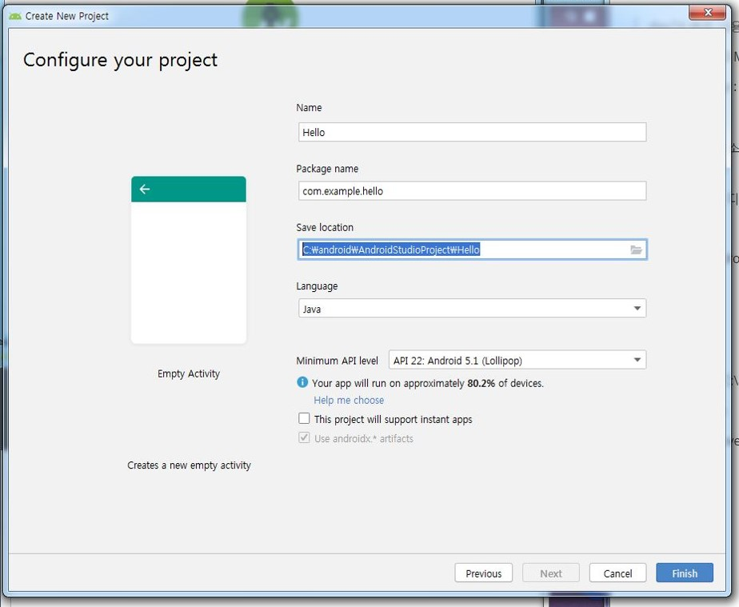
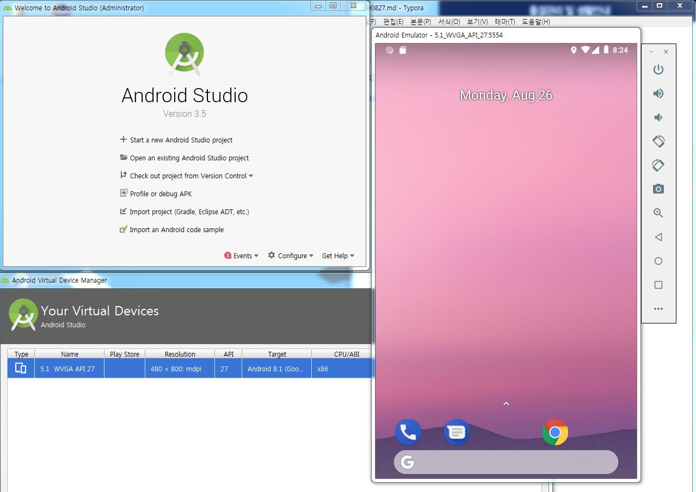
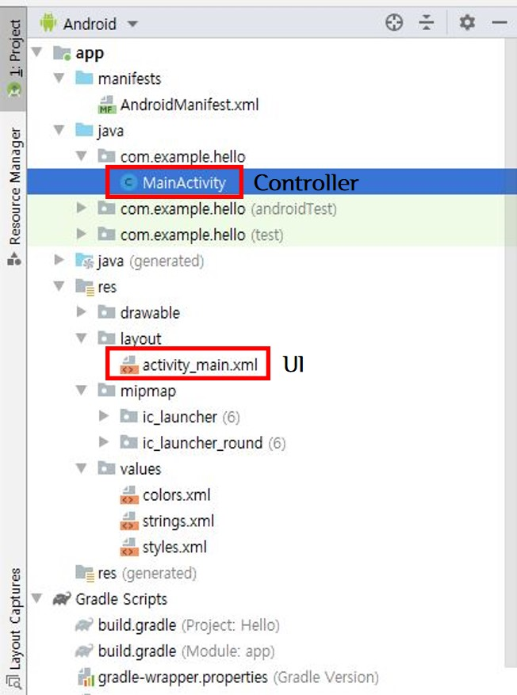
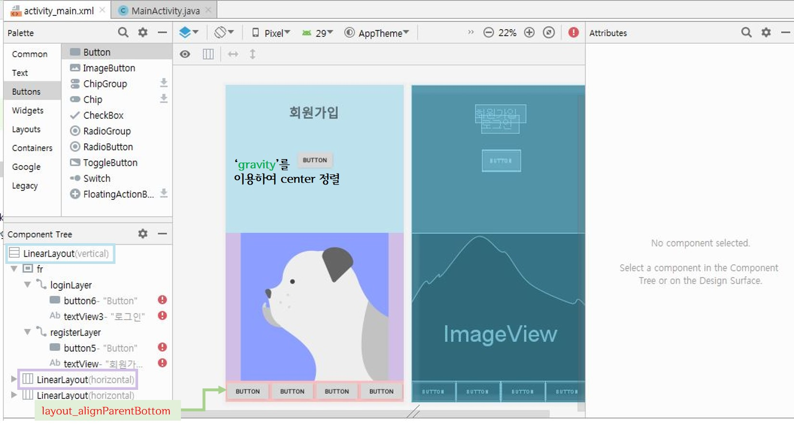
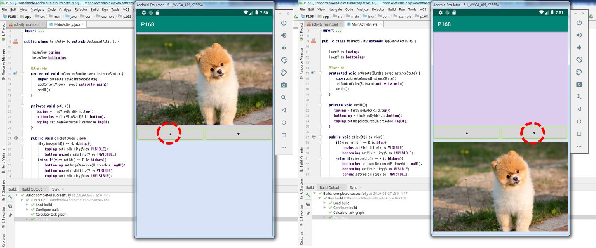
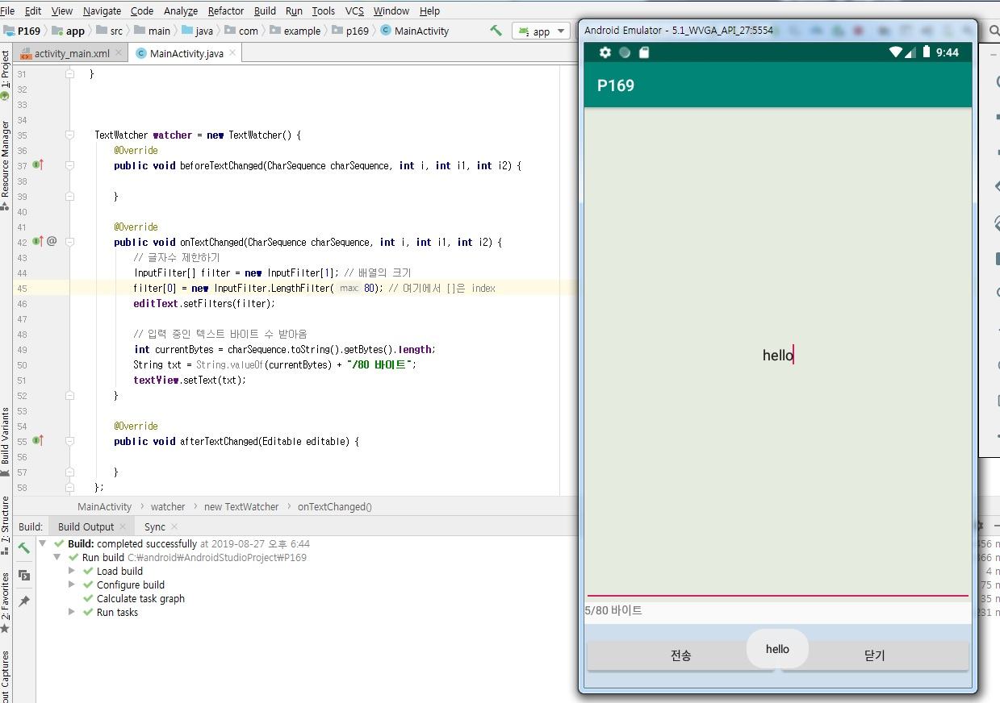
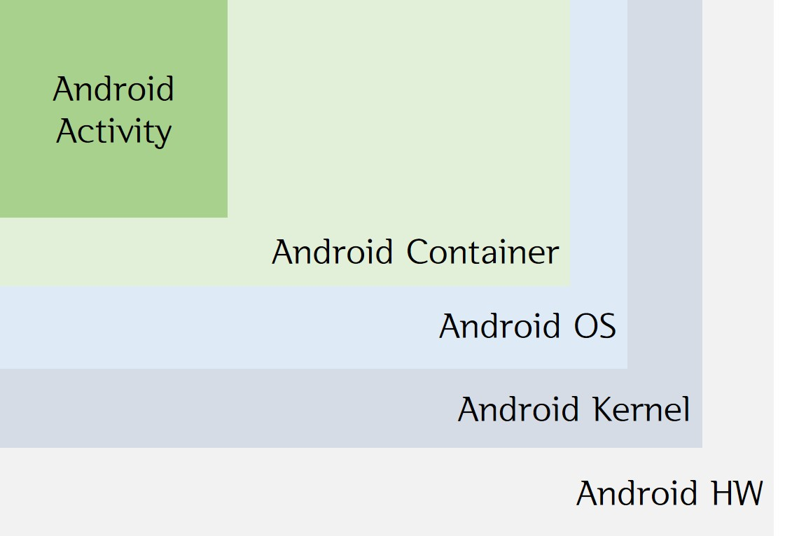

> day74 배운 내용 : Project Setting | Android Application | View | Layout 

## 1. Project Setting

### 1-1. Create Project

- [Start a new Android Studio project] 혹은 [New Project]
- [Empty Activity] project 선택
- [Configure your project] setting



### 1-2 Device Setting

Create Virtual Device 

- [Configure] → [AVD Manager] → [Create Virtual Device]
- 'ram: 2048, heap : 512'로 설정했음

Smart Phone Setting

- [휴대전화 정보] → [소프트웨어 정보] → [빌드 번호] 
- 빌드번호 여러 번 터치하면 '개발자모드' 접속 가능
- 개발자 옵션에서 'USB 디버깅 모드' 체크



### 1-3. Project List



- UI는 'xml'로 만들고 Controller는 'java' :star:

> layout 아래 activity_main.xml과 MainActivity.java

- res

  - drawable : 어플 이미지

  - mipmap : 아이콘? 안드로이드?

- Gradle Scripts : Maven과 같은 역할


## 2. Android Application

Application Icon 설정

```
android:icon="@mipmap/icon1" 
android:label="hello" 
android:roundIcon="@mipmap/icon1"
```

> 'mipmap'을 이용하여 App Icon & 'label'로 App의 이름

Touch 시 'MainActivity' 실행

```
<activity android:name=".MainActivity">
            <intent-filter>
                <action android:name="android.intent.action.MAIN" />

                <category android:name="android.intent.category.LAUNCHER" />
            </intent-filter>
        </activity>
```


## 3. View

'View'란 무엇인가?

- 개발 측면에서 위젯(Widget)은 Palette이며, 뷰에 존재해야함
- 위젯은 컨트롤의 역할을 수행
- 뷰를 배치하는 역할을 하는 것이 레이아웃(Layout)

'View'의 영역

- padding : 내부
- margin : 외부
- gravity : **전체** 정렬 (화면의 모든 버튼 다)

> layout_gravity와 margin 사용하면 버튼 하나에 대한 정렬 가능

## 4. Layout

레이아웃의 종류

| 레이아웃 이름                    | 설명                                                      |
| :------------------------------- | :-------------------------------------------------------- |
| 제약 레이아웃 (ConstraintLayout) | 제약조건을 사용해 화면을 구성 / 자유롭게 배치 가능        |
| 리니어 레이아웃 (LinearLayout)   | 한 쪽 방향으로 차례대로 뷰가 추가 됨 / 가로세로 정렬 가능 |
| 상대 레이아웃 (RelativeLayout)   | 양 끝 벽면을 찍어 상대 위치 설정해줘야 됨                 |
| 프레임 레이아웃 (FrameLayout)    | 여러 개의 뷰가 중첩하여 쌓게 됨                           |
| 테이블 레이아웃 (TableLayout)    | 격자 모양의 배열을 사용하여 화면을 구성 - TableRow        |

레이아웃 배치

- layout_width 
- layout_height
- wrap_parent : 콘텐츠 기준으로 배치 → font 크기에 맞춤
- match_content : 공간 기준으로 배치 → 화면의 가로 비율에 맞춤
- 수치를 입력하여 지정할 수도 있음 (ex- 200dp) → 화면 변동 시 모양이 바뀔 우려가 있음
- layout_alignParentBottom : 버튼 맨 아래 정렬하여 배치



> 예제 ② 결과 화면

-----------------------------------------------------------------------------------------------------------------------------------------------------------

:ghost: **예제 ① :** 첫 번째 버튼 클릭하면 두 번째 버튼의 색상 변경

[P115 예제코드 보러가기](https://github.com/xuansohx/TIL/tree/master/%EC%98%88%EC%A0%9C%EC%BD%94%EB%93%9C/day74_Android_ChangeButton_P115)

ID로 버튼에 대한 정보 받아오기

```java
    @Override
    protected void onCreate(Bundle savedInstanceState) {
        super.onCreate(savedInstanceState);
        setContentView(R.layout.activity_main);
        bt2 = findViewById(R.id.button26);
        // 화면에 있는 두 번째 버튼 정보 받아옴
        // R. 뒤에 이미지인지 위젯인지 정보 입력하면 가져올 수 있음
    }
```

버튼을 클릭하였을 때 동작하는 함수 정의 → `View view` 꼭 사용하기 :star:

```java
 public void btclick(View view) {
        bt2.setBackgroundColor(Color.RED);
        bt2.setText("Clicked");
    }
```

<br>

:pear: **예제 ② :**  버튼 4개 활용하여 사진 바꾸기(Visible & InVisible) / 로그인과 회원가입 화면 번갈아 출력

[P158 예제코드 보러가기](https://github.com/xuansohx/TIL/tree/master/%EC%98%88%EC%A0%9C%EC%BD%94%EB%93%9C/day74_Android_ChangeView_P158)

Application 기본 세팅

```java
private void setUi() {
        img = findViewById(R.id.img); // 'img'라고 명명한 ImageView 영역에 img insert
        loginLayer = findViewById(R.id.loginLayer); // connection
        registerLayer = findViewById(R.id.registerLayer);
        //loginLayer.setVisibility(View.INVISIBLE); // 화면에 보여지지 않게 설정
        //registerLayer.setVisibility(View.INVISIBLE);
        disable(); // 위의 두 줄 함수로 만들어 간단히 처리 → frame 생성?
    }
```

버튼에 따른 Visible과 InVisible 및 화면 출력

```java
 public void clickBt(View view){
        // onclick 설정해두면, 버튼 클릭 시 모든 event를 이 곳에서 처리
        if(view.getId() == R.id.bt1){
            img.setImageResource(R.drawable.d1);
        }else if(view.getId() == R.id.bt2){
            img.setImageResource(R.drawable.d2);
        }else if(view.getId() == R.id.bt3){ // 어떤 버튼에 눌렀는 지에 따라 교차되어 화면 출력
            loginLayer.setVisibility(View.VISIBLE);
            registerLayer.setVisibility(View.INVISIBLE);
        }else if(view.getId() == R.id.bt4){
            loginLayer.setVisibility(View.INVISIBLE);
            registerLayer.setVisibility(View.VISIBLE);
        }
```

-----------------------------------------------------------------------------------------------------------------------------------------------------------

:chestnut: **day74 workshop ① :** 버튼을 누를 때마다 이미지의 위치 변경​ - ImageView 이용

[P168 실습코드 보러가기](https://github.com/xuansohx/TIL/tree/master/%EC%8B%A4%EC%8A%B5%EC%BD%94%EB%93%9C/Android/day74_Android_ChangeView_P168)



<br>

:sunflower: **day74 workshop ② :** SMS 입력 화면 만들고, 글자의 수 표시 및 제한하기​

[P169 실습코드 보러가기](https://github.com/xuansohx/TIL/tree/master/%EC%8B%A4%EC%8A%B5%EC%BD%94%EB%93%9C/Android/day74_Android_InputText_P169)



Text 입력하기 - TextWtcher

```java
 TextWatcher watcher = new TextWatcher() {
        @Override
        public void beforeTextChanged(CharSequence charSequence, int i, int i1, int i2) {

        }

        @Override
        public void onTextChanged(CharSequence charSequence, int i, int i1, int i2) {
            // 글자수 제한하기
            InputFilter[] filter = new InputFilter[1]; // 배열의 크기
            filter[0] = new InputFilter.LengthFilter(80); // 여기에서 []은 index
            editText.setFilters(filter);

            // 입력 중인 텍스트 바이트 수 받아옴
            int currentBytes = charSequence.toString().getBytes().length;
            String txt = String.valueOf(currentBytes) + "/80 바이트";
            textView.setText(txt);
        }

        @Override
        public void afterTextChanged(Editable editable) {

        }
    };
```

Toast로 결과 화면 띄우기

```java
  public void onCick(View view) {
        // send 버튼과 close 버튼 나눔 - if문 사용
        if (view.getId() == R.id.sendbt) { // send 버튼 누르면 Toast로 표시
            String message = editText.getText().toString();
            Toast.makeText(this, message, Toast.LENGTH_SHORT).show();
    } else if(view.getId() == R.id.closebt){
            finish();
        }
```

<br>

:crescent_moon: **day74 workshop ③ :** 두 개의 WS 통합하여 하단 버튼 두 개로 조작 → 버튼에 누르면 각각 다른 이미지​

P170

-----------------------------------------------------------------------------------------------------------------------------------------------------------

:heavy_check_mark: Android 시스템 구성도




