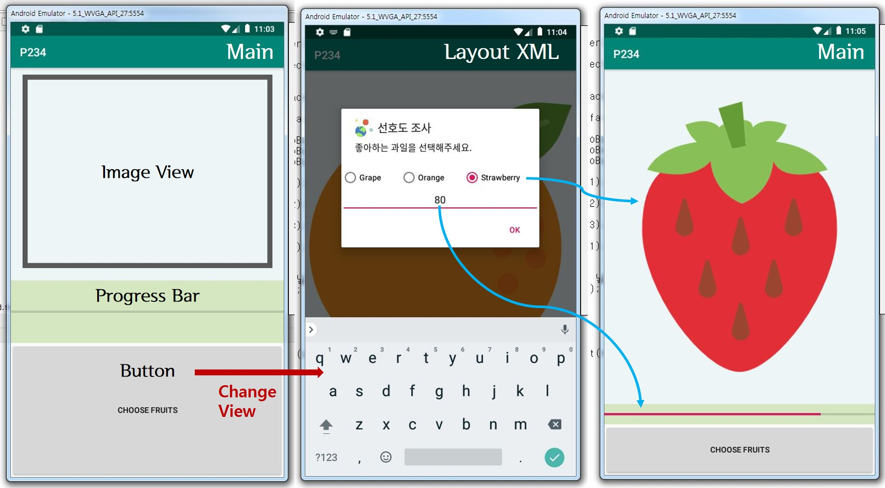

> day75 배운 내용 : 기본 위젯과 이벤트 처리 | Bundle 활용하기 | 토스트, 스낵바, 대화상자 | 프로그레스바

## 1. 기본 위젯과 이벤트 처리

### TextView

- 텍스트뷰는 화면에서 글자를 보여주는 역할
- string.xml 파일로 분리하여 다국어 지원도 가능
- maxLines 속성을 이용하여 문자열의 최대 줄 수 설정

### Buttons

- Buttons의 종류
- Buttons의 이벤트 처리 /  [P178 예제코드 보러가기](https://github.com/xuansohx/TIL/tree/master/%EC%98%88%EC%A0%9C%EC%BD%94%EB%93%9C/day75_Android/day75_Android_EventByButton_P178)

```java
public class MainActivity extends AppCompatActivity
implements View.OnClickListener{
    Switch switch1;
    
    @Override
    protected void onCreate(Bundle savedInstanceState) {
        super.onCreate(savedInstanceState);
        setContentView(R.layout.activity_main);

        // Buttons
        switch1 = findViewById(R.id.switch1);
        // Listener 이용하여 Button의 변화를 감지하도록 설정
        switch1.setOnCheckedChangeListener(new CompoundButton.OnCheckedChangeListener() {
            @Override
            public void onCheckedChanged(CompoundButton compoundButton, boolean b) {
                if (b == true) {
                    Toast.makeText(MainActivity.this,"Switch",Toast.LENGTH_SHORT).show();
                    // 이 경우 상위 클래스를 쓰고 써줘야 toast 띄우기 가능
                    bt.setBackgroundColor(Color.RED);
                } else {
                    bt.setBackgroundColor(Color.BLUE);
                }
            }
        });
}
```

### 방향전환 

- AndroidManifest.xml에 `configChanges` 추가 / [P200 예제코드 보러가기](https://github.com/xuansohx/TIL/blob/master/%EC%98%88%EC%A0%9C%EC%BD%94%EB%93%9C/day75_Android/day75_Android_ChangeDirection_P200/MainActivity.java)

```XML
 <application
        android:allowBackup="true"
        android:icon="@mipmap/ic_launcher"
        android:label="@string/app_name"
        android:roundIcon="@mipmap/ic_launcher_round"
        android:supportsRtl="true"
        android:theme="@style/AppTheme">
        <activity android:name=".MainActivity"
            android:configChanges="orientation|screenSize|keyboardHidden">
            <!-- configChanges를 추가하여 방향전환 알 수 있도록 함 -->
            <intent-filter>
                <action android:name="android.intent.action.MAIN" />

                <category android:name="android.intent.category.LAUNCHER" />
            </intent-filter>
        </activity>
    </application>

```


## 2. Bundle 활용하기

### Bundle 

[P212 예제코드 보러가기](https://github.com/xuansohx/TIL/tree/master/%EC%98%88%EC%A0%9C%EC%BD%94%EB%93%9C/day75_Android/day75_Android_Bundle_P212)

- Back Key를 누르면 데이터가 사라짐
- 홈버튼을 이용한 화면 이동 혹은 통화 등 앱이 살아있는 동안 데이터가 임시로 저장되는 것

```java
 button.setOnClickListener(new View.OnClickListener() {
            @Override
            public void onClick(View view) {
                String data = editText.getText().toString();
                savedInstanceState.putString("save",data);
            }
        });
```

```java
       button2.setOnClickListener(new View.OnClickListener() {
            @Override
            public void onClick(View view) {
                String data = null;
                if(savedInstanceState != null){
                    data = savedInstanceState.getString("ID");
                }else{
                    data = "Empty";
                }
                Toast.makeText(MainActivity.this,data, Toast.LENGTH_SHORT).show();

            }
        });
```

### SharedPreferences 

[P213 예제코드 보러가기](https://github.com/xuansohx/TIL/tree/master/%EC%98%88%EC%A0%9C%EC%BD%94%EB%93%9C/day75_Android/day75_Android_SharedPreferences_P213)

- Bundle 보다 데이터가 오래 저장
- Back Key를 눌러도, 데이터를 지우거나 앱을 지우지 않으면 데이터가 보존

```java
    public void clickbt(View view){
        if(view.getId() == R.id.button){
            // save
            sp = getSharedPreferences("ma",MODE_PRIVATE);
            // PRIVATE으로 설정하면 저장된 데이터 나 밖에 못 봄
            SharedPreferences.Editor editor = sp.edit();
            editor.putString("key01","id01");
            editor.commit(); // 데이터를 가져온 후, 반드시 commit을 하여 저장하기
        }else if(view.getId() == R.id.button2){
            // load
            sp = getSharedPreferences("ma",MODE_PRIVATE);
            String id = sp.getString("key01","default");
            Toast.makeText(this,id,Toast.LENGTH_SHORT).show();
        }
    }
}
```

## 3. 토스트, 스낵바 그리고 대화상자 사용하기

새로운 화면 띄우기 위하여 layout xml 추가하기

- [Project] → [Layout] → [new] → [XML] → [Layout XML File]

Toast

```java
    public void toast(View view){
        LayoutInflater inflater = getLayoutInflater();
        View tview = inflater.inflate(R.layout.toast,(ViewGroup) findViewById(R.id.tlayout));
        Toast toast = new Toast(this); // this - '여기'에서 동작하겠음
        toast.setGravity(Gravity.CENTER,0,-100);
        toast.setDuration(Toast.LENGTH_LONG);
        toast.setView(tview);
        toast.show();
    }
```

Dialog 

```java
    public void dialog(View view){
        AlertDialog.Builder builder = new AlertDialog.Builder(this);
        builder.setTitle("my dialog");
        builder.setMessage("Do you Exit App?");
        builder.setIcon(R.drawable.icon1);

        // toast.xml 을 불러와 띄우기 가능
        // 이거 없으면 이미지 없이 텍스트만
        LayoutInflater inflater = getLayoutInflater();
        View tview = inflater.inflate(R.layout.toast,(ViewGroup)        findViewById(R.id.tlayout)); 
        TextView tv = tview.findViewById(R.id.textView);
        tv.setText("Do you wanna Exit App...?");

        builder.setView(tview); // xml 파일을 띄우기

        // 버튼을 누르면..?
        builder.setPositiveButton("OK", new DialogInterface.OnClickListener() {
            @Override
            public void onClick(DialogInterface dialogInterface, int i) {
                Toast.makeText(MainActivity.this,"OK",Toast.LENGTH_SHORT).show();
                finish();
            }
        });
        builder.setNegativeButton("NO", new DialogInterface.OnClickListener() {
            @Override
            public void onClick(DialogInterface dialogInterface, int i) {
                Toast.makeText(MainActivity.this,"NO",Toast.LENGTH_SHORT).show();
            }
        });

        AlertDialog dialog = builder.create();
        dialog.setCancelable(false); 
        // alert 창이 뜨면 뒤에 터치 못하게 하는 것 → 무조건 선택하도록
        dialog.show();
    }
```

##  프로그레스바 사용하기

프로그레스바 사용하기 

```java
public class MainActivity extends AppCompatActivity {

    ProgressBar progressBar;
    ProgressDialog progressDialog;

    @Override
    protected void onCreate(Bundle savedInstanceState) {
        super.onCreate(savedInstanceState);
        setContentView(R.layout.activity_main);
        progressBar = findViewById(R.id.progressBar2);
    }

    public void bar(View view){
        if(view.getId() == R.id.button){
            progressBar.setProgress(progressBar.getProgress()+10);
        }else if(view.getId() == R.id.button2){
            progressBar.setProgress(progressBar.getProgress()-10);
        } // get 으로 값을 받아온 후, 바로 set 으로 설정
    }

    public void dialog(View view){
        if(view.getId() == R.id.button3){
            progressDialog = new ProgressDialog(MainActivity.this);
            progressDialog.setProgressStyle(ProgressDialog.STYLE_SPINNER);
            progressDialog.setMessage("Progress...");
          //  progressDialog.setCancelable(false); // 여기 주석처리하면 아무 곳 누르면 종료됨
            progressDialog.show();
        }else if(view.getId() == R.id.button4){
            progressDialog.dismiss();
        }

    }
}
```

프로그레스바에 버튼을 추가하여 종료할 수 있도록

```java
    public void dialog(View view){
        if(view.getId() == R.id.button3){
            progressDialog = new ProgressDialog(MainActivity.this);
            progressDialog.setProgressStyle(ProgressDialog.STYLE_SPINNER);
            progressDialog.setMessage("Progress...");
            progressDialog.setButton(progressDialog.BUTTON_NEGATIVE, "Cancel", 
                                     new DialogInterface.OnClickListener() {
                @Override
                public void onClick(DialogInterface dialogInterface, int i) {
                    progressDialog.dismiss();
                }
            });
            progressDialog.setCancelable(false); // 여기 주석처리하면 아무 곳 누르면 종료됨
            progressDialog.show();
        }else if(view.getId() == R.id.button4){
            progressDialog.dismiss();
        }

    }
```

-------------------------------------------------------------------------------------------------------------------------------------------

:green_apple: **day75 workshop ② :**  시크바와 프로그레스바 보여주기 / P233

- 화면에 시크바와 프로그레스바, 그리고 입력상자를 배치
- 시크바의 값을 바꾸면 프로그레스바의 값도 바뀜 & 입력 상자에 표시되도록

[P233 실습코드 보러가기](https://github.com/xuansohx/TIL/tree/master/%EC%8B%A4%EC%8A%B5%EC%BD%94%EB%93%9C/Android/day75_Android_SeekBarAndProgressBar_P233)

:orange: **day75 workshop ②** P234

[P234 실습코드 보러가기](https://github.com/xuansohx/TIL/tree/master/%EC%8B%A4%EC%8A%B5%EC%BD%94%EB%93%9C/Android/day75_Android_OverAll_P234)

