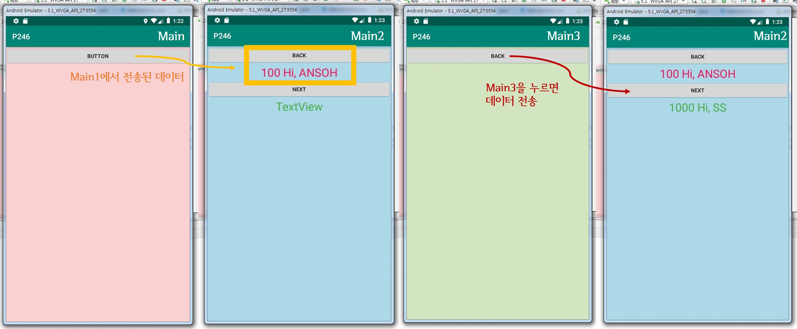
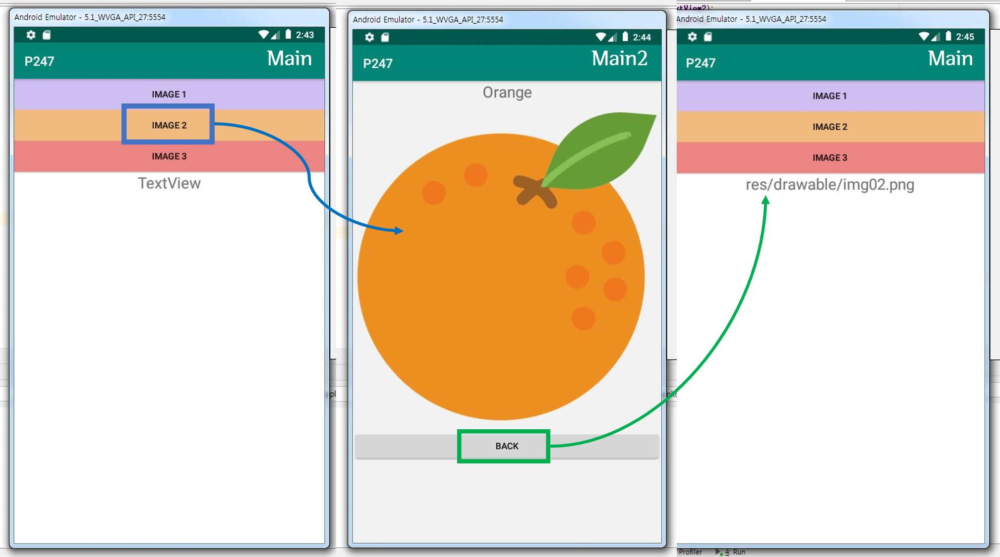

> day76 배운 내용 : Activity | Intent  | SharedPreferences | Fragment

## 1. Activity

안드로이드 앱의 네 가지 구성 요소

- 액티비티 (**Activity**) : 화면을 구성하는 영역 - view
- 서비스 (Service) : 화면에 보여지지는 않지만 계속 동작하고 있음 - background
- 브로드캐스트 수신자 (Broadcast Receiver) : 수신 여부를 알려줌 → 화면에 띄울 수 있도록
- 내용 제공자 (Content Provider) : 콘텐츠를 가져와 사용하는 것 ex) SKT의 T전화


## 2. Intent

Intent는 Activity를 전환하거나, 다른 화면으로 데이터를 전송할 때 사용

- 단순히 액티비티만 띄워주는 경우 :  `startActivity()`
- 액티비티와 함께 데이터를 전송하는 경우 : `startActivityForResult()`

-----------------------------------------------------------------------------------------------------------------------------------------------------------

:apple: **예제** : 새로운 Activity 추가 후 응답 처리하기 (화면 전환)

[P246 예제코드 보러가기](https://github.com/xuansohx/TIL/tree/master/%EC%98%88%EC%A0%9C%EC%BD%94%EB%93%9C/day76_Android_Intent_ChangeActivity_P246)

새로운 Activity 추가하기

- [New] → [Activity] → [Empty Activity]
- app/res/layout에 activity_main2.xml 파일 생성

`Intent` 이용하여 화면 전환하기

- main 
  - main의 버튼을 누르면 다음 화면(main2)으로 이동
  - 이 때 `intent`에 data를 담아 전송함

```java
public class MainActivity extends AppCompatActivity {

    @Override
    protected void onCreate(Bundle savedInstanceState) {
        super.onCreate(savedInstanceState);
        setContentView(R.layout.activity_main);
    }

    public void clickBt(View view){
        // 액티비티 간 화면 이동
        Intent intent = new Intent(MainActivity.this,Main2Activity.class);
        // MainActivity.this 대신 getApplicationContext() 써도 됨
        intent.putExtra("num",100);
        intent.putExtra("str","Hi, ANSOH");
        startActivity(intent);
    }
}
```

- main2

  - main에서 받아온 data를 첫 번째 textview에 표시함

  - 두 번째 버튼을 누르면 request code와 함께 다음 화면(main3)으로 전환
  - 세 번째 버튼에서 `back`버튼을 누르면 main2로 돌아오는데 이 때 data 받을 준비

```java
public class Main2Activity extends AppCompatActivity {
    TextView textView, textView2;

    @Override
    protected void onCreate(Bundle savedInstanceState) {
        super.onCreate(savedInstanceState);
        setContentView(R.layout.activity_main2);
        textView = findViewById(R.id.textView);
        textView2 = findViewById(R.id.textView2);
        
        // 메인 페이지에서 intent에 담은 data를 가져옴
        Intent intent = getIntent();
        int num = intent.getIntExtra("num",0);
        String str = intent.getStringExtra("str");
        
        // 받아온 data를 textview에 담아 표시함
        textView.setText(num+" "+str);
    }

    public void clickBt(View view){
        finish();
    }

    public void clickBt2(View view){
        // go MAIN3
        Intent intent = new Intent(getApplicationContext(),Main3Activity.class); 
        // 값을 보냄 (request code)
        startActivityForResult(intent,100); 
    }

    @Override // 세 번째 페이지(MAIN 3)의 data를 받음
    protected void onActivityResult(int requestCode, int resultCode, @Nullable Intent data) {
        super.onActivityResult(requestCode, resultCode, data);
        // 서로 전송한 code가 일치할 때, data를 get 하여 main2의 textview2에 표시
        if(requestCode == 100 && resultCode == RESULT_OK){
            int nn = data.getIntExtra("nm",0);
            String st = data.getStringExtra("st");
            textView2.setText(nn+" "+st);
        }
    }
}

```

- main3

```java
public class Main3Activity extends AppCompatActivity {

    @Override
    protected void onCreate(Bundle savedInstanceState) {
        super.onCreate(savedInstanceState);
        setContentView(R.layout.activity_main3);
    }


    public void clickBt(View view){
        Intent intent = new Intent();
        intent.putExtra("nm",1000);
        intent.putExtra("st","Hi, SS");
        setResult(RESULT_OK,intent); // 버튼을 클릭하면 main3를 호출했던 2 에게 보내고 finish
        finish();
    }
}

```



-----------------------------------------------------------------------------------------------------------------------------------------------------------

:melon: **day76 workshop ①** : 버튼에 따라 다른 이미지 출력 → back 버튼 누르면 선택했던 파일명 출력

[P247 실습코드 보러가기](https://github.com/xuansohx/TIL/tree/master/%EC%8B%A4%EC%8A%B5%EC%BD%94%EB%93%9C/Android/day76_Android_ImageButton_intent_P247)

main

- main에서 선택한 버튼에 따라 다른 이미지 전송 (ID 값 이용)

```JAVA
 public void clickBt(View view){
        // 액티비티 간 화면 이동
        //Intent intent = new Intent(MainActivity.this,Main2Activity.class);
        Intent intent = new Intent(getApplicationContext(),Main2Activity.class);

        // 버튼에 따라 다른 이미지와 이름 전송
        // 버튼의 아이디 값과 비교하여, 해당하는 사진의 아이디 값과 이름을 intent에 저장
        if(view.getId() == R.id.button){
            intent.putExtra("str","Grape");
            intent.putExtra("img",R.drawable.img01);
        }else if(view.getId() == R.id.button2){
            intent.putExtra("str","Orange");
            intent.putExtra("img",R.drawable.img02);
        }else if(view.getId() == R.id.button3){
            intent.putExtra("str","Strawberry");
            intent.putExtra("img",R.drawable.img03);
        }

        startActivityForResult(intent,100);
        // 이거 맨 마지막에 써야 전송 됨
        // 중간에 쓰면 아래 코드가 실행되지 않음
    }
```

- main2에서 보낸 이미지 파일명 data를 받아 textview에 표시

```java
    @Override
    protected void onActivityResult(int requestCode, int resultCode, @Nullable Intent data) {
        super.onActivityResult(requestCode, resultCode, data);
        // requestcode와 resultcode 일치하면 선택했던 이미지의 파일명 표시
        if(requestCode == 100 && resultCode == RESULT_OK){
            String st = data.getStringExtra("imagename");
            int nn = data.getIntExtra("file",0);
            textView.setText(nn);
        }
```

> 파일명 대신 경로가 표시되는 문제는 해결하지 못함

main2

- main2에서 선택한 버튼에 해당하는 이름과 이미지 파일 정보 받아와 표시

```java
  @Override
    protected void onCreate(Bundle savedInstanceState) {
        super.onCreate(savedInstanceState);
        setContentView(R.layout.activity_main2);
        textView2 = findViewById(R.id.textView2);
        imageView = findViewById(R.id.imageView);

        // getIngent를 통하여 받아옴
        Intent intent = getIntent();
        name = intent.getStringExtra("str");
        textView2.setText(name);

        image = intent.getIntExtra("img",0);
        imageView.setImageResource(image);

    }
```

- 새로운 intent를 생성하여 파일명을 main으로 전송

```java
    public void clickBt(View view){
        Intent intent = new Intent();
        intent.putExtra("imagename",name);
        intent.putExtra("file", image);
        setResult(RESULT_OK,intent);
        finish(); // 뒤로가기
    }
}
```




## 3. SharedPreferences

:star: `bundle`은 데이터를 잠시 저장 & `SharedPreferences`는  앱이 꺼졌다 켜져도 저장됨

:pineapple: **day76 workshop ②** : 자동로그인 체크 시, 아이디 정보가 저장되어 로그인 없이 다음 페이지로 이동

[P285 실습코드 보러가기](https://github.com/xuansohx/TIL/tree/master/%EC%8B%A4%EC%8A%B5%EC%BD%94%EB%93%9C/Android/day76_Android_AutoLogin_P285)

main

- 시작하자마자 자동로그인 체크 여부 확인하여 View를 결정

```java
    @Override
    protected void onCreate(Bundle savedInstanceState) {
        super.onCreate(savedInstanceState);
        setContentView(R.layout.activity_main);
        editText = findViewById(R.id.editText);
        editText2 = findViewById(R.id.editText2);
        checkBox = findViewById(R.id.checkBox);

        // App이 실행되자마자, 자동로그인 체크 여부 검사를 하여 
        // 데이터가 저장되어 있으면 로그인 과정이 필요 없으므로 바로 다음 페이지
        SharedPreferences sp = getSharedPreferences("userdata", MODE_PRIVATE);
        if (sp.contains("id") && sp.contains("pwd")) {
            intent = new Intent(getApplicationContext(), Main2Activity.class);
            startActivity(intent);
        }
    }
```

- 아이디와 비밀번호를 입력 후, 로그인 버튼 누르면 Activity 이동

```java
    // 로그인 버튼을 누르면
    public void clickBt(View view) {
        // 화면 이동
        // 이 때 로그인 정보가 일치해야 다음 화면
        // 그렇지 않으면 경고 메시지 띄우기
        if (editText.getText().toString().equals("ansoh") && editText2.getText().toString().equals("pwd123")) {

            // 자동로그인
            if (checkBox.isChecked() == true) {
                // userdata는 데이터 저장 공간
                SharedPreferences sp = getSharedPreferences("userdata", MODE_PRIVATE); 
                SharedPreferences.Editor editor = sp.edit(); // 데이터를 넣거나 수정하는 역할

                editor.putString("id", editText.getText().toString()); // 데이터를 저장
                editor.putString("pwd", editText2.getText().toString());
                editor.commit(); // 데이터를 저장하면 반드시 'commit'을 해줘야 됨
            } else {
                // 데이터 저장 공간
                SharedPreferences sp = getSharedPreferences("userdata", MODE_PRIVATE); 
                SharedPreferences.Editor editor = sp.edit();
                editor.clear(); // 만약 자동로그인 체크를 하지 않으면 저장소를 비워줌 → clear
                editor.commit();
            }

            intent = new Intent(getApplicationContext(), Main2Activity.class);
            /* intent는 다음 화면으로 데이터를 전송할 때만 이용
               따라서 전송할 데이터가 없으면 저장하지 않아도 됨
               intent.putExtra("id",R.id.editText); 
               intent.putExtra("pwd",R.id.editText2); */
            startActivity(intent);
            //startActivityForResult(intent,100); 
            //→ 이것도 데이터를 전송할 때만! 없으면 Result 없이 사용
        } else {
            Toast.makeText(this, 
                           "아이디 또는 비밀번호를 확인해주세요.", 
                           Toast.LENGTH_SHORT).show();
        }

    }
```

main2

```java
public class Main2Activity extends AppCompatActivity {

    TextView textView;

    @Override
    protected void onCreate(Bundle savedInstanceState) {
        super.onCreate(savedInstanceState);
        setContentView(R.layout.activity_main2);
    }

    public void clickBt(View view){
        finish();
    }
}
```


## 4. Fragment

- 여러 개의 화면을 구성할 때 보통 각각의 화면을 액티비티로 만든 후 액티비티를 전환하는 방법 사용
- 그런데 화면의 일부를 다른 화면으로 구성하고 싶을 때? → Fragment 사용


