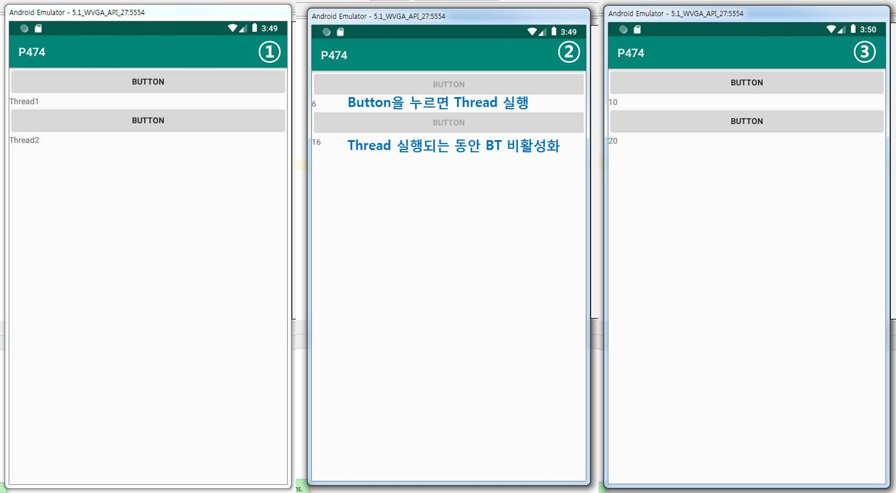
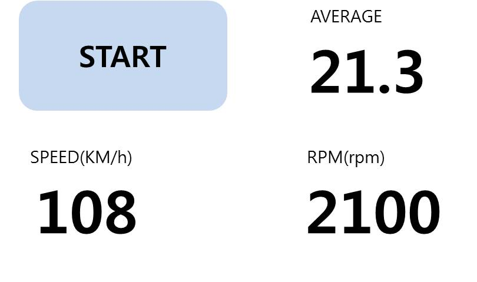

> day79 배운 내용 : WebView | SeekBar | Thread | Handler

## 1. WebView

### 1-1. Android Studio에서 WebView Setting

- 웹브라우저를 앱 안에 넣을 때는 웹뷰(WebView)를 사용

```java
public class MainActivity extends AppCompatActivity {
    WebView webView;
    TextView textView;

    @Override
    protected void onCreate(Bundle savedInstanceState) {
        super.onCreate(savedInstanceState);
        setContentView(R.layout.activity_main);
        webView = findViewById(R.id.webView);
        webView.setWebViewClient(new WebViewClient());

        // 우리가 만든 JS라는 class를 등록
        webView.addJavascriptInterface(new JS(),"js");

        WebSettings webSettings = webView.getSettings();
        webSettings.setJavaScriptEnabled(true); // webView에서 Java 동작하도록

        textView = findViewById(R.id.textView);

        webView.loadUrl("http://m.naver.com"); 
        // App이 network를 통해 왔다갔다 하려함 (보안은 취약)
    }

    final class JS{ // final class는 변경할 수 없는 클래스?
        JS(){}
        @android.webkit.JavascriptInterface // 이 함수는 webkit의 Javascript로 동작
        public void webclick(String str){
            textView.setText(str);
            Toast.makeText(MainActivity.this,""+str,Toast.LENGTH_SHORT).show();
        }
    }
    public void clickBt(View view){
        if(view.getId() == R.id.button){
            webView.loadUrl("http://www.daum.net");
        }else if(view.getId() == R.id.button2){
            webView.loadUrl("http://70.12.60.109/webview");
        }else if(view.getId() == R.id.button3){
            webView.loadUrl("javascript:s('cmd')"); // 함수호출
        }
    }
}

```

- `onCreate`에 Android와 Java 연동될 수 있도록 설정?

```
webSettings.setJavaScriptEnabled(true); // webView에서 Java 동작하도록
```

- XML 레이아웃에서 `<web-View>` 태그로 정의

AndroidManifest.xml 에 `<user-permission>` 추가

```
<uses-permission android:name="android.permission.INTERNET"/>
```

### 1-2. Create web page

**Eclipse**로 web 만들기

- 서버 설정하기 - Tomcat
- 'Dynamic Web Project' 만든 후, Project Name은 'webview'로 설정
- web page 만듦

```html
<html>
<head>
<meta charset="EUC-KR">
<title>Insert title here</title>
<script>
function s(data){
	document.getElementById('id02').innerHTML = 'Web view Event'+data;
}
</script>
</head>
<body>
<h1>Web View Test</h1>
<h2 id="id02">Sample Data</h2>
<button onclick="window.js.webclick('web')">Click</button>
</body>
</html>
```

[P458 예제코드 보러가기](https://github.com/xuansohx/TIL/tree/master/%EC%98%88%EC%A0%9C%EC%BD%94%EB%93%9C/day79_Android/day79_Android_WebView_P458)

## 2. SeekBar 

SeekBar의 움직임을 감지하여 화면에 표시 → [P462 예제코드 보러가기](https://github.com/xuansohx/TIL/tree/master/%EC%98%88%EC%A0%9C%EC%BD%94%EB%93%9C/day79_Android/day79_Android_SeekBar_P462)

```java
 seekBar.setOnSeekBarChangeListener(new SeekBar.OnSeekBarChangeListener() {
            @Override
            public void onProgressChanged(SeekBar seekBar, int i, boolean b) {
                textView.setText("SeekBar Value : "+i);
                setBright(i);
            }
```

> 화면 밝기 혹은 볼륨을 조절할 때 사용


[ 참고 ] 키패드 제어

앱 실행 시 키보드가 먼저 떠올라 화면을 가리는 현상 방지

```xml
<activity android:name=".MainActivity"
android:windowSoftInputMode="stateHidden">
```

> AndroidManifest.xml 에 추가해주기


## 3. Thread and Handler

- 서비스 : BackGround에서 동작하여 눈에 보이지 않는 프로세스
- 프로세스 : 코딩이 기계어로 바뀌어 동작되는 것
- 스레드 
  - 단독으로 생성되지 않고, 프로세스 안에서 생성
  - 프로세스가 사용하는 메모리를 공유하는 것 ∴ 하나의 프로세스 안에 여러 개의 스레드 동작 가능
  - 메모리를 공유하여 사용하기 때문에 더 많은 사람들에게 서비스 제공이 가능
  - MainThread는 SubThread가 제어할 수 없음
- SubThread가 MainThread를 직접 건드리는 것을 방지하기 위해 사용하는 것이 Handler

### 3-1. Thread

버튼을 클릭하면 Thread가 동작하도록 설정

```java
  public void clickB1(View view){
       Thread t1 = new Thread(r1);
       t1.start();
       button.setEnabled(false);
    }
```

Thread 객체 생성

```java
    Runnable r1 = new Runnable() {
        @Override
        public void run() {
            for(int i=0; i<=10; i++){
                try {
                    Thread.sleep(500);
                } catch (InterruptedException e) {
                    e.printStackTrace();
                }
                Log.d("[T]","---"+i);
                final int temp =i;
                runOnUiThread(new Runnable() {
                    @Override
                    public void run() {
                        textView.setText(temp+"");
                    }
                });
            }
            runOnUiThread(new Runnable() {
                @Override
                public void run() {
                    button.setEnabled(true);
                }
            });

        }
    };
```

[P474 예제코드 보러가기](https://github.com/xuansohx/TIL/tree/master/%EC%98%88%EC%A0%9C%EC%BD%94%EB%93%9C/day79_Android/day79_Android_Thread_P474)



### 3-2. Handler

- Handler는 서브 Thread가 메인 Thread를 직접 건드리는 것을 방지
- 서브 Thread는 메인 Thread를 제어하지 못 하므로 Runnable 사용함

```java
runOnUiThread(new Runnable() {
                    @Override
                    public void run() {
                        textView2.setText(temp +"");
                    }
                });
```

- `Service`는 앱이 비활성화 되어도 동작 ∵ MainActivity와 별개이기 때문
- `Thread`는 앱이 종료되는 동시에 중단

[P478 예제코드 보러가기](https://github.com/xuansohx/TIL/tree/master/%EC%98%88%EC%A0%9C%EC%BD%94%EB%93%9C/day79_Android/day79_Android_Handler_P478)

### 3-3. Thread로 메시지 전송하기

> 서브 Thread와 메인 Thread 간 자유로운 왕래는 불가

[P485 예제코드 보러가기](https://github.com/xuansohx/TIL/tree/master/%EC%98%88%EC%A0%9C%EC%BD%94%EB%93%9C/day79_Android/day79_Android_ThreadMessage_P485)

-----------------------------------------------------------------------------------------------------------------------------------------------------------

:phone: **day79 workshop** : 자동차 계기판 만들기 - Thread 이용

- `START` 버튼을 누르면 SPEED와 RPM 수치가 출력 → 랜덤함수 이용
- AVERAGE는 RPM을 SPEED로 나눈 값

[P488 실습코드 보러가기](https://github.com/xuansohx/TIL/tree/master/%EC%8B%A4%EC%8A%B5%EC%BD%94%EB%93%9C/Android/day79_Android_Cluster_Thread_P488)




