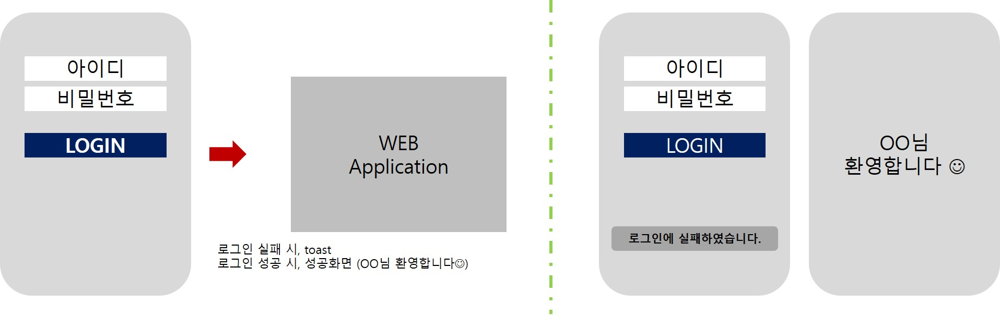
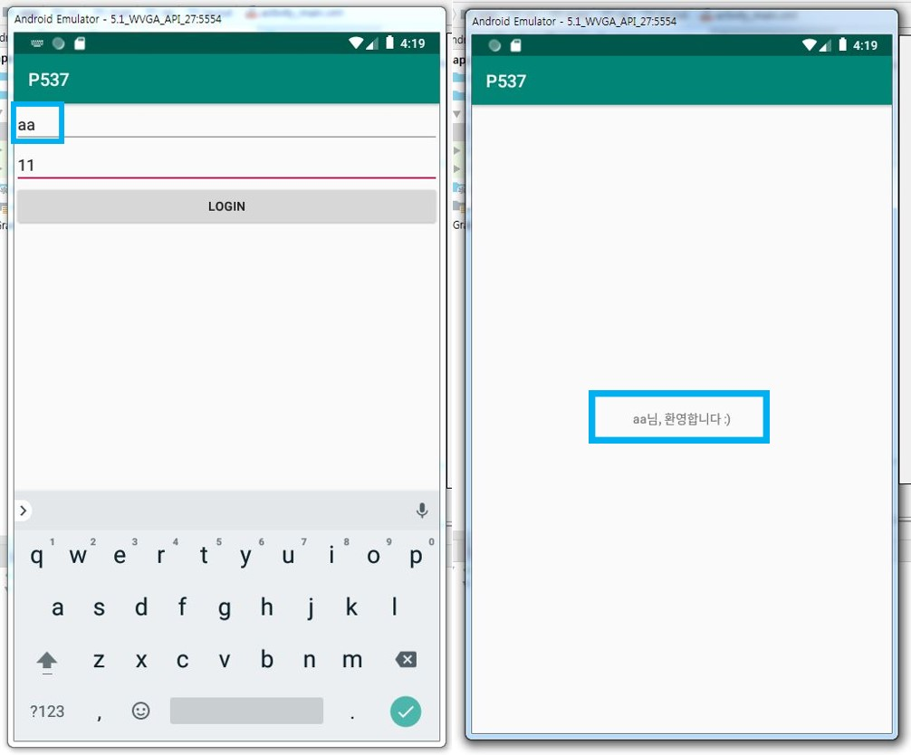

> day84 배운 내용 : 로그인 기능 구현 | 데이터베이스 | Android로 다이어리 구현하기

## 1. Mobile Database - Login

- 앱을 만들 때 데이터를 간단하게 저장하고 싶을 땐 'SharedPreferences'를 사용

- 하지만 많은 양의 데이터를 체계적으로 관리하려면 데이터베이스가 필요 → 표준 SQL문 사용하면 효율적

  - IndexedDB : JSON Object 형태로 data를 저장

  - WebSQL : SQL 형태로 data를 IN & OUT

<br>

:desktop_computer: **day84 workshop ① :** 로그인 기능 구현 / P537

- get 방식으로 서버에 요청하여 로그인 정보 확인 → 로그인
- get 방식 : http://70.12.60.109/webview/login.jsp?id=aa&pwd=11
- 메인에서 로그인 하면 다음 페이지로 이동 / 로그인 실패 할 경우, Toast 띄워서 경고



`AndroidMainfest.xml` 에 `uses-permission` 추가하기 

```xml
<uses-permission android:name="android.permission.INTERNET"/>
```

데이터를 관리하는 `HttpHandler.java` 파일 복붙

메인(`MainActivity.java`)에서 로그인 시도 및 정보 확인

:heavy_check_mark: 로그인 버튼을 누르면 입력한 아이디와 비밀번호 값 받아와 체크

```java
    public void clickBt(View view){
        id = idbox.getText().toString();
        pwd= pwdbox.getText().toString();
        check();
    }
```

> check() 함수의 실행 위치 중요 → `getText()`로 값을 먼저 받아온 후 체크해야됨!

:heavy_check_mark: 로그인 정보 확인

```java
   private void check(){
        String url = "http://70.12.60.109/webview/login.jsp?id="+id+"&pwd="+pwd;
        HttpTask httpTask = new HttpTask(url);
        httpTask.execute();
    }
```

:heavy_check_mark: Thread 이용하여 로그인 정보 확인 및 실행 → Eclipse 연동

```java
        // Thread 동작
        @Override
        protected String doInBackground(String... strings) {
            String str = HttpHandler.getString(url);
            return str; // 0이나 1을 받아옴 → onPostExecute 여기로 감
        }

        // Thread 동작 후
        @Override
        protected void onPostExecute(String str) {
            Log.d("test",str);
            if(str.equals("0")){
                // 로그인
                Intent intent = new Intent(getApplicationContext(), loginok.class);
                intent.putExtra("id",id);
                startActivity(intent);
            }else{
                // 로그인 실패
                Toast.makeText(MainActivity.this,
                               "아이디 또는 비밀번호를 확인해주세요.",
                               Toast.LENGTH_SHORT).show();
            }

        }
```

> Intent에 로그인 유저 정보 담아서 화면과 함께 전송

```jsp
<%@ page language="java" contentType="text/html; charset=EUC-KR"
    pageEncoding="EUC-KR"%>
<%
String id = request.getParameter("id");
String pwd = request.getParameter("pwd");
String result = "0";
if(id.equals("aa") && pwd.equals("11")){
	result="0";
}else{
	result="1";
}
out.print(result);
%>
```

> Eclipse에서 입력한 아이디 'aa'와 비밀번호 '11'을 입력해야 로그인 성공 

로그인 성공하면 `loginok.java` 이동 → 이때 로그인 유저정보 받아와 띄움

```java
    @Override
    protected void onCreate(Bundle savedInstanceState) {
        super.onCreate(savedInstanceState);
        setContentView(R.layout.activity_loginok);
        textView = findViewById(R.id.textView);

        Intent intent = getIntent();
        String name = intent.getStringExtra("id");
       // String pwd = intent.getStringExtra("pwd");
        textView.setText(name +"님, 환영합니다 :)");
    }
```




## 2. DataBase


## 3. Android로 Diary 구현

