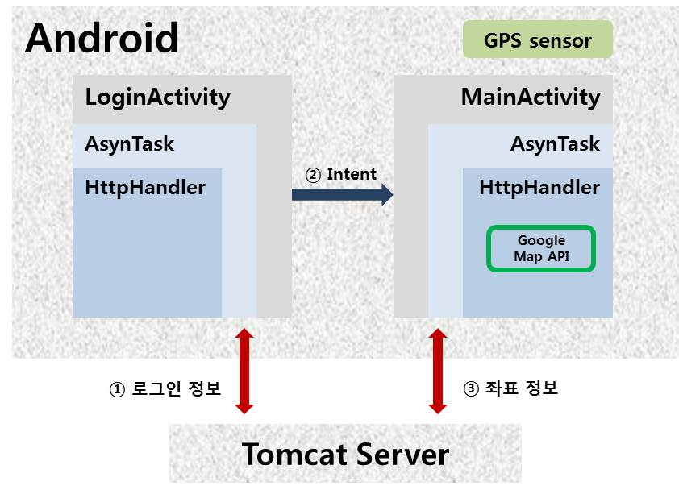
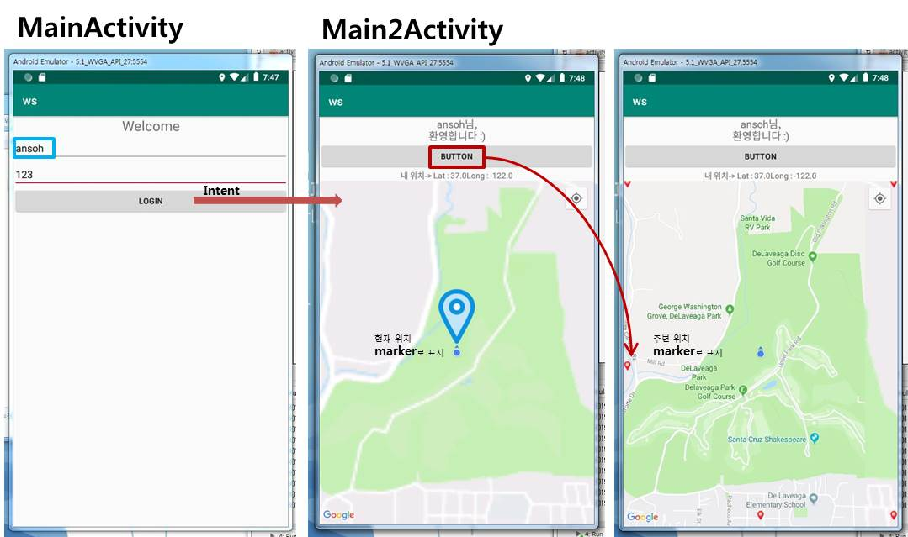

> day87 수행평가 : Android 수행평가 진행 ( Intent | Permission Check | Handler | AsynTask | Map API )

## Android 수행평가 : IoT 제어를 위한 스마트 디바이스 개발 기술

1. Android 앱과 서버를 연동하는 프로그램 개발
2. 로그인을 서버와 연동하여 진행
3. 로그인 후 지도를 앱에 표시
4. 지도에 현재 위치를 표시
5. 현재 위치 주변의 특정 위치를 마커로 표시

[실습코드 보러가기](https://github.com/xuansohx/TIL/tree/master/%EC%8B%A4%EC%8A%B5%EC%BD%94%EB%93%9C/Android/day87_Android_SmartDevice)

<br>

### 1. 시스템 구성도



[ 시나리오 ]

① 로그인을 시도하면 서버에 접속하여 로그인 정보를 확인

② Intent를 활용하여 로그인 정보를 담아 Activity 이동 (MainActivity → Main2Activity)

③ Main2Activity로 이동하면 현재 위치를 표시하는 marker와 좌표가 textView에 표시됨

④ 버튼을 누르면 주변의 위치가 marker로 표시. 이때 좌표 정보는 서버에서 받아옴

> 현재 위치를 전송한 후 → 데이터 가공하여 다시 받음 (JSON)


### 2. 실행 코드

#### 2-1. Android 앱과 서버 연동을 위한 준비

AndroidManifest.xml에 `uses-permission` 추가

```
<uses-permission android:name="android.permission.INTERNET"/>
```

Eclipse 내 jsp 파일을 이용하여 서버 만듦

```jsp
<%@ page language="java" contentType="text/html; charset=EUC-KR"
    pageEncoding="EUC-KR"%>
<%
String id = request.getParameter("id");
String pwd = request.getParameter("pwd");
String result = "0";
if(id.equals("abc") && pwd.equals("123")){
	result="0";
}else{
	result="1";
}

out.print(result);

%>
```

HttpHandler 준비

```java
package com.example.p537;

import ...

public class HttpHandler {
    public static String getString(String urlstr){
        // url을 집어 넣으면 그 url로 접속
        String result= null;
        URL url = null;
        HttpURLConnection hcon = null;
        InputStream is = null;
        try {
            url = new URL(urlstr);
            hcon = (HttpURLConnection)url.openConnection();
            hcon.setConnectTimeout(10000);
            hcon.setRequestMethod("GET");
            is = new BufferedInputStream(hcon.getInputStream());
            result = convertStr(is);
        }catch (Exception e){
        e.printStackTrace();
        }finally {
            hcon.disconnect(); // 이거 반드시 필요
        }
        return result;
    }

    public static String convertStr(InputStream is){
        String result = null;
        BufferedReader br = null;
        br = new BufferedReader(new InputStreamReader(is));
        StringBuilder sb = new StringBuilder();
        String temp;
        try{
            while((temp = br.readLine()) != null){
                sb.append(temp); // 가져온 String이 sb에 들어감
            }
        }catch(Exception e){
            e.printStackTrace();
        }finally {
            try {
                is.close();
            } catch (IOException e) {
                e.printStackTrace();
            }
        }
        return sb.toString();
    }

}
```

> app > java > com.example 에 생성


#### 2-2. 로그인과 메인 화면 만들기

> 로그인에 성공하면 메인 화면에 접속 / 이때 메인 화면엔 지도가 표시됨

Activity를 추가하여 로그인 성공 후 이동하게 될 메인 화면 생성 → 지도 표시

> map을 띄울 `Fragment`는 Text로 추가함

```xml
<fragment
        android:id="@+id/map"
        android:layout_width="match_parent"
        android:layout_height="match_parent"
        class="com.google.android.gms.maps.SupportMapFragment" />
```


#### 2-3. 로그인 기능 구현

MainActivity.java

로그인 버튼을 누르면 입력한 아이디와 비밀번호 정보를 저장

```java
    public void clickBt(View view){
        // 버튼을 누르면 입력한 아이디와 비밀번호 값을 저장하여
        id = idbox.getText().toString();
        pwd = pwdbox.getText().toString();
        // 서버와 연동하여 확인
        check();
    }
```

서버에 접속하여 로그인 정보 확인하는 함수 만듦

```java
private void check(){
        // 로그인 정보가 맞는지 서버를 통하여 확인함
        String url = "http://70.12.60.109/webview/login.jsp?id="+id+"&pwd="+pwd;
        HttpTask httpTask = new HttpTask(url);
        httpTask.execute();
    }
```

`AsynTask` 활용하여 서버에 접속하여 확인 & `intent`를 통해 Activity 이동 및 데이터 전송

```java
class HttpTask extends AsyncTask<String, Void, String> {
        String url; // url 받음
        public HttpTask(String url) {
            this.url = url;
        } 

        // Thread 동작
        @Override
        protected String doInBackground(String... strings) {
            String str = HttpHandler.getString(url);
            return str; // 0이나 1을 받아옴 → onPostExecute 여기로 감
        }

        // Thread 동작 후
        @Override
        protected void onPostExecute(String str) {
            Log.d("test",str);
            if(str.equals("0")){
                // 로그인 성공 → 메인 화면으로 이동(Main2Activity)
                Intent intent = new Intent(getApplicationContext(), Main2Activity.class);
                intent.putExtra("id",id); // 화면 이동할 때 아이디 정보 함꼐 전송
                startActivity(intent);
            }else{
                // 로그인 실패
                Toast.makeText(MainActivity.this,"아이디 또는 비밀번호를 확인해주세요.",Toast.LENGTH_SHORT).show();
            }

        }
    }
```


#### 2-4. 메인 화면에 지도 띄우기 위한 준비

지도 정보를 활용하기 위하여 AndroidManifest.xml 에 `uses-permission` 추가

```xml
 <!-- 위치와 지도를 사용하기 위한 Permission (맨 위에 추가) -->
<uses-permission android:name="android.permission.ACCESS_FINE_LOCATION" />

<!-- activity 위에 meta-data 추가 → value 값은 API Key -->
 <meta-data
            android:name="com.google.android.geo.API_KEY"
            android:value="API Key 값 입력하기" />
```

> Google API Key 관리 : [http://console.developers.google.com](http://console.developers.google.com/)

Grandle Scripts 내 `build.gradle (Module : app)` 확인

- `android{ }`에서 `minSdkVersion` 확인 → 버전이 높으면 실행 안 될 수도 있음

```java
android {
    compileSdkVersion 29
    buildToolsVersion "29.0.2"
    defaultConfig {
        applicationId "com.example.p675"
        minSdkVersion 22
        targetSdkVersion 29
        versionCode 1
        versionName "1.0"
        testInstrumentationRunner "androidx.test.runner.AndroidJUnitRunner"
    }
```

- `dependencies{ }`에 내용 한 줄 추가

```java
    dependencies {
    implementation 'com.google.android.gms:play-services-maps:16.1.0'
    }
```


#### 2-5. 메인 화면에 지도 띄우기

Main2Activity.java에서 Intent로 보낸 아이디 정보 받아옴

```java
   Intent intent = getIntent();
   String str = intent.getStringExtra("id");
   idView.setText(str+"님,\n환영합니다 :)");
```

두 종류의 marker(현재 위치와 주변 위치)를 생성해야 하므로 두 개의 변수로 선언

```java
    MarkerOptions myLocationMarker, marker;
    // 현재 내 위치를 표시할 marker와 주변 위치를 표시할 marker 선언

    double lat, lon; // 현재 위치
    double pointLat, pointLon; // 내 주변
    ArrayList<LatLng> points; // 내 주변 여러 marker를 List에 담아 표시
```

지도를 띄우기 위한 Fragment 호출

```java
mapFragment = (SupportMapFragment) getSupportFragmentManager().findFragmentById(R.id.map);
        mapFragment.getMapAsync(new OnMapReadyCallback() {
            @Override
            public void onMapReady(GoogleMap googleMap) {
                Log.d("Map", "지도 준비됨.");
                map = googleMap;
                map.setMyLocationEnabled(true);
                startLocationService();
            }
        });

        try {
            MapsInitializer.initialize(this);
        } catch (Exception e) {
            e.printStackTrace();
        }

```

Main2Activity로 이동하면 현재 위치를 marker로 표시함

```java
    // 현재 위치 받음
    private void showCurrentLocation(Double latitude, Double longitude) {
        LatLng curPoint = new LatLng(latitude, longitude);
        map.animateCamera(CameraUpdateFactory.newLatLngZoom(curPoint, 15));
        showMyLocationMarker(curPoint);
    }

    // 현재 위치 Marker로 표시
    private void showMyLocationMarker(LatLng curPoint) {
        if (myLocationMarker == null) {
            myLocationMarker = new MarkerOptions();
            myLocationMarker.position(curPoint);
            myLocationMarker.icon(BitmapDescriptorFactory.fromResource(R.drawable.mylocation));
            map.addMarker(myLocationMarker);
        } else {
            myLocationMarker.position(curPoint);
        }
    }
```

> GPSListener 필요함

버튼을 누르면 서버에서 주변 위치 좌표를 받아와 marker로 표시

```java
    public void callMarker(View view){
        // 버튼 누르면 현재 위치 주변으로 특정 위치 마커로 표시하기
        getNewPoint(pointLat, pointLon);
    }

    private void getNewPoint(double lat, double lon) {
        String url =  "http://70.12.60.109/webview/marker.jsp?lat="+lat+"&lon="+lon;
        HttpTask httpTask = new HttpTask(url);
        httpTask.execute();
    }
```

> 서버에 접속해야 하므로 AsynTask와  HttpHandler 사용하기

```java
 @Override
        protected void onPostExecute(String s) {
            super.onPostExecute(s);
            JSONArray ja = null;
            try {
                ja = new JSONArray(s);
                for(int i=0; i<ja.length(); i++){
                    JSONObject jo = ja.getJSONObject(i);
                    double latt = jo.getDouble("lat");
                    double lonn = jo.getDouble("lon");
                    LatLng latlng = new LatLng(latt, lonn);
                    points.add(latlng);
                    Log.i("JSONtest", latlng.latitude+" "+latlng.longitude);
                }
                LatLng curpoint = new LatLng(lat, lon);
                showLocationLists(points);
            } catch (JSONException e) {
                e.printStackTrace();
            }

        }
    }

    // 주변 위치 marker로 표시
    private void showLocationLists(ArrayList<LatLng> points) {
        int p = points.size();
        map.clear();
        for(int i=0; i<p; i++){
            marker = new MarkerOptions();
            marker.position(points.get(i));
            marker.title("주변 위치");
            marker.icon(BitmapDescriptorFactory.fromResource(R.drawable.marker));
            map.addMarker(marker);
        }
```

> 서버에서 좌표 정보 받아와 marker로 표시


### 3. 실행 결과



