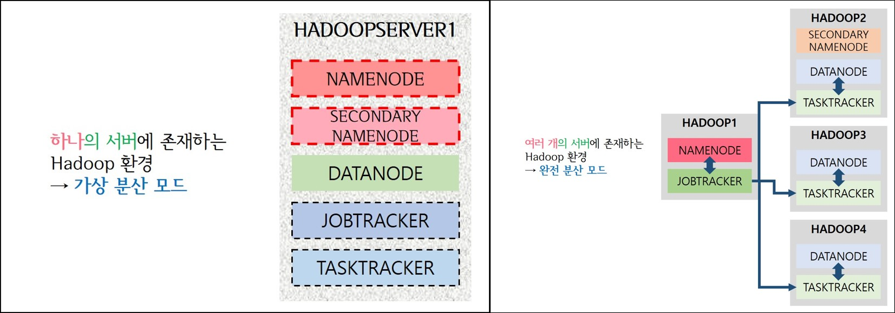
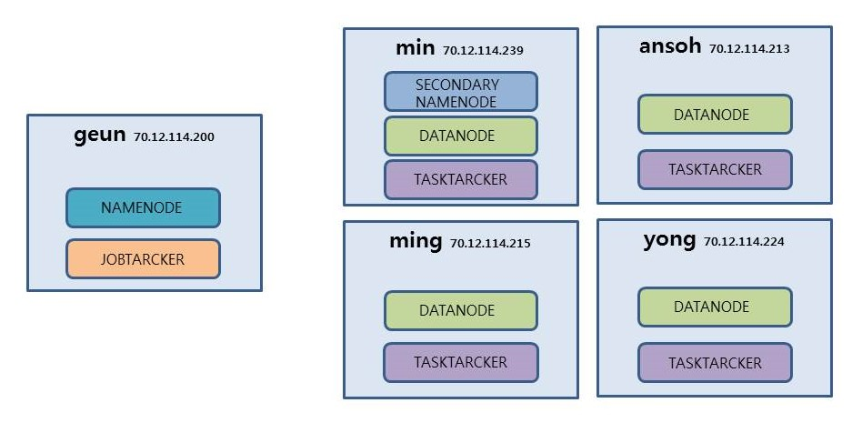

190806 - 오늘 배운 내용 

> day60 배운 내용 ② : 가상 분산 모드 | 완전 분산 모드

## 1. 가상 분산 모드

> 하나의 서버에 모든 Hadoop 환경 설정



| HADOOP 구조        | 역할                                                         |
| ------------------ | ------------------------------------------------------------ |
| NAMENODE           | Client을 포함한 외부의 모든 요청사항을 수행                  |
| SECONDARY NAMENODE | NAMENODE의 백업 저장소  → 복제하여 저장하는 역할             |
| DATANODE           | 데이터가 저장되는 곳 ≒ DB / 데이터가 여러 개로 나뉘어 들어감 |
| JOBTRACKER         | 작업을 분배? / MapReduce                                     |
| TASKTRACKER        | 작업을 수행? / MapReduce                                     |


## 2. 완전 분산 모드

> 여러 개의 서버에 Hadoop이 설치된 경우 → HADOOP1, HADOOP2, HADOOP3, HADOOP4로 만듦

- HADOOP1 HADOOP2 HADOOP3 HADOOP4 설정 → /etc/sysconfig/network-scripts/ifcfg-ens33 수정

  → 네트워크 설정 'NAT'으로 바꾸고, MAC 주소 및 hostname 변경

① hostname 변경

```
hostnamectl set-hostname hadoop1
hostnamectl set-hostname hadoop2
hostnamectl set-hostname hadoop3
hostnamectl set-hostname hadoop4
```

② /etc/hosts에 IP 주소랑 hostname 추가

```
192.168.111.201 hadoop1
192.168.111.202 hadoop2
192.168.111.203 hadoop3
192.168.111.204 hadoop4
```

③ ifconfig-ens33 수정

```
# HADOOP1
MACADDRESS="00:50:56:3C:82:7A"
IPADDR=192.168.111.201
GATEWAY=192.168.111.2
DNS1=192.168.111.2

# HADOOP2
MACADDRESS="00:50:56:2C:02:C2"
IPADDR=192.168.111.202
GATEWAY=192.168.111.2
DNS1=192.168.111.2

# HADOOP3
MACADDRESS="00:50:56:39:6A:B5"
IPADDR=192.168.111.203
GATEWAY=192.168.111.2
DNS1=192.168.111.2

# HADOOP4
MACADDRESS="00:50:56:2F:3D:8D"
IPADDR=192.168.111.204
GATEWAY=192.168.111.2
DNS1=192.168.111.2
```

> `systemctl restart network`로 네트워크 재부팅 해주기

<br>

:star: SSH 활성화

- HADOOP1 Key 설정

```
ssh-keygen -t dsa -P '' -f ~/.ssh/id_dsa → 키 생성
cd .ssh → .ssh에 접속하여 키가 생성되었는지 확인
cat id_dsa.pub >> authorized_keys 
```

- 생성된 public key를 .ssh에서 다른 서버로 전송 (∵ 다른 서버 자유롭게 접속하기 위함_

```
scp authorized_keys root@hadoop2:~/.ssh/authorized_keys
scp authorized_keys root@hadoop3:~/.ssh/authorized_keys
scp authorized_keys root@hadoop4:~/.ssh/authorized_keys
```

- 다른 서버 접속해보기 → 비밀번호 없이 접속이 되어야 함!

```
ssh hadoop2
ssh hadoop3
ssh hadoop4
```


:star: HADOOP1 세팅 후 다른 서버엔 압축하여 전송 ∴ HADOOP1 환경설정

- /etc/profile 설정

```
HADOOP_HOME=/etc/hadoop-1.2.1
export HADOOP_HOME
PATH에 $HADOOP_HOME/bin: 추가
```

- /etc/hadoop-1.2.1/conf/hadoop-env.sh

```shell
// 9번 째 줄에서 주석 제거 후 아래 내용 추가
export JAVA_HOME=/etc/jdk1.8
export HADOOP_HOME_WARN_SUPPRESS="TRUE" 
```

> profile 뿐 아니라 shell에도 정의를 해줘야 오류가 안 남

- core-site.xml

```xml
<configuration>
        <property>
                <name>fs.default.name</name>
                <!-- <value>hdfs://hadoop1:9000</value> -->
                <value>hdfs://192.168.111.201:9000</value>
                <!-- IP 주소로 설정하기 --> 
        </property>
        <property>
                <name>hadoop.tmp.dir</name>
                <value>/etc/hadoop-1.2.1/tmp</value>
        </property>
</configuration>
```

- hdfs-site.xml

```xml
<configuration>
<property>
    <name>dfs.permissions</name>
    <value>false</value>
  </property>
  <property>
    <name>dfs.replication</name>
    <value>2</value>
    <!-- 복제본 두 개씩 -->
  </property>
  <property>
    <name>dfs.http.address</name>
    <value>192.168.111.201:50070</value>
    <!-- namenode의 IP 주소 -->
    <!-- 외부에서 들어올 때! 9000번은 내부? -->
  </property>
  <property>
    <name>dfs.secondary.http.address</name>
    <value>192.168.111.202:50090</value>
    <!-- secondary namenode의 IP 주소 -->
  </property>
  <property>
    <name>dfs.name.dir</name>
    <value>/etc/hadoop-1.2.1/name</value>
  </property>
  <property>
    <name>dfs.data.dir</name>
    <value>/etc/hadoop-1.2.1/data</value>
  </property>
</configuration>
```

- mapred-site.xml

```xml
<configuration>
        <property>
                <name>mapred.job.tracker</name>
                <value>hadoop1:9001</value>
                <!-- namenode가 있는 마스터의 IP 주소 -->
        </property>
</configuration>
```

- /etc/bashrc

```
. /etc/hadoop-1.2.1/conf/hadoop-env.sh
```

- /etc/hadoop-1.2.1/conf 설정

```
> vi masters (secondary namenode가 있는 곳을 써줌)
hadoop2 추가
> vi slaves (slaves는 작업수행 / datanode가 있는 곳 써줌)
hadoop2
hadoop3
hadoop4 추가
```

:star: HADOOP1의 환경설정파일 압축하여 HADOOP2, 3, 4로 전송하기

- 압축파일 만듦

```
tar cvfz hadoop.tar.gz/etc/hadoop-1.2.1/
```

- 압축파일 전송

```
scp hadoop.tar.gz root@hadoop2,3,4:/etc
```

- HADOOP1에서 HADOOP2 , 3, 4 압축 풀기

```
ssh root@hadoop2,3,4 "cd /etc;tar xvfz hadoop.tar.gz;rm -rf hadoop.tar.gz"
```

> 압축을 풀고 난 후, 압축파일 지움

- namenode format 후 hadoop 실행

```
hadoop namenode -format
start-all.sh
```

- `jps`로 현재 동작 중인 프로세스 확인


-----------------------------------------------------------------------------------------------------------------------------------------------------------

:bridge_at_night: **day60 Team Workshop** : 서로 다른 장비의 서버에서 완전 분산 모드 환경 구축하기 (bridge 이용)



