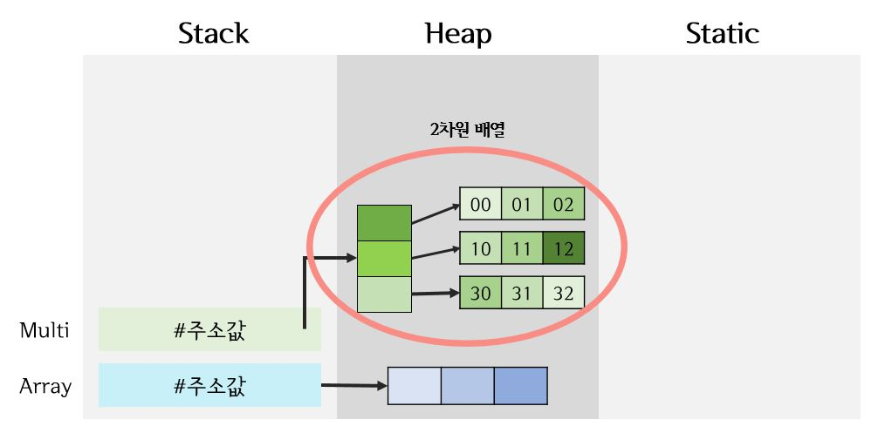

> day5 배운 내용 : 배열 | 2차원 배열

## 1. 배열(array)

- 배열은 데이터의 묶음으로 많은 양의 데이터를 저장할 수 있음
- 배열은 '한 가지 타입'만 사용할 수 있으며, 배열의 사이즈를 정해놓고 사용
- 배열은 객체이며 Reference Type

- 배열 생성하기

```java
int a[] = new int[5]; // 사이즈가 5인 배열의 생성 → int형 data만 들어갈 수 있음
int b[] = {1,2,3}; // 사이즈가 3인 배열 b 안의 데이터 1,2,3

int []c = new int[5];
int []d = {4,5,6};
```

> 다양한 방법으로 배열을 선언하고 생성할 수 있음

### 1-1. 배열에 데이터 입력

```java
int a[] = new int[3];
a[0] = 10;
a[1] = 30;
a[2] = 20; // 배열의 자리는 0부터 순차적으로 증가
```

### 1-2 배열 출력하기

```java
System.out.println(a); // 배열 a의 메모리 내 주소 값 출력([I@15db9742)
System.out.println(a.length); // 배열의 크기 출력
System.out.println(Arrays.toString(a)); // 배열의 데이터 출력하기
```

### 1-3. 배열 응용하기

- 배열에 랜덤으로 값 집어넣기

```java
int a[] = new int[5];

Random r = new Random();
for(int i=0; i<a.length; i++){ // a[0]부터 배열의 크기만큼 for문을 돌림
    a[i] = r.nextInt(90)+10; // 10부터 99까지의 난수를 각 배열에 넣음
}
```

> r.nextInt(90) : 0부터 89까지이 난수 생성 → 여기에 +10을 하면, 10부터 99까지의 난수 생성

- 배열 내 최대최소 값 출력

```java
int max = a[0]; // 임시로 배열의 첫 번째 값 a[0]을 최대최소로 저장
int min = a[0]; 

for(int i=1; i<a.length; i++){
    if(a[1]>max) { 
        max = a[i]; 
        // 계속 비교하다가 비교 값이 더 크면 최대값이 계속 바뀌면서 비교
    } else if(a[i]<min) {
				min = a[i];
			}
```

- 배열 내 정렬

```java
// 큰 수부터 내림차순으로 정렬하기
for(int i=0; i<a.length; i++) { 
    for(int j=0; j<a.length-1-i; j++) { 
        if(a[j]<a[j+1]) {
            int temp = a[j];
            a[j] = a[j+1];
            a[j+1] = temp;
        }
    }
}
```

> 이중 for문과 임시변수 temp 이용하여 자리 재정렬

- String을 char로 출력

```java
String str = "ILOVEYOU"; // String에 있는 A~G의 배열을 char에 넣기
char []c = str.toCharArray();
		
System.out.println(Arrays.toString(c)); 
```

> 한 글자씩 출력이 됨


## 2. 2차원 배열

- 2차원 배열 생성하기

```java
int ma[][] = new int[2][3];
```

> 2행3열의 2차원 배열의 생성 → 크기가 2인 행 배열이 크기가 3인 열 배열을 갖는 형태

- 메모리 영역에 표시하기 (JVM)



````java
int Array[] = new int[3];
int Multi[][] = new int[3][3];
````

