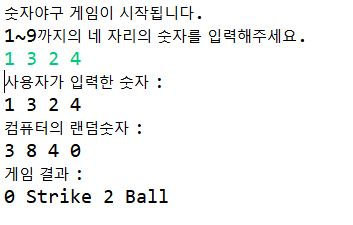
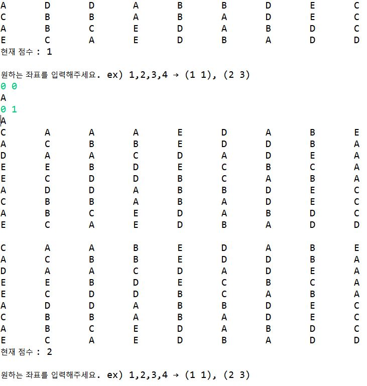

> day6 배운 내용 : workshop 진행 (숫자야구, 캔디크러쉬, 부루마블 구현하기)

:baseball: **day6 workshop ① :** 숫자야구

[실습코드 보러가기](https://github.com/xuansohx/TIL/blob/master/%EC%8B%A4%EC%8A%B5%EC%BD%94%EB%93%9C/java/Bulls-and-cows.java)



▶ workshop 수행 시 어려웠던 점 : 컴퓨터의 숫자와 사용자가 선택한 숫자 비교하기 → 배열의 위치와 for문 이용

```java
for (int m = 0; m < com.length; m++) {
			for (int n = 0; n < user.length; n++) {
				if (com[m] == user[n] && m == n) { // 숫자와 자리 비교
					s++; // 숫자와 자리가 모두 같으면 strike++
				} else if (com[m] == user[n] && m != n) {
					b++; // 숫자만 같으면 ball++
				}
			}
		}
```

> 배열 내 각 자리의 숫자와 값을 이중 for문을 이용하여 비교하여 해결

-----------------------------------------------------------------------------------------------------------------------------------------------------------

:candy: **day6 workshop ②** : 캔디크러쉬​

[실습코드 보러가기](https://github.com/xuansohx/TIL/blob/master/%EC%8B%A4%EC%8A%B5%EC%BD%94%EB%93%9C/java/Candy-Crush.java)



▶ workshop 수행 후 보완할 점 : 좌표변경 코드 간단하게 바꿔보기

-----------------------------------------------------------------------------------------------------------------------------------------------------------

:game_die: **day6 workshop ③** : 부루마블​

[실습코드 보러가기](https://github.com/xuansohx/TIL/blob/master/%EC%8B%A4%EC%8A%B5%EC%BD%94%EB%93%9C/java/Monopoly.java)


▶ workshop 수행 시 어려웠던 점 : player의 주사위 값이 game map의 길이를 초과하였을 때 방향 전환하여 이동하는 것 → 주사위 값과 현재 내 위치의 차이만큼 이동하기 위한 `dist` 변수 이용

```java
  if(a==0) { // →
		   if((b+data1)>map.length-1) { // ↓
			   int dist = map.length - 1 - b; 
			   a = (data1-dist);
			   b=7;
		   }else {
			   b += data1;
		   }
	   }
```

> 시계방향으로 한 라인씩 (주사위 값(data)+현 위치)의 값과 map의 길이를 비교하여 계산하는 if문 사용

> 위의 코드에서 변수 a, b는 player의 위치를 나타내는 배열 `map[a][b]`의 자리를 나타내는 값

