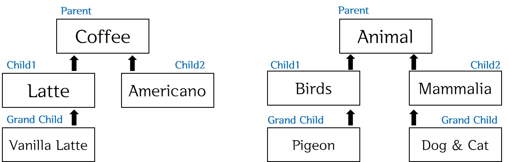

> day11 배운 내용 : 상속(inheritance) | Heterogeneous | Polymorphism  | instanceof (비교연산자)

# 객체지향 프로그래밍 Ⅱ

## 1. 상속(inheritance)

- 기존의 클래스를 재사용하여 새로운 클래스를 작성하는 것
- 코드의 재사용성이 높기 때문에 중복을 제거하여 생산성과 유지보수에 크게 기여
- 상속을 구현하는 방법 : 클래스의 이름을 키워드 **'extends'**와 함께 사용

```java
class Child extends Parent{
    
} // Child는 기존 클래스 Parent를 상속 받아 새로 작성한 클래스
```

|    조상 클래스     |      자손 클래스      |
| :----------------: | :-------------------: |
| 부모(parent)클래스 |   자식(child)클래스   |
| 상위(super)클래스  |    하위(sub)클래스    |
|  기반(base)클래스  | 파생된(derived)클래스 |

- 자식 클래스가 부모 클래스로부터 상속을 받게 되면 부모 클래스의 필드와 메서드를 물려받게 됨 

  → 자식 클래스에서 정의한 것은 부모 클래스에서 사용 불가능

- 생성자와 초기화 블럭은 상속되지 않음 / 멤버만 상속

- 자식 클래스는 여러 부모 클래스로부터 상속받지 못함 = **'단일상속'**만 가능

- 부모 클래스는 여러 자식 클래스에게 상속이 가능 

  **∴ 자손 클래스의 멤버 개수는 조상 클래스보다 항상 같거나 많음** 

### 클래스 간의 관계 결정하기

- 상속관계 : '~은 ~이다.' ***(is-a)***

- 포함관계 : '~은 ~을 가지고 있다.' ***(has-a)***

- 형변환 :

  - 자식클래스 → 부모클래스 : 형변환 생략 가능

  ​        : Shape = new Circle [o]

  - 자식클래스 ← 부모클래스 : 형변환 생략 불가

  ​        : Circle c = Shape [x] >>> Circle c = (Circle) sh [o]

[ 예시 ] 직원과 매니저의 상속관계 나타내기 : is-a관계

① UML

.jpg)

- 공통적인 특성을 많이 갖고 있는 Employee가 상위클래스가 되어 화살표를 받음(Employee ← Manager)

- 하위클래스인 Manager는 상위클래스의 속성 및 기능을 그대로 상속받을 뿐 아니라, 

  새로운 기능을 정의할 수 있음

- 상위클래스에서 정의 된 기능을 하위클래스에서 재정의 하는 것을 '오버라이드(Override)'라고 함

② 상위클래스 : EMployee

```java
package company;

public class Employee {
	protected String id; // string으로 해야 숫자나 문자, 특수문자 들어가는 것이 가능
	protected String name;
	protected double salary;
	protected String dept;
	// protected는 하위클래스에서 자유로운 접근이 가능함 + 같은 패키지 내에서도 가능
	// private는 encap.이 너무 강하여 접근이 어려움(하지만 일반적인 것은 private)
	
	public Employee() {
	}
	public Employee(String id, String name, double salary, String dept) {
		this.id = id;
		this.name = name;
		this.salary = salary;
		this.dept = dept;
	}
	public String getId() {
		return id;
	}
	public void setId(String id) {
		this.id = id;
	}
	public String getName() {
		return name;
    }
	public void setName(String name) {
		this.name = name;
	}
	public double getSalary() {
		return salary;
	}
	public void setSalary(double salary) {
		this.salary = salary;
	}
	public String getDept() {
		return dept;
	}
	public void setDept(String dept) {
		this.dept = dept;
	}
    
	@Override
	public String toString() {
		return "Employee [id=" + id + ", name=" + name + ", salary=" + salary + ", dept=" + dept + "]";
	}
	
	public double salaryM() {
		double money = 0;
		double temp = 0;
		// 4대 보험료 8.4% 공제
		// 세금 3.2% 공제
		temp += this.salary*0.084;
		temp += this.salary*0.032; // 둘 중 일부가 바뀔 수 있으니 따로 계산
		money = this.salary - temp;
		
		return money;
	}
	
	public double annSalary() {
		double money = 0;
		money = this.salaryM()*12;
		return money;
	}

}

```

③ 하위클래스 : Manager

```java
package company;

public class Manager extends Employee{ // 'extends Employee' 이렇게 하면 상속이 됨
	private double incentive;

	public Manager() { // default constructor
	}

	public Manager(String id, String name, double salary, String dept, double incentive) {
		//super(id, name, salary, dept); // super는 상위클래스의 코드를 이용하겠다는 의미
		this.id = id; // private에서는 이렇게 못 쓰지만, protected는 접근이 가능함
		this.name = name;
		this.salary = salary;
		this.dept = dept;
		this.incentive = incentive;
	}

	// 재정의
	// Override : toString 그대로 사용하지 않고 재정의하여 사용
	
	@Override // 상위클래스 함수를 재정의 하겠다는 의미
	public String toString() {
		return "Manager [id=" + id + ", name=" + name + ", salary=" + salary + ", dept=" + dept + ", incentive="
				+ incentive + "]";
	}

	// 매니저는 인센티브가 추가됨
	@Override
	public double salaryM() {
		double money = 0;
		money = super.salaryM() + this.incentive;
		// super.salaryM() : 이거 사용해서 상위클래스의 계산 코드만 가져올 수 있음
		return money;
	}

//	@Override 
//	public double annSalary() {
//		double money = 0;
//		money = super.salaryM()*12;
//		return money;
//	}
// 이 경우에는 상위클래스와 코드가 동일하므로, Override 하지 않아도 됨	
}

```

④ 테스트 : Company

```java
package company;

public class Company {

	public static void main(String[] args) {
		Employee e1 = new Employee("11", "James", 1000, "Dev");
		System.out.println(e1);
		System.out.println(e1.salaryM());
		System.out.println(e1.annSalary());
		
		Manager m1 = new Manager("22", "Tom", 1000, "Dev",100);
		// 상위클래스의 속성을 그대로 상속받아서 사용가능
		System.out.println(m1);
		System.out.println(m1.salaryM());
		System.out.println(m1.annSalary());
	}

}

```

[ 예시 ] 점과 도형의 상속관계


- Shape(←Point) ← Circle, Rectangle, Triangle

[ 예시 ] 상속에 상속 받는 구조 : parent 아래 두 개의 child와 grand child 존재하는 경우




### 알아두어야 할 용어

```java

		// Heterogeneous Collection 
		Shape s[] =new Shape[3];
		s[0] = new Circle(new Point(1,1),5);
		s[1] = new Triangle(new Point(2,2),5,6);
		s[2] = new Rectangle(new Point(3,3),5,6);
		
		// Polymorphism(다형성)
		for(Shape sh:s) { 
			sh.move(5, 5); 
			if(sh instanceof Circle) { // instanceof : 비교연산자
				Circle c = (Circle)sh; 
				c.fillColor("red");
			}

```

① Heterogeneous Collection : 다양한 종류의 객체를 하나로 모음

② Polymorphism 

- 의미는 같지만 표현과 동작이 다른 것 → 하나의 클래스를 여러가지 형태로 구현

- 상속받은 기능을 변경하거나 확장할 수 있음

- 표준화 된 틀만 갖고 있으면 언제든 원하는 요소를 장착하여 구현하는 것이 쉬움

  ∵ 클래스의 변경과 추가가 용이하기 때문

③ instanceof (비교연산자)

- Java에만 있는 연산자로 등호와 같은 의미
- 다형성 내 객체의 특성을 확인할 때 사용