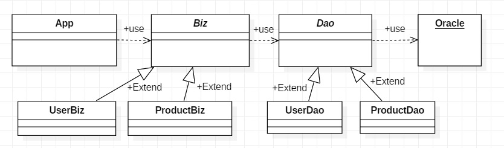

> day12 배운 내용 : 상속에서의 클래스 관계 | 오버라이딩(overriding) | 제어자(modirier) | DB | Generics

## 객체지향 프로그래밍 Ⅱ

### 1. 상속(inheritance)

- 상위클래스와 하위클래스의 관계는 ''상속관계(is-a)'' 또는 ''포함관계(has-a)''가 성립되어야 함
- 하위클래스는 하나의 상위클래스에게만 상속받을 수 있음 → 단일 상속(single inheritance)
- Object클래스는 모든 클래스 상속계층도의 최상위에 있는 조상클래스

### 2. 오버라이딩(overriding)

- 조상 클래스로부터 상속받은 메서드의 내용을 변경하는 것을 '오버라이딩'이라고 함

- 오버라이딩의 조건 : ① 같은 이름 ② 같은 매개변수 ③ 같은 반환타입(return)

- 오버라이딩의 특성 :

  ① 접근 제어자는 조상 클래스의 메서드보다 좁은 범위로 변경할 수 없음

  (넓은 것 → 좁은 것 : public, protected, (default), private)

  ② 조상 클래스의 메서드보다 많은 수의 예외를 선언할 수 없음

  ③ 인스턴스메서드를 static메서드로 또는 그 반대로 변경할 수 없음

#### 오버로딩과 오버라이딩

- 오버로딩(overloading) : 기존에 없는 새로운 메서드를 정의하는 것(new)

  → 함수이름은 동일한데 변수가 다름 & return은 상관없음

- 오버라이딩(overriding) : 상속받은 메서드의 내용을 변경하는 것(change, modify)

### 3. super

- 자식 클래스에서 부모 클래스로부터 상속받은 멤버를 참조하는데 사용되는 참조 변수
- 자식클래스와 부모클래스의 멤버 이름이 같을 경우 사용함

### 4. 제어자(modirier)

클래스, 변수 또는 메서드의 선언부와 함께 사용되어 부가적인 의미를 부여

- 접근 제한자 : public, protected, default, private
- 그 외 : static, final, abstract, native, transient, synchronized, volatile, strictfp

​        → 접근 제어자는 한 번에 네 가지 중 하나만 선택하여 사용할 수 있음

- final : 마지막, 변경될 수 없는

| 사용될 수 있는 곳 | 클래스, 메서드, 멤버변수, 지역변수                        |
| :---------------: | :-------------------------------------------------------- |
|      클래스       | 변경될 수 없는 클래스, 확장될 수 없음 ∴ 상속해 줄 수 없음 |
|      메서드       | 변경할 수 없는 메서드, 오버라이딩(overriding) 불가        |
|       변수        | 값을 변경할 수 없는 상태가 됨                             |

- abstract : 추상의, 미완성의 → 클래스와 메서드에서 사용

- 접근 제어자(access modifier) 

  - 접근 제어자 사용하는 이유 : 

    ① 외부로부터 데이터를 보호(encapsulation)

    ② 외부에는 불필요한, 내부적으로만 사용되는 부분을 감추기 위함

  - public > protected > (default) > private

|  제어자   | 특징                                                      |
| :-------: | :-------------------------------------------------------- |
|  public   | 접근 제한이 없음                                          |
| protected | 같은 패키지 내 + 다른 패키지의 자손클래스에서 접근이 가능 |
|  default  | 같은 패키지 내에서만 접근이 가능                          |
|  private  | 같은 클래스 내에서만 접근이 가능                          |

- 제어자의 조합

① 메서드에 static과 abstract를 함께 사용할 수 없음

: static은 오버라이딩이 불가 ↔ abstract은 오버라이딩이 가능

② 클래스에 abstract와 final을 동시에 사용할 수 없음

: abstract는 상속을 통해 완성되어야하는 추상표현인데, final은 확장이 불가능하므로

③ abstract 메서드의 접근 제어자가 private일 수 없음 ∵ 자식클래스의 접근을 허용하기 위하여

④ 메서드에 private와 final을 같이 사용하지 않아도 됨

-----------------------------------------------------------------------------------------------------------------------------------------------------------

### 5. 데이터베이스(data base)

- App > Biz(UserBiz, PoductBiz) > Dao(UserDao, ProductDao) > Oracle

  : 여기서 Biz와 Dao는 추상함수로 처리함 ㅣ Biz와 Dao는 다양하게 상속(확장) 가능

- App에서 바로 Oracle로 전달하는 것보다 여러 단계를 거치는 것이 보안과 유지보수가 용이함

  ∵ 종류와 용도에 따라 구분해두었으므로 코드 수정 시 DB가 변동되는 것을 최소화 할 수 있음

- 또한 App 하나만 사용하면 코드가 복잡하게 얽히기 때문에 불편함
-  각 클래스의 역할 :

① App : 화면 코드 사용, 사용자가 데이터 입력 및 확인

② Biz : App에서 온 data를 검증

★ Biz가 필요한 이유 : 데이터검증과 보안 / 유지보수 시 영향 최소화 / 에러발생 시 대처

③ Dao : data를 전달 / 필요한 정보 꺼내어 database에 집어 넣음

### 6. Generics

- 다양한 타입의 객체들을 다루는 메서드나 컬렉션 클래스에 컴파일 시의 타입체크를 해주는 기능

  → 객체의 타입 안정성을 높이고 형변환의 번거로움을 줄임