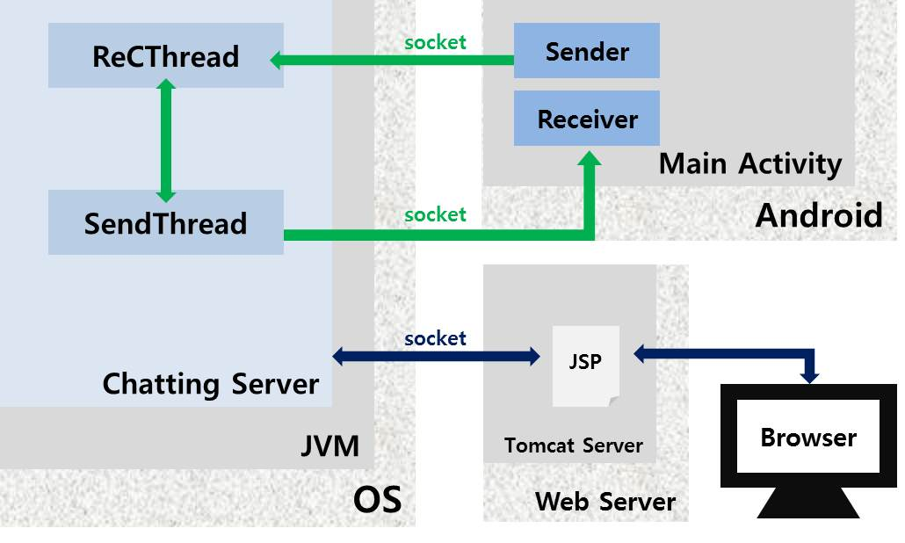
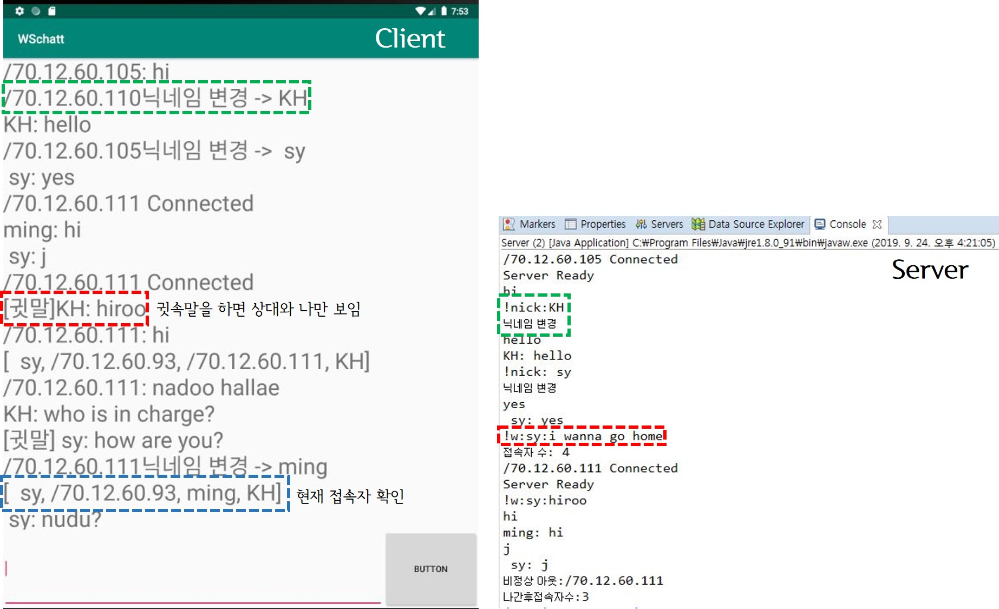

> day93 수행평가 : Network 수행평가 진행 (Socket을 이용하여 server와 Android, web 통신)

## Network 수행평가 : IoT 제어 및 통신 기술

 :speech_balloon: ​카카오톡과 같은 채팅창 만들기 - NUGAtalk

### 1. 시스템 구성도

[ 시나리오 ]

① Chatting Server가 시작되면 `ReCThread`가 동작되면서 받을 준비

② Client가 Android 혹은 web으로 접속하면 `socket`이 생성 : `map`을 통해 IP주소와 `DataOutputStream` 저장

③ `Sender`를 통하여 서버의 `ReCThread`로 전송

④ 서버의 `ReCThread`가 socket을 받아 다시 `SendThread`로 보냄

⑤ Client의 `Receiver`로 받아 View에 채팅 내용을 뿌림

### 2. 실행 코드

[실습코드 보러가기](https://github.com/xuansohx/TIL/tree/master/%EC%8B%A4%EC%8A%B5%EC%BD%94%EB%93%9C/Network/day93_Network_Socket_NUGAtalk)

### 3. 실행 결과

