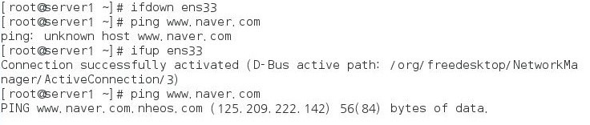
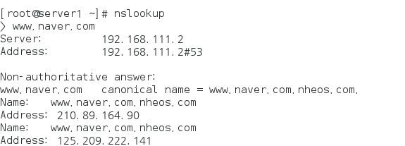
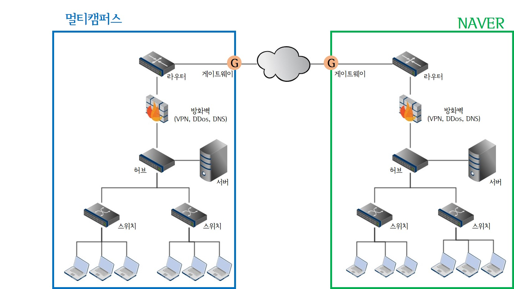

> day51 배운 내용 : CRON과 AT | 네트워크 관련 설정과 명령어 | 네트워크 구성도 | DB 서버 구축(Oracle)

## 1. CRON과 AT

### 1-1. CRON

- 주기적으로 반복되는 일을 자동으로 실행할 수 있도록 시스템 작업을 예약해 놓는 것

  → corn 관련 데몬(서비스) : crond & 관련 파일은 /etc/crontab에 위치

- `/etc/crontab`의 형식 :star:

```
분 시 일 월 요일 사용자 실행명령
```

> 분에는 0~59, 시에는 0~23, 일에는 1~31, 월에는 1~12, 요일에는 0~6이 올 수 있음(요일은 0부터 일요일)

- 명령어 예시

```
00 05 1 * * root cp -r /home /backup
```

▶ 매월 1일 5시에 사용자 root는 'home' 디렉토리를 'backup'으로 copy 하라 

> 명령를 실행 할 시간 / 명령을 실행 할 사용자 / 실행 할 명령어 

```
vi etc/crontab → 여기에 명령어 추가 (아래는 추가 할 내용)
10 11 24 * * root cp -r /home /backup
```

▶ 매월 24일 11시10분에 root는 'home' 디렉토리를 'backup' 디렉토리로 copy 하라

- `status crond` : crond의 상태를 체크함 → 'active(running)' 상태인지 확인

```
crond.service - Command Scheduler
   Loaded: loaded (/usr/lib/systemd/system/crond.service; enabled)
   Active: active (running) since 수 2019-07-24 19:08:44 KST; 8h left
 Main PID: 690 (crond)
   CGroup: /system.slice/crond.service
           └─690 /usr/sbin/crond -n
```

- `systemctl restart crond` : 설정 바뀌었으므로 재시작

-----------------------------------------------------------------------------------------------------------------------------------------------------------

- 주기적으로 실행 할 내용을 /etc/cron*/에 넣어 놓고 작동 가능

````
01 * * * * root run-parts /etc/cron.hourly
02 4 * * * root run-parts /etc/cron.daily
03 4 * * 0 root run-parts /etc/cron.weekly
42 4 1 * * root run-parts /etc/cron.monthly
````

▶ `run-parts` : 해당 디렉토리 안의 명령을 모두 실행

### 1-2. AT

- CRON은 주기적으로 반복 작업 ↔ AT은 일회성 작업 (예약해 놓으면 **한 번만** 실행되고 소멸)

```
// 예약 : at 시간
at 3:00am tomorrow → 내일 새벽3시
at 11:00pm January 30 → 1월30일 오후 11시
at not +1 housrs → 1시간 후

// 예약시간에 수행 할 명령어 입력
at> 프롬프트에 예약 명령어 입력 후 엔터

// 완료되면 Ctrl+D

// 예약확인
at -l

// 예약취소
atrm 작업번호
```

- AT을 이용한 명령어 예시

```
[root@server1 ~]# at 11:25 am today
at> cp -r /home /backup
at> reboot<EOT> → 여기까지 입력한 후, Ctrl+D
job 1 at Wed Jul 24 11:25:00 2019
```

> 오늘 11시25분 cp 작업이 일어난 후 reboot

- 예약된 작업 리스트 확인

```
[root@server1 ~]# at -l
1	Wed Jul 24 11:25:00 2019 a root
```

-----------------------------------------------------------------------------------------------------------------------------------------------------------

:alarm_clock: **실습 14 :** 매월 24일 오후 12시 30분에 '/home' 디렉토리와 그 하위 디렉토리를 '/backup'으로 백업

① server 실행 → cron과 관련 서비스인 'crond'가 동작하는지 확인

```
# systemctl status crond 

Active: active (running) since 수 2019-07-24 20:25:19 KST; 8h left // Active 상태
```

② 예약파일을 실행 후, 예약 명령어 입력

```
# gedit /etc/crontab → 예약 파일 열기

// 맨 아래에 명령어 추가
30 12 24 * * root run-parts /etc/cron.monthly
```

③ 메시지 출력 스크립트 파일 만든 후, 속성 실행 권한 설정

```
[root@server1 cron.monthly]# touch myBackup.sh
[root@server1 cron.monthly]# chmod 755 myBackup.sh
[root@server1 cron.monthly]# ls -l
합계 0
-rwxr-xr-x 1 root root 0  7월 24 11:34 myBackup.sh
```

④ `gedit myBackup.sh` 실행하고 내용 추가

```
#! /bin/sh

set $(data)
fname="backup-$2$3.tar.xz"

tar cfj /backup/$frame /home
```

> 현재 날짜를 추출해서 /backup에 'backup-현재날짜.tar.xz'라는 파일로 '/home' 전체의 백업 파일을 생성

⑤ 설정 변경되었으므로 서버 재시작

```
systemctl restart crond
```


## 2. 네트워크 관련 설정과 명령어

### 2-1. 네트워크 관련 필수 개념

- TCP/IP 

  - 컴퓨터끼리 네트워크상으로 의사소통을 하는 약속을 '프로토콜'이라고 함

    → 여러 프로토콜 중 가장 유명한 것이 'TCP/IP'

  - 통신의 전송/수신을 다루는 TCP(Transmission Control Protocol)와 

    데이터 통신을 다루는 IP(Internet Protocol)로 구성

- 호스트 이름과 도메인 이름

  - 호스트 이름(host name) : 컴퓨터에 지정된 이름 / 개발자 간 사용
  - 도메인 이름(domain name) : IP를 대신하여 사용하는 것으로 외부에서 누구나 알고 접근할 수 있도록 함

> 도메인 이름(또는 도메인 주소)는 hanb.co.kr과 같은 형식으로 표기하며 kr은 한국, co는 회사, hanb는 단체/회사의 이름 ∴ 호스트 이름이 this이고 도메인 이름이 hanbit.co.kr이면 'this.hanbit.co.kr'로 표기하며 유일함

- IP 주소 : 네트워크에 연결된 모든 컴퓨터의 고유한 주소
- 네트워크 주소 : 같은 네트워크에 속해 있는 공통 주소

- 브로드캐스트 주소 : 내부 네트워크의 모든 컴퓨터가 수신하는 주소 
- 게이트웨이 : 외부 네트워크로 나가는 통로
- DNS 서버 주소 : 인터넷 사용 시 URL을 해당 컴퓨터의 IP 주소로 변환해주는 서버 컴퓨터
- DHCP : IP 주소 자동 할당 → 컴퓨터를 켤 때마다 DNS 서버에서 새로운 IP 주소를 받아 동작

### 2-2. 네트워크 관련 명령어

> 리눅스에서는 네트워크 장치는 ens22 또는 ens33에서 관리

```
ifconfig ens32 또는 ens33 → 네트워크 설정 정보를 출력
ifup ens32 또는 ens33 → 네트워크 장치를 가동
ifdown ensew 또는 ens33 → 네트워크 장치를 정지
```



```
nslookup → domain의 IP 주소 확인 가능 / DNS 서버의 작동을 테스트 함
```



## 3. 네트워크 구성도

> 1. 현 자리에서 네이버 웹 서버와 연결하는 경로
> 2. 현 자리에서 옆 건물의 특정 PC와 Chatting을 할 때 네트워크 구성도



- 백본스위치(Backbone Switch) : 네트워크의 중심으로 방화벽, 워크그룹 스위치, 각종 서버가 접속하는 핵심 영역 → 많은 트래픽을 처리해야 하므로 고성능 필요 (여기서 신호가 분배) ∴ 라우터와 게이트웨이 근처 위치?
- DNS(Domain Name System) 서버 : 도메인의 이름을 네트워크 주소인 IP 주소로 변환하는 역할
- 라우터(Router) : 네트워크에서 데이터의 전달을 촉진하는 중계 장치 ∴ 데이터 전송을 위한 경로 지정(길잡이)
- 게이트웨이(Gateway) : 다른 네트워크로 들어가는 입구 역할


## 4. 데이터베이스 서버 구축

> **Linux 용** Oracle 11g express edition 다운로드

- file에 내 컴퓨터의 oracle 설치파일 복사&붙여넣기 → 압축해제(unzip)

```
unzip oracle-xe-11.2.0-1.0.x86_64.rpm.zip → 'Disk1' 생성
```

- swap 늘려주기 (가상 메모리 추가)

```
dd if=/dev/zero of=/swapfile bs=1024 count=4194304 → 가상 메모리용 파일 생성(4GB)
mkswap /swapfile → 파일을 가상 메모리로 포맷
swapon /swapfile → 가상 메모리 활성화
swapon -s → 가상 메모리 용량 확인
```

> dd 명령어의 옵션 중 if(Input File)은 지정한 파일을 입력 대상으로 하는 것 / of(Output File) / bs(Bytes)

- 생성한 가상 메모리 파일을 재부팅한 후에도 사용할 수 있도록 설정

```
[root@server1 Disk1]# cd /etc/rc.d/
[root@server1 rc.d]# ls -l rc.local
-rw-r--r--. 1 root root 477  6월 10  2014 rc.local
[root@server1 rc.d]# chmod 755 rc.local
[root@server1 rc.d]# ls -l rc.local
-rwxr-xr-x. 1 root root 477  6월 10  2014 rc.local
[root@server1 rc.d]# vi rc.local 
[root@server1 rc.d]# cat rc.local → 터미널에서 내용 확인 가능
#!/bin/bash
# THIS FILE IS ADDED FOR COMPATIBILITY PURPOSES
#
# It is highly advisable to create own systemd services or udev rules
# to run scripts during boot instead of using this file.
#
# In constrast to previous versions due to parallel execution during boot 
# this script will NOT be run after all other services.
#  
# Please note that you must run 'chmod +x /etc/rc.d/rc.local' to ensure
# that this script will be executed during boot.

touch /var/lock/subsys/local

swapon /swapfile → 이 라인의 내용 추가했음
```

- 재부팅한 후, 가상 메모리 용량을 확인

```
reboot
swapon -s
```

- Oracle Database Express 11g 설치하기

```
cd /root/file/Disk1 → HOME에서 패키지 파일이 위치한 디렉토리로 이동
ls -l → 패키지 파일 확인
yum -y localinstall oracle* → Oracle DB Express 11g 설치
```

> 설치 파일을 갖고 있으면 localinstall 사용 / 없으면 yum 서버에 접속하여 이용할 수 있도록 install 사용

- 설치 완료 후 환경 설정

```
[root@server1 Disk1]# service oracle-xe configure → 환경 설정

Specify the HTTP port that will be used for Oracle Application Express [8080]:y
Specify a port that will be used for the database listener [1521]: y
The password you entered contains invalid characters. Enter password: 111111
Confirm the password: 111111
Do you want Oracle Database 11g Express Edition to be started on boot (y/n) [y]:y

[root@server1 Disk1]# /etc/init.d/oracle-xe start → 서비스 시작
```

- Oracle 환경을 설정해 줌

```
. /u01/app/oracle/product/11.2.0/xe/bin/oracle_env.sh

gedit /etc/bashrc → 재부팅 후에도 계속 설정이 적용되도록 하기 위하여 실행
// 맨 아래에 추가하기 ↓
. /u01/app/oracle/product/11.2.0/xe/bin/oracle_env.sh
```

- `firewall-config` 명령어를 입력한 후, 8080과 1521 포트를 열어줌

- 웹 브라우저로 Oracle 접속 후 확인하기 

> Workspace : 'internal' / Username : 'admin' / Password : '111111'

