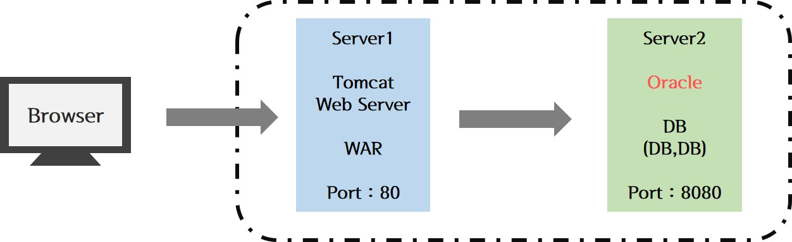
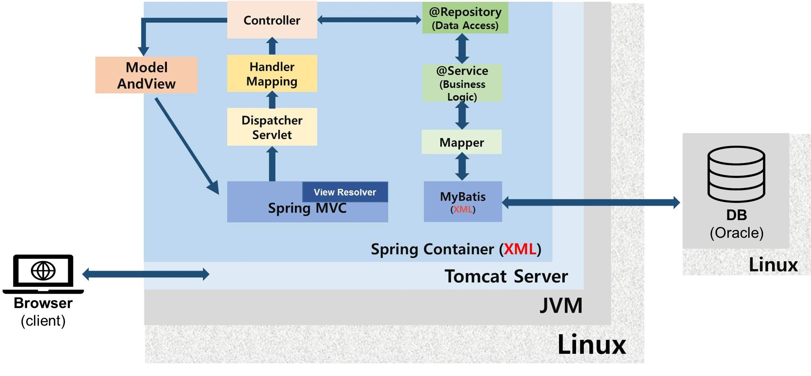
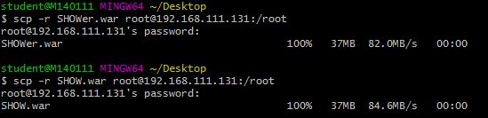

## Linux Final Workshop 

- **주제 :** 미니프로젝트('SHOWer')와 Linux 연동하여 Browser에서 접속하기

- **개요 :**

> Linux에서 war파일과 Tomcat, Oracle DB를 연동하여 실행 → Browser에서 접속하여 확인

- **시스템 구성도 :**

- **Linux 환경 구축하기 :**

① Linux (CentOS) 환경 세팅 후, JDK와 Tomcat 설치 → 이때 gnome 적용하지 않았음

② RAID1과 swap의 동작상태 확인

③ Tomcat의 동작상태 확인

④ eclipse에서 프로젝트를 WAR 파일로 export 하여 server1으로 전송 

⑤ server2의 Oracle DB 환경 구축 - table 생성 확인

⑥ Browser에서 server1의 IP 주소로 접속해보기 

