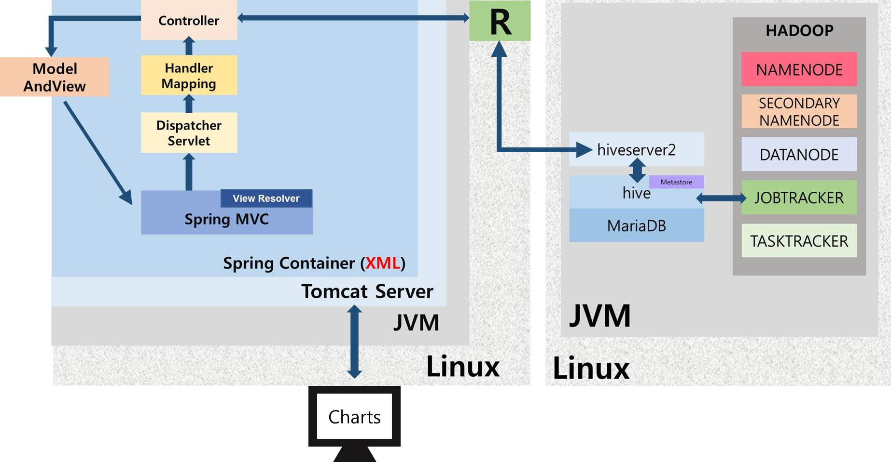
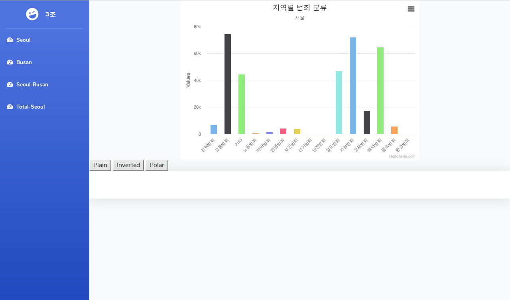
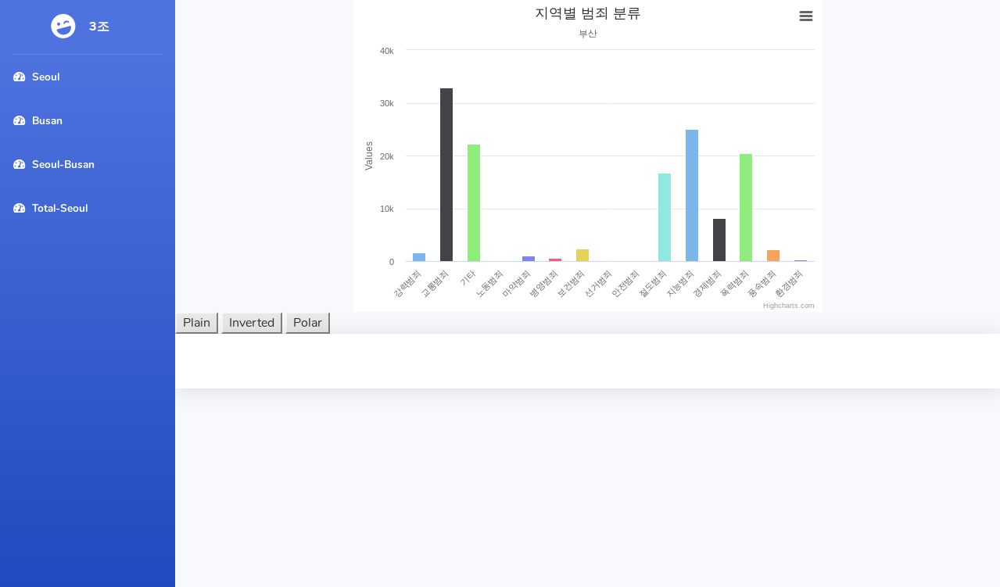
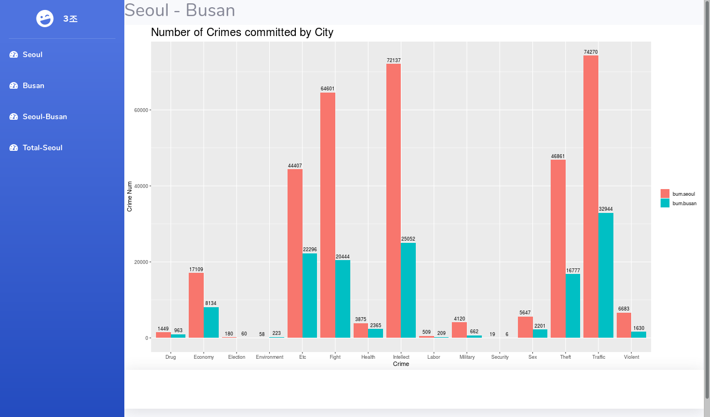
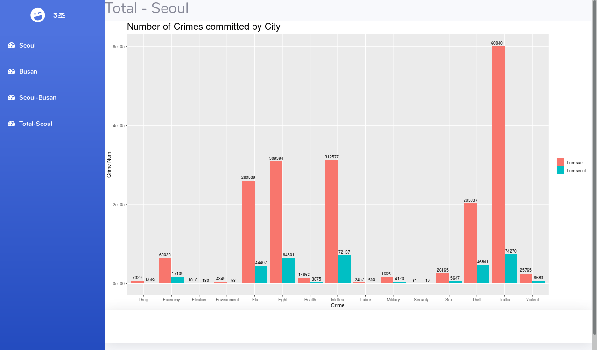

> day72 배운 내용 : 'Linux 환경에서 R을 활용한 데이터 분석' 프로젝트 진행

## 1. 프로젝트 소개

### 1-1. 시스템 구성도



### 1-2. 사용하는 데이터

발생하는 범죄를 종류와 지역 별로 분류한 데이터 사용 

:heavy_check_mark: 한 도시에서 발생하는 범죄를 종류 별로 분류하여 통계 → Highchart 활용

:heavy_check_mark: 도시 별 범죄 발생 건수를 비교하여 나타냄 → png 라이브러리 활용


## 2. 설치방법

### 2-1. 데이터를 분석하기 위한 시스템 구축 - R

R 설치 할 때 필요한 라이브러리 준비

```
yum -y install epel-release
```

/etc/yum.repos.d/ 에서 epel.repo 주석 수정

```
baseurl=http://~~~
#metalink=http://~~~
```

OS 업그레이드 → 이후 `reboot` 진행

```
yum -y upgrade
```

필요한 라이브러리 추가 설치 (update)

```
yum -y update lvm2
yum -y update device-mapper
```

R 설치하기

```
yum -y install R
```

Rstudio 설치

:heavy_check_mark: www.rstudio.com 에 접속하여 Rstudio.1.2.1335-Fedora19/RedHat(64-bit) 다운

:heavy_check_mark: 설치 후 `reboot` 진행하기

Rstudio 실행하기

```
Rstudio → 'centos'로 로그인 한 후, Rstudio 실행
```

R 서버 띄우기

```R
install.packages("Rserve") # console에 입력

library(Rserve)
Rserve(args="--RS-enable-remote -no-save")
```


### 2-2. 데이터를 저장하기 위한 시스템 구축 - Hadoop, Hive

> 하나의 장비(서버)에서 모든 환경을 설정하는 가상분산모드 구축

#### Hadoop 설치

:heavy_check_mark: Hadoop 설치

- setting에서 network는 'nat'으로 설정 ∵ IP를 할당 받기 위함
- firewall 설정 변경

```
systemctl stop firewalld
systemctl disable firewalld
```

- Hadoop 파일 다운 및 압축 풀기 (hadoop-1.2.1.tar.gz)

```
tar xvf hadoop-1.2.1.tar.gz → file 디렉토리에 있는 Hadoop 파일 압축 풀기
cp -r hadoop-1.2.1 /etc → 압축 푼 파일을 /etc/로 복사
```

- /etc/profile 파일에 환경변수 등록 → Tomcat 아래 부분에 추가

```
HADOOP_HOME=/etc/hadoop-1.2.1
export JAVA_HOME CLASSPATH TOMCAT_HOME HADOOP_HOME
PATH=.:$JAVA_HOME/bin:$TOMCAT_HOME/bin:$HADOOP_HOME/bin:$PATH
```

- hostname 변경한 후, /etc에 IP 주소와 hostname 추가 (ifcfg-ens33)

```
hostnamectl set-hostname rserver
```

:heavy_check_mark: SSH 설정

- private key와 public key 만듦

```
ssh-keygen -t dsa -P '' -f ~/.ssh/id_dsa 
```

- '.ssh'에 접속하여 public key 등록

```
cat id_dsa.pub >> authorized_keys
```

- 비밀번호 없이 로그인 가능 여부 확인

```
ssh rserver → 'rserver'는 우리가 설정한 hostname / exit로 로그아웃
```

:heavy_check_mark: Hadoop conf 설정

- /etc/hadoop-1.2.1/conf/core-site.xml

```xml
<configuration>
<property>
  <name>fs.default.name</name>
  <!-- HDFS의 기본 이름을 의미함 / URL 형태로 사용 -->
  <value>hdfs://localhost:9000</value>
</property>
<property>
  <name>hadoop.tmp.dir</name> 
  <!-- 임시 데이터 저장을 위한 공간 -->
  <value>/etc/hadoop-1.2.1/tmp</value>
</property>
</configuration>
```

- /etc/hadoop-1.2.1/conf/hdfs-site.xml

```xml
<configuration>
<property>
  <name>dfs.replication</name>
  <!-- HDFS의 저장될 데이터의 복제본 개수 -->
  <value>1</value>
</property>
<property>
  <name>dfs.name.dir</name>
  <value>/etc/hadoop-1.2.1/name</value>
</property>
<property>
  <name>dfs.data.dir</name>
  <value>/etc/hadoop-1.2.1/data</value>
</property>
<property>
  <name>dfs.webhdfs.enabled</name>
  <value>true</value>
</property>
</configuration>
```

- /etc/hadoop-1.2.1/conf/mapred-site.xml

```xml
<configuration>
<property>
  <name>mapred.job.tracker</name>
  <value>localhost:9001</value>
</property>
</configuration>
```

- /etc/hadoop-1.2.1/conf/hadoop-env.sh (9번 째 줄 수정)

```sh
export JAVA_HOME=/etc/jdk1.8
export HADOOP_HOME_WARN_SUPPRESS="TRUE" // 오류메세지 발생 방지
```

- /etc/bashre (맨 아래에 추가)

```
. /etc/hadoop-1.2.1/conf/hadoop-env.sh
```

- hadoop 포맷 후, `reboot` 하기

```
hadoop namenode -format
```

:heavy_check_mark: Hadoop 실행

- hadoop 시작

```
start-all.sh
jps
```

- hadoop 종료

```
stop-all.sh
```

-----------------------------------------------------------------------------------------------------------------------------------------------------------

#### Hive 설치

:heavy_check_mark: 필요한 파일 확인

- mysql : mariadb-java-client-1.3.5.jar

- hive : apache-hive-1.0.1-bin.tar.gz

:heavy_check_mark: Mysql에 hive 등록

- mysql로 바로 접속

```
mysql -u root -p mysql
```

- localhost에 접속하는 모든 hive에게 권한 부여

```
grant all privileges on *.* to 'hive'@'localhost' identified by '111111';
flush privileges;
```

- hive_db 만들고, hive에게 모든 권한 부여

```
create database hive_db → 'hive_db'라는 database 만듦

grant all privileges on hive_db.* to 'hive'@'%' identified by '111111' with grant option;
grant all privileges on hive_db.* to 'hive'@'localhost' identified by '111111' with grant option; → 권한 부여

flush privileges;

commit;
```

- hive로 접속하기

```
mysql -u hive -p hive_db
```

:heavy_check_mark: hive 세팅

- hive 압축을 푼 후, 이름을 변경하여 /etc로 옮김

```
tar xvf apache-hive-1.0.1-bin.tar.gz → 압축해제
mv apachehive-1.0.1-bin hive → mv 명령어로 이름 변경
cp -r hive /etc → /etc로 hive 디렉토리 이동 (디렉토리 이동할 때 '-r' 사용)
```

- /etc/profile 수정

```
HIVE_HOME=/etc/hive
export JAVA_HOME CLASSPATH TOMCAT_HOME HADOOP_HOME HADOOP_HOME
PATH=.:$JAVA_HOME/bin:$TOMCAT_HOME/bin:$HADOOP_HOME/bin:$HIVE_HOME/bin:$PATH
```

- /etc/hive/conf에 hive-site.xml 생성
- `reboot` 진행 한 후, mysql 확인하고 hadoop 시작

```
ps -ef | grep mysql
start-all.sh 
```

- /etc/hive/lib에 jdbc driver 복사

```
cp mariadb-java-client-1.3.5.jar /etc/hive/lib/
```

:heavy_check_mark: Hadoop과 Hive 연동하기

- Hadoop에 Hive가 활동 할 디렉토리 만듦

```
hadoop dfs -mkdir /tmp
hadoop dfs -mkdir /user/hive/warehouse
```

- write 할 수 있도록 권한 수정

```
hadoop dfs -chmod g+w /tmp
hadoop dfs -chmod g+w /user/hive/warehouse
```

- /tmp/hive 권한 주기

```
hadoop dfs -chmod 777 /tmp/hive
```

- hive 실행


## 3. 실습 코드

### 3-1. R

rhive 함수

```r
rhive <- function(){
  # RJDBC와 rJava 두 가지 패키지 install  
  library(RJDBC);	
  library(DBI);
  library(rJava);
  hive_lib <- '/home/centos/R/x86_64-redhat-linux-gnu-library/3.6/java_hive_lib'; 
  
  # jar들 메모리에 올리는 과정
  .jinit();
  .jaddClassPath(dir(hive_lib,full.names = T));
  .jclassPath(); 
  
  # JDBC 드라이버 로딩 및 Connection 만듦
  drv=JDBC(driverClass='org.apache.hive.jdbc.HiveDriver',
           'hive-jdbc-1.0.1.jar');
  conn=dbConnect(drv,"jdbc:hive2://70.12.114.240:10000/default",
                 "root","111111");
    
  # 데이터 가져오기
  user=dbGetQuery(conn,"select hdi.country, hdi.hdi from hdi limit 10");
    
  # Connection Close
  dbDisconnect(conn);
    
  return (user);
}
```

rhive_bum 함수

```r
rhive_bum <- function(){
  # RJDBC와 rJava 두 가지 패키지 install 
  library(RJDBC);
  library(DBI);
  library(rJava);
  hive_lib <- '/home/centos/R/x86_64-redhat-linux-gnu-library/3.6/java_hive_lib';
    
  # jar들 메모리에 올리는 과정
  .jinit();
  .jaddClassPath(dir(hive_lib,full.names = T));
  .jclassPath(); 
    
  # JDBC 드라이버 로딩 및 Connection 만듦
  drv=JDBC(driverClass='org.apache.hive.jdbc.HiveDriver',
           'hive-jdbc-1.0.1.jar');
  conn=dbConnect(drv,"jdbc:hive2://70.12.114.240:10000/default",
                 "root","111111");
  
  # 데이터 가져오기
  bum_data_raw <<- dbGetQuery(conn,"select * from BUM");
    
  # Connection Close  
  dbDisconnect(conn);
    
  return (bum_data_raw); 
}
```

graph1 함수

```r
graph1 <- function(){
  # sql과 차트를 차용하기 위한 패키지 install  
  library(sqldf)
  library(ggplot2)
  library(dplyr)
  library(reshape2)
    
  rhive_bum()
    
  # seoul - busan
  bum_data1 <- sqldf('select "bum.crime", "bum.seoul", "bum.Busan" from bum_data_raw')
  bum_data1 <- bum_data1[order(bum_data_raw$bum.seoul ,decreasing=T),]
  bum_data1 <- bum_data1[1:15,]
  
  # 두 가지 데이터를 출력하기 위함
  m_bum_data1 <- melt(bum_data1, id="bum.crime")
    
  colnames(m_bum_data1) <- c("Crime","City","Num")
  
  # R 분석을 통하여 생성된 차트를 아래 위치에 PNG로 저장  
  png("/home/centos/rminipjt/tomcat/webapps/SB.png",width=1042,height=622)
  png("/home/centos/rminipjt/tomcat/webapps/mini/imgs/SB.png",width=1042,height=622)
    
  # 차트 출력  
  print(ggplot(m_bum_data1, aes(x=Crime, y=Num, fill=City)) +
    geom_bar(stat = "identity", position = "dodge") +
    ggtitle("Number of Crimes committed by City") +
    theme(plot.title = element_text(size=20)) +
    theme(legend.title = element_blank()) +
    ylab("Crime Num") +
    geom_text(aes(label=Num), vjust=-0.5,position=position_dodge(.9),size=3)
    )
    
  dev.off()
}
```

graph2 함수

```r
graph2 <- function(){
  # sql과 차트를 차용하기 위한 패키지 install  
  library(sqldf)
  library(ggplot2)
  library(dplyr)
  library(reshape2)
    
  rhive_bum()
    
  # total - seoul 
  bum_data2 <- sqldf('select "bum.crime", "bum.sum" ,"bum.seoul" from bum_data_raw')
  bum_data2 <- bum_data2[order(bum_data_raw$bum.sum ,decreasing=T),]
  bum_data2 <- bum_data2[1:15,]
    
  # 두 가지 데이터를 출력하기 위함  
  m_bum_data2 <- melt(bum_data2, id="bum.crime")
    
  colnames(m_bum_data2) <- c("Crime","City","Num")
  
  # R 분석을 통하여 생성된 차트를 아래 위치에 PNG로 저장  
  png("/home/centos/rminipjt/tomcat/webapps/TS.png",width=1042,height=622)
  png("/home/centos/rminipjt/tomcat/webapps/mini/imgs/TS.png",width=1042,height=622)
    
  # 차트 출력    
  print(ggplot(m_bum_data2, aes(x=Crime, y=Num, fill=City)) +
          geom_bar(stat = "identity", position = "dodge") +
          ggtitle("Number of Crimes committed by City") +
          theme(plot.title = element_text(size=20)) +
          theme(legend.title = element_blank()) +
          ylab("Crime Num") +
          geom_text(aes(label=Num), vjust=-0.5,position=position_dodge(.9),size=3)
  )
    
  dev.off()
}
```


### 3-2. Java

[실습코드 보러가기 ](https://github.com/xuansohx/TIL/tree/master/%EC%8B%A4%EC%8A%B5%EC%BD%94%EB%93%9C/R/day72_RProject)


## 4. 프로젝트 결과

서울에서 발생한 범죄 종류 별 통계 - highchart 활용



부산에서 발생한 범죄 종류 별 통계 - highchart 활용



서울과 부산의 범죄 발생 건수 비교 - png 라이브러리 활용



전체 도시와 서울의 범죄 발생 건수 비교 - png 라이브러리 활용

