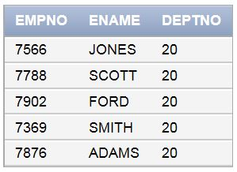
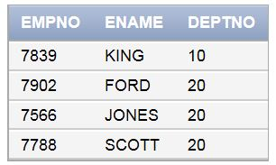
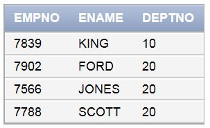

### 1. 집합 함수

####  `WHERE`과 `HAVING` 차이점 정확히 알기

[ 문제 1 ] JOB 별 월급의 평균을 구하시오

```sql
SELECT JOB, AVG(SAL) FROM EMP
GROUP BY JOB;
```

[ 문제 2 ] JOB 별 중에서 E가 들어간 JOB만 조회 하시오 → 그룹화 되어진 JOB의 조건 = `HAVING`

```SQL
SELECT JOB, AVG(SAL) FROM EMP
GROUP BY JOB
HAVING JOB LIKE '%E%';
```

[ 문제 3 ] JOB 별 월급의 평균을 구하시오

단, DEPTNO가 10,20인 직원들을 대항으로 하시오

```SQL
SELECT JOB, AVG(SAL) FROM EMP
WHERE DEPTNO IN (10,20)
GROUP BY JOB;
```

[ 문제 4 ] DEPTNO 별 JOB 별 월급의 평균을 구하시오

단, 이름에 A가 들어간 직원들을 대상으로 하시고 DEPTNO 20,30인 부서들을 대상으로 하시오

또한 월급의 평균이 1000 이상인 것을 대상으로 하시오

```SQL
SELECT DEPTNO, JOB, AVG(SAL) FROM EMP
WHERE ENAME LIKE '%A%' AND COMM IS NULL 
-- COMM은 그룹화 되어있지 않으므로 WHERE에 조건 추가
GROUP BY DEPTNO, JOB
HAVING DEPTNO IN (20,30) AND AVG(SAL)>=1000
ORDER BY DEPTNO;
```

[ 문제 5 ] 연도별 입사자의 월급의 평균을 구하시오

```sql
SELECT TO_CHAR(HIREDATE,'YYYY') AS YEAR, AVG(SAL) FROM EMP
GROUP BY TO_CHAR(HIREDATE,'YYYY')
ORDER BY YEAR;
```

[ 문제 6 ] 연도별 입사자 중 매니저들의 월급의 평균을 구하시오

```sql
SELECT TO_CHAR(HIREDATE,'YYYY') AS YEAR, AVG(SAL) FROM EMP
WHERE JOB IN ('MANAGER') -- WHERE의 위치와 쓰임 잘 보기
GROUP BY TO_CHAR(HIREDATE,'YYYY')
ORDER BY YEAR;
```

### 2. 뷰(view) 

▶ 부서 별 월급의 평균을 조회하는 VIEW를 작성하시오

```sql
CREATE VIEW DEPTSAL(DEPTNO,SALAVG) -- SALAVG에는 내가 연산한 결과가 출력됨
AS
SELECT DEPTNO, AVG(SAL) FROM EMP -- 부서별 월급의 평균 구하기
GROUP BY DEPTNO;

SELECT * FROM DEPTSAL; -- DEPTSAL만 조회해도 위의 연산이 출력됨

CREATE VIEW ORACLE(TOTALAVG)
AS
SELECT AVG(SALAVG) FROM DEPTSAL; -- 뷰 두 개 만들기도 가능
```

### 3. 상관 서브쿼리 

▶ SCOTT이 소속된 부서의 매니저들의 EMPNO, ENAME, DEPTNO를 조회하시오 

```SQL
SELECT EMPNO, ENAME, DEPTNO FROM EMP
WHERE DEPTNO = (SELECT DEPTNO FROM EMP WHERE ENAME = 'SCOTT');
-- 다시 확인해보기 (오답)
```

( 결과 )



```sql
SELECT EMPNO, ENAME, DEPTNO FROM EMP 
WHERE EMPNO IN(
SELECT MGR FROM EMP
WHERE DEPTNO = 
(SELECT DEPTNO FROM EMP WHERE ENAME = 'SCOTT'));
```

( 결과 )



```sql
SELECT EMPNO, ENAME, DEPTNO FROM EMP e1
WHERE EMPNO IN(
SELECT MGR FROM EMP e2
WHERE DEPTNO =
(SELECT DEPTNO FROM EMP WHERE ENAME = 'SCOTT')
AND e1.EMPNO = e2.MGR
);
```

( 결과 )



### 4. 종합 문제

▶ 지역 별 입사 일이 가장 늦은 사원의 정보를 출력하시오 (LOC, ENAME, HIREDATE)

```SQL
SELECT d.LOC, e.ENAME, e.HIREDATE FROM EMP e, DEPT d
WHERE e.DEPTNO = d.DEPTNO -- JOIN
AND e.HIREDATE >= (
SELECT MAX(e2.HIREDATE) FROM EMP e2, DEPT d2 -- 비교대상
WHERE e2.DEPTNO = d2.DEPTNO
AND d.LOC = d2.LOC -- 지역 내 가장 늦은 입사자를 찾아야하므로 같은 지역인지 확인
GROUP BY d.LOC -- 지역 별 입사 일이므로 지역으로 그룹화
)
```

