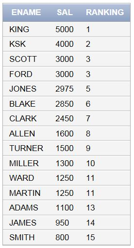
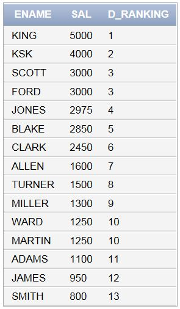
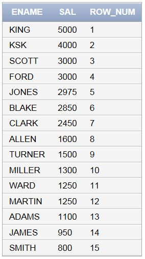
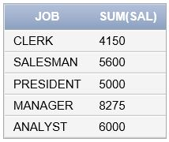

> day18 배운 내용 :  day16 복습 문제 | EXISTS 술어 | 집합 연산(UNION, JOIN) | 윈도우함수(순위) | ROLLUP

-----------------------------------------------------------------------------------------------------------------------------------------------------

[ 복습 문제 1 ] - 상관서브쿼리

내가 속한 각 부서 별 월급 중 평균 이상으로 받는 직원들을 조회하시오

```sql
SELECT ENAME, SAL FROM EMP e1 -- 나의 정보 조회
WHERE SAL > (
SELECT AVG(SAL) FROM EMP e2
WHERE e1.DEPTNO = e2.DEPTNO -- 내가 속한 각 부서    
GROUP BY DEPTNO -- 부서로 그룹화
);
```

[ 복습 문제 2 ] - 상관서브쿼리

내가 속한 각 부서 별 월급 중 가장 많이 받는 직원들을 조회하시오

```sql
SELECT DEPTNO, ENAME, SAL FROM EMP e1 -- 나의 정보 조회
WHERE SAL >= (
SELECT MAX(SAL) FROM EMP e2
WHERE e1.DEPTNO = e2.DEPTNO -- 내가 속한 각 부서    
GROUP BY DEPTNO -- 부서로 그룹화
);
```

[ 복습 문제 3 ] - 상관서브쿼리 & Join

내가 속한 각 부서 별 월급 중 가장 많이 받는 직원들을 조회하시오 (단, 부서명과 지역을 출력)

```sql
SELECT e1.DEPTNO, e1.ENAME, e1.SAL, d.DNAME, d.LOC FROM EMP e1, DEPT d -- 나의 정보 조회
WHERE e1.DEPTNO = d.DEPTNO -- Join
AND SAL >= (
SELECT MAX(SAL) FROM EMP e2
WHERE e1.DEPTNO = e2.DEPTNO -- 내가 속한 각 부서    
GROUP BY DEPTNO -- 부서로 그룹화
);
```

-----------------------------------------------------------------------------------------------------------------------------------------------------

### 1. EXISTS 술어

> EXISTS의 조건이 'TRUE'일 때만 다음 라인 조회

> EXISTS는 항상 상관 서브쿼리를 인수로 가짐 → SELECT를 사용함

▶ DALLAS에 있는 직원의 정보를 조회하시오

```SQL
-- EXISTS 사용하지 않고 IN  사용한 경우
SELECT e1.DEPTNO, e1.ENAME, e1.SAL, d.DNAME, d.LOC FROM EMP e1, DEPT d 
WHERE e1.DEPTNO = d.DEPTNO 
AND e1.DEPTNO IN (
SELECT DEPTNO FROM DEPT
WHERE LOC = 'DALLAS');
```

```sql
-- EXISTS의 잘못된 사용의 예
SELECT e1.DEPTNO, e1.ENAME, e1.SAL, d.DNAME, d.LOC FROM EMP e1, DEPT d 
WHERE e1.DEPTNO = d.DEPTNO -- Join
AND EXISTS ( -- EXISTS 쓰려면 상관 서브쿼리 사용해야 됨
SELECT DEPTNO FROM EMP 
WHERE LOC = 'DALLAS');
```

```sql
-- EXISTS 사용한 경우 → 반드시 SELECT와 상관 서브쿼리 사용하기
SELECT e1.DEPTNO, e1.ENAME, e1.SAL, d.DNAME, d.LOC FROM EMP e1, DEPT d 
WHERE e1.DEPTNO = d.DEPTNO 
AND EXISTS (
SELECT d2.DEPTNO FROM DEPT d2, EMP e2
WHERE d2.DEPTNO = e2.DEPTNO
AND LOC = 'DALLAS'
AND e1.DEPTNO = e2.DEPTNO);
```


▶ MANAGER인 직원을 조회하시오

```sql
SELECT ENAME, JOB FROM EMP
WHERE JOB = 'MANAGER';
```

▶ JONES가 속한 JOB의 직원을 조회하시오

```sql
SELECT ENAME, JOB FROM EMP
WHERE JOB IN (
SELECT JOB FROM EMP
WHERE ENAME = 'JONES'
);
```

```sql
-- EXISTS 사용 (+상관 서브쿼리)
SELECT ENAME, JOB FROM EMP e1
WHERE EXISTS (
SELECT JOB FROM EMP e2
WHERE ENAME = 'JONES'
AND e1.JOB = e2.JOB
);
```

▶   Join 활용하여 응용하기 → 직원의 부서명과 지역까지 출력

```sql
SELECT e1.ENAME, e1.JOB, d.DNAME, d.LOC FROM EMP e1, DEPT d
WHERE EXISTS (
SELECT JOB FROM EMP e2
WHERE ENAME = 'JONES'
AND e1.JOB = e2.JOB
);
```


### 2. 집합 연산

> 집합 연산이란 레코드끼리 더하거나 빼는 레코드 사칙연산

> 집합 연산자는 중복행을 제외함 → 중복행을 포함하려면 ALL 옵션을 사용

#### 2-1. `UNION` : 테이블 덧셈

▶ MANAGER와 SALES 직원들의 이름과 JOB을 조회하시오

```sql
SELECT ENAME, JOB FROM EMP 
WHERE JOB = 'MANAGER'
UNION
SELECT ENAME, JOB FROM EMP
WHERE JOB = 'SALESMAN'
ORDER BY JOB; -- 여기서 ORDER BY는 전체를 정렬하는 것
```

```sql
SELECT ENAME, JOB FROM EMP 
WHERE JOB = 'MANAGER'
UNION -- 덧셈 대상이 되는 레코드의 열은 같은 데이터형이여야 함
SELECT ENAME, TO_CHAR(HIREDATE, 'YYYY/MM/DD') FROM EMP
WHERE JOB = 'SALESMAN'
ORDER BY JOB;
```

- `UNION ALL` : 중복된 행도 모두 포함하여 출력

- `UNION` 대신 `INTERSECT`를 사용하면 공통 부분인 '교집합'이 출력

- `EXCEPT` : 첫 번째 레코드에서 두 번째 레코드를 빼고 남은 부분이 선택되어 출력

#### 2-2. `JOIN` : 결합

> 다른 테이블에서 열을 가지고 와서 '열을 늘리는' 처리 → 복수의 테이블에서 원하는 데이터 선택

- `INNER JOIN` : 내부 결합 → 내부 결합에서 `ON`구는 필수!

```SQL
-- Oracle용
SELECT e.NAME, d.LOC FROM EMP e, DEPT d
WHERE e.DEPTNO = d.DEPTNO -- PRIMARY KEY와 FORIEGN KEY
AND e.JOB = 'MANAGER'
AND d.LOC = 'CHICAGO'; -- 조건부여

-- ANSI표준
SELECT e.ENAME, d.LOC FROM
EMP e INNER JOIN DEPT d
ON (e.DEPTNO = d.DEPTNO) -- ON은 걸합 조건 전용 WHERE / 반드시 사용하기
WHERE e.JOB = 'MANAGER'
AND d.LOC = 'CHICAGO'; -- 조건부여
```

```sql
SELECT e.ENAME, d.LOC FROM EMP e 
INNER JOIN DEPT d 
USING (DEPTNO); -- ON 대신 USING을 사용해도 됨
```


▶ `VIEW`를 활용하여 테이블 생성 후,  Join으로 필요한 데이터 불러와 조회하기

> `VIEW` : 물리적인 테이블이 만들어지는 것이 아니라 필요 시에 불러오기 위함

```sql
-- VIEW로 세 개의 테이블 만듦
CREATE VIEW T_EMP (ENO,ENM,SAL,DNO) 
AS (
SELECT EMPNO, ENAME, SAL, DEPTNO FROM EMP
);

CREATE VIEW T_DEPT (DNO,DNM,LOC)
AS (
SELECT DEPTNO, DNAME, LOC FROM DEPT
);

CREATE VIEW T_SAL (ENO,ASAL)
AS (
SELECT EMPNO, (SAL*12)+(NVL(COMM,0)*12) FROM EMP
);
```

```sql
-- 직원 정보를 조회 (ENO, ENM, SAL, ASAL, DNM, LOC)
-- Oracle용
SELECT e.ENO, e.ENM, e.SAL, a.ASAL, d.DNM, d.LOC FROM T_EMP e, T_SAL a, T_DEPT d
WHERE e.DNO = d.DNO
AND e.ENO = a.ENO;

-- ANSI표준
SELECT e.ENO, e.ENM, e.SAL, a.ASAL, d.DNM, d.LOC 
FROM T_EMP e INNER JOIN T_DEPT d ON (e.DNO = d.DNO)
INNER JOIN T_SAL a ON (e.ENO = a.ENO);
```

```sql
-- JONES 부서원만 조회하시오
SELECT e.ENO, e.ENM, e.SAL, a.ASAL, d.DNM, d.LOC 
FROM T_EMP e, T_SAL a, T_DEPT d
WHERE e.DNO = d.DNO
AND e.ENO = a.ENO
AND e.DNO IN (
SELECT DNO FROM T_EMP WHERE ENM = 'JONES');

-- 부서 별 연봉의 평균을 구하시오
SELECT e.ENO, e.ENM, e.SAL, a.ASAL, d.DNM, d.LOC 
FROM T_EMP e, T_SAL a, T_DEPT d
WHERE e.DNO = d.DNO
AND e.ENO = a.ENO
AND a.ASAL >= (
SELECT AVG(s1.ASAL) FROM T_EMP e1, T_SAL s1
WHERE e1.ENO = s1.ENO -- 부서 별 연봉 평균
AND e.DNO = e1.DNO -- 자기 자신에 대한 정보
GROUP BY (e1.DNO) 
);
```


▶ 직원의 정보를 출력하시오 (EMPNO, ENAME, MNAME을 출력)

```sql
-- 매니저 이름 출력하려면 self-join 이용함
SELECT e1.EMPNO AS EMPNO, 
       e1.ENAME AS ENAME,
       e2.ENAME AS MNAME -- self-join
FROM EMP e1, EMP e2
WHERE e1.MGR = e2.EMPNO;
```

-----------------------------------------------------------------------------------------------------------------------------------------------------------

- `OUTER JOIN` : 외부 결합 

```sql
-- 데이터 넣기
INSERT INTO EMP VALUES
(8888,'KSK','SALESMAN',7839,TO_DATE('2019/06/01','yyyy/MM/DD'),4000,100,NULL);
/* DEPT가 아직 없으므로 'NULL'로 표기
   TO_CHAR은 꺼낼 때, TO_DATE는 데이터 넣을 때 */
```

Oracle용

```SQL
SELECT e.ENAME, e.JOB, d.DNAME, d.LOC 
FROM EMP e, DEPT d 
WHERE e.DEPTNO = d.DEPTNO(+); 
-- 우측에 (+)하면 좌측에 없는 값 출력

SELECT e.ENAME, e.JOB, d.DNAME, d.LOC 
FROM EMP e, DEPT d 
WHERE e.DEPTNO(+) = d.DEPTNO;
/* 좌측에 (+)하면 우측에 없는 값 출력
   양 쪽 (+)는 할 수 없음 */
```

ANSI표준

```sql
SELECT e.ENAME, e.JOB, d.DNAME, d.LOC
FROM EMP e LEFT OUTER JOIN DEPT d USING(DEPTNO);
-- EMP 기준

SELECT e.ENAME, e.JOB, d.DNAME, d.LOC
FROM EMP e RIGHT OUTER JOIN DEPT d USING(DEPTNO);
-- DEPT 기준

SELECT e.ENAME, e.JOB, d.DNAME, d.LOC
FROM EMP e FULL OUTER JOIN DEPT d USING(DEPTNO);
-- 양 쪽 다 출력
```


## 3. 윈도우 함수

> 윈도우 함수는 랭킹, 순번 생성 등 일반 집약 함수로는 불가능한 고급처리를 수행

- `RANK` 함수

```sql
SELECT ENAME, SAL, 
RANK() OVER(ORDER BY SAL DESC) AS RANKING
FROM EMP
ORDER BY SAL DESC;
```

> 같은 순위인 레코드가 복수 존재하면 후순위를 건너뜀
>
> EX) 1위가 3개인 레코드인 경우 : 1위, 1위, 1위, 4위...



- `DENSE_RANK`함수

```sql
SELECT ENAME, SAL, 
DENSE_RANK() OVER(ORDER BY SAL DESC) AS D_RANKING
FROM EMP
ORDER BY SAL DESC;
```

> 랭킹을 산출하지만 같은 순위의 레코드가 복수 존재해도 후순위를 건너뛰지 않음
>
> EX) 1위가 3개인 레코드인 경우 : 1위, 1위, 1위, 2위...



- `ROW_NUMBER` 함수

```SQL
SELECT ENAME, SAL, 
ROW_NUMBER() OVER(ORDER BY SAL DESC) AS ROW_NUM
FROM EMP
ORDER BY SAL DESC; 
```

> 순위에 상관없이 연속 번호를 부여
>
> EX) 1위가 3개인 레코드인 경우 : 1위, 2위, 3위, 4위...



▶ 상위 1위부터 5위까지 출력

```sql
SELECT ENAME, SAL, ROW_NUM FROM (
SELECT ENAME, SAL,
ROW_NUMBER() OVER (ORDER BY SAL DESC) AS ROW_NUM
FROM EMP
)
WHERE ROW_NUM <= 5;

-- 전체 인원 수 추가하기
SELECT ENAME, SAL, RANK, 
(SELECT COUNT(*) FROM EMP)AS TOTAL
FROM (
SELECT ENAME, SAL,
RANK() OVER (ORDER BY SAL DESC) AS RANK
FROM EMP
)
WHERE RANK <= 5;

-- 월급의 평균 추가하기
SELECT ENAME, SAL, 
ROUND((SELECT AVG(SAL) FROM EMP),2) AS ASAL,
RANK, 
(SELECT COUNT(*) FROM EMP)AS TOTAL
FROM (
SELECT ENAME, SAL,
RANK() OVER (ORDER BY SAL DESC) AS RANK
FROM EMP
)
WHERE RANK <= 5; -- 서브쿼리 이용하면 됨
```


## 4. ROLLUP

> `GROUP BY`구와 함께 사용되며, 합계와 소계를 한 번에 구할 수 있음

▶ JOB 별 SAL의 합계 구하기

```SQL
SELECT JOB, SUM(SAL) FROM EMP
GROUP BY JOB;
```



▶ ROLLUP 사용하여 합계 구하기 

```sql
SELECT JOB, SUM(SAL) FROM EMP
GROUP BY ROLLUP(JOB);
```

.JPG)

: 합계의 소계가 함께 출력되는 것 확인할 수 있음