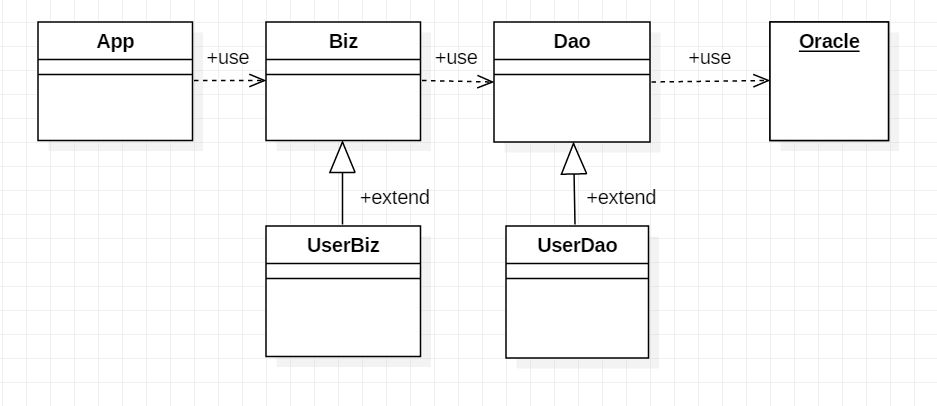
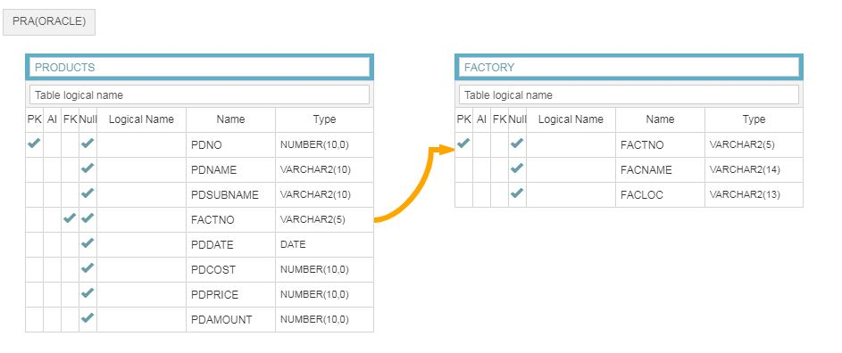
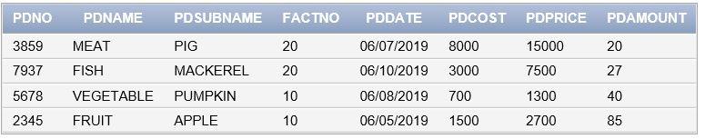
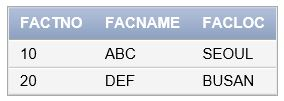
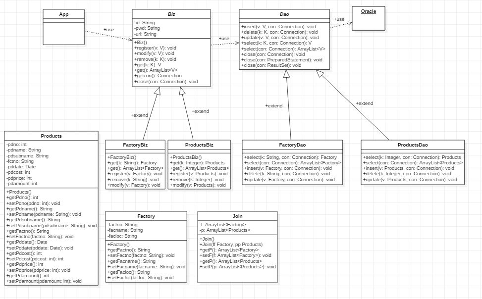

> day19 배운 내용 : 데이터베이스 구조 | 데이터베이스연동(JDBC) 팀별 workshop 진행

## 1. 데이터베이스 구조



▶ App과 Oracle 사이에 Biz와 Dao를 추가하여 데이터베이스를 관리함 : 데이터 유지보수관리가 용이함

① **App** : 사용자 요청정보를 받아서 Biz에 전달하고 처리 결과를 보여줌 / 실제 User data 입력 받음

② **Biz** : 

- 실제 데이터에 대한 삽입, 삭제, 수정, 조회 등 공통된 작업을 수행하는 추상클래스

- 전달된 데이터를 로직에 의하여 처리하고 결과를 반환

- Dao에서 담당한 CRUD 작업의 성공 여부에 따른 최종 COMMIT과 ROLLBACK을 수행

  → 이 과정을 거쳐 데이터 검증과 보안을 가능하도록 함 (transaction)

③ **Dao** : 

- Biz에서 전달 된 파라미터를 기반으로 DB에 CRUD 작업을 실행

  > Create (insert) | Read (select) | Update (update) | Delete (delete)

- 최종 transaction 처리는 Biz에 위임 시키고, 처리 결과만 Biz에 전달

- 작업 중 Exception이 발생하면 처리하지 않고, 초기화 된 데이터를 Biz에 전달

  ex) 결제정보와 배송정보가 모두 완료가 되어야 구매가 완료 / 둘 중 하나라도 빠지면 구매가 완료되지 않음

## 2. workshop 

▶ 워크북 124쪽을 참고하여 DATABASE를 만든 후, 데이터를 관리하는 개발 환경인 JDBC 시스템 구축하기

> **JDBC** (Java DataBase Connectivity) : 자바 프로그램 내에서 SQL을 실행하기 위해 데이터베이스를 연결해주는 응용프로그램 인터페이스 →  JAVA에서 DB(Oracle)에 접근하여 데이터를 조회, 삽입, 수정, 삭제 할 수 있음

#### 2-1. 사용 할 테이블

PRODUCTS Table

|     설명     |   컬럼    |     타입     | 제약조건 | 참조테이블/컬럼 |
| :----------: | :-------: | :----------: | :------: | :-------------: |
|   제품번호   |   PDNO    |    NUMBER    |    PK    |                 |
| 제품카테고리 |  PDNAME   | VARCHAR2(10) |          |                 |
|    제품명    | PDSUBNAME | VARCHAR2(10) |          |                 |
|   공장번호   |  FACTNO   | VARCHAR2(10) |    FK    | FACTORY/FACTNO  |
|  제품생산일  |  PDDATE   |     DATE     |          |                 |
|   제품원가   |  PDCOST   |    NUMBER    |          |                 |
|   제품가격   |  PDPRICE  |    NUMBER    |          |                 |
|   재고수량   | PDAMOUNT  |    NUMBER    |          |                 |

FACTORY Table

|   설명   |  컬럼   |     타입     | 제약조건 | 참조테이블/컬럼 |
| :------: | :-----: | :----------: | :------: | :-------------: |
| 공장번호 | FACTNO  | VARCHAR2(5)  |    PK    |                 |
|  공장명  | FACNAME | VARCHAR2(14) |          |                 |
| 공장위치 | FACLOC  | VARCHAR2(13) |          |                 |

#### 2-2. ERD 

> ERD(Entity Relation Diagrom) : 테이블 간의 연관 관계를 나타낸 그림 → 데이터 베이스 구조



#### 2-3. DATABASE 구축 (DDL, DML)

> DDL(데이터정의언어) : `CREATE` `DROP` `ALTER` 
>
> DML(데이터조작언어) : `SELECT` `INSERT` `DELETE` `UPDATE`

##### ① TABLE 생성

PRODUCTS

```sql
CREATE TABLE PRODUCTS(
PDNO NUMBER(10,0),
PDNAME VARCHAR2(10),
PDSUBNAME VARCHAR2(10),
FACTNO VARCHAR2(5),
PDDATE DATE,
PDCOST NUMBER(10,0),
PDPRICE NUMBER(10,0),
PDAMOUNT NUMBER(10,0)
);
```

FACTORY

```SQL
CREATE TABLE FACTORY(
FACTNO VARCHAR2(5),
FACNAME VARCHAR2(14),
FACLOC VARCHAR2(13)
);
```

##### ② 제약조건(PK, FK) 설정 

> `PRIMARY KEY` : 해당 필드가 NOT NULL과 **UNIQUE** 제약 조건의 특징을 가짐 → NULL 값과 중복된 값을 가질 수 없게 됨

> `FOREIGN KEY` : 한 테이블을 다른 테이블과 연결해주는 역할 (의존)
>
> → 참조되는 테이블은 반드시 UNIQUE나 PRIMARY KEY 설정

```SQL
ALTER TABLE PRODUCTS ADD PRIMARY KEY(PDNO);
ALTER TABLE FACTORY ADD PRIMARY KEY(FACTNO);
-- 해당 데이터가 고유의 값을 갖도록 함

ALTER TABLE PRODUCTS ADD FOREIGN KEY(FACTNO) 
                         REFERENCES FACTORY(FACTNO);
-- 참조되지 않는 테이블로 데이터가 들어가는 것을 방지
```

##### ③ 데이터 입력

```SQL
-- PRODUCTS Table
INSERT INTO PRODUCTS VALUES(2345,'FRUIT','APPLE',10,TO_DATE('2019-06-05','YYYY-MM-DD'),1500,2700,85);
INSERT INTO PRODUCTS VALUES(5678,'VEGETABLE','PUMPKIN',10,TO_DATE('2019-06-08','YYYY-MM-DD'),700,1300,40);
INSERT INTO PRODUCTS VALUES(7937,'FISH','MACKEREL',20,TO_DATE('2019-06-10','YYYY-MM-DD'),3000,7500,27);
INSERT INTO PRODUCTS VALUES(3859,'MEAT','PIG',20,TO_DATE('2019-06-07','YYYY-MM-DD'),8000,15000,20);

-- FACTORY Table
INSERT INTO FACTORY VALUES('10','ABC','SEOUL');
INSERT INTO FACTORY VALUES('20','DEF','BUSAN');
```

PRODUCTS Table



FACTORY Table



##### ④ JOIN

```sql
SELECT * FROM PRODUCTS P, FACTORY F
WHERE P.FACTNO = F.FACTNO;
```

> 두 개의 테이블을 함께 불러올 때, JOIN을 걸지 않으면 transaction이 두 번 일어남
>
> 하지만 객체를 블럭화하여 사용하므로 재사용이 용이함

### 2-4. UML



### 2-5. JDBC API 이용하여 CRUD 프로그램 작성

