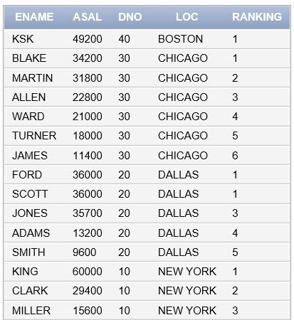
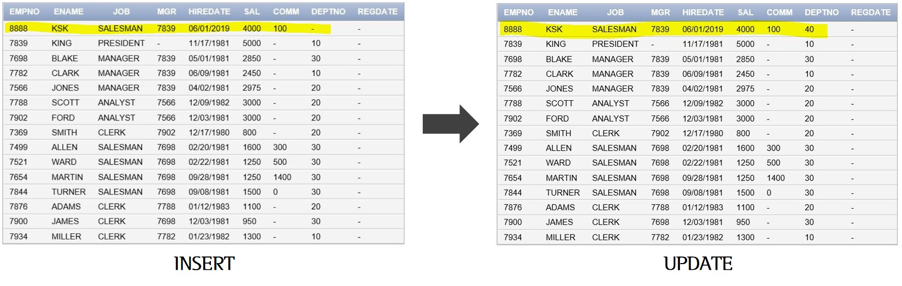

6조

[ 문제 1]

전체 평균보다 높은 부서 직원들의 연봉순위를 ANSI 표준으로 작성 

```SQL
SELECT RANK() OVER(ORDER BY ASAL DESC) AS RANKING,
ENM, ASAL FROM T_EMP e JOIN T_SAL s
ON (e.ENO = s.ENO)
WHERE ASAL > (SELECT AVG(ASAL) FROM T_SAL)
ORDER BY ASAL DESC;
```

> Oracle용과 ANSI(SQL) 표준 공부하기

[ 문제 2 ]

관리하는 직원들의 평균 월급이 가장 높은 매니저의 정보를 출력

```SQL
SELECT * FROM EMP 
WHERE EMPNO = (
SELECT e.MGR FROM EMP e
GROUP BY e.MGR -- MGR 별로 묶어서 보여줌
HAVING AVG(e.SAL) = (
SELECT MAX(AVG(e2.SAL))FROM EMP e2
WHERE MGR IS NOT NULL 
GROUP BY e2.MGR)
);
```

3조

[문제 1]

직원들의 정보와 해당 직원의 상사 정보를 같이 출력

왼쪽이 부하직원들의 정보, 오른쪽은 상사의 정보 (MGR은 상사의 EMPNO를 나타낸다고 가정)

```sql
SELECT e.EMPNO, e.ENAME, e.JOB, e.MGR,
m.EMPNO, m.ENAME, m.JOB, m.MGR FROM EMP e, EMP m
WHERE e.MGR = m.EMPNO;
```

[ 문제 2]

부서별 연봉의 평균 보다 많이 받는 직원을 구하고 연봉 순위를 매기기 (T_EMP, T_SAL, T_DEPT를 이용)

```sql
SELECT e.ENO, e.ENM, a.ASAL, d.DNM, d.LOC, 
RANK() OVER(ORDER BY ASAL DESC) AS RANKING
FROM T_EMP e, T_SAL a, T_DEPT d
WHERE e.DNO = d.DNO
AND e.ENO = a.ENO
AND a.ASAL >(
SELECT AVG(s1.ASAL) FROM T_SAL s1,T_EMP e1
WHERE e1.ENO = s1.ENO
AND e.DNO = e1.DNO
GROUP BY (e1.DNO)
);
```

2조

[ 문제 1 ]

입사 년도 별로 월급을 가장 많이 받는 사람의 이름, SAL, 입사년도, 근속연수를 구하고 순위 매기기

```sql
SELECT ENAME, SAL,
TO_CHAR(HIREDATE,'YYYY') AS EMPYEAR,
TRUNC(MONTHS_BETWEEN(SYSDATE,HIREDATE)/12,0) AS YEARS,
RANK() OVER(ORDER BY TRUNC(MONTHS_BETWEEN(SYSDATE,HIREDATE)/12,0)DESC ) AS RANKING
FROM EMP e 
WHERE SAL >= (
SELECT MAX(SAL) FROM EMP e2
WHERE TO_CHAR(e.HIREDATE,'YYYY') = TO_CHAR(e2.HIREDATE,'YYYY')
GROUP BY TO_CHAR(HIREDATE,'YYYY')
)
ORDER BY EMPYEAR;
```

[ 문제 2 ] 

LOCATION 별로 연봉(세금은 계산하지 않음)과 연봉의 순위를 구한 후, 

직원의 이름, 연봉, 부서 정보, 부서 내 랭킹을 LOC과 랭킹 순으로 모두 출력

```SQL
SELECT e.ENAME, 
(e.SAL+NVL(COMM,0))*12 AS ASAL, e.DEPTNO AS DNO, 
d.LOC, 
RANK() OVER(
PARTITION BY LOC -- PARTITION BY 사용하여 원하는 영역 별 순위를 결정
ORDER BY (e.SAL+NVL(COMM,0))*12 DESC) AS RANKING
FROM EMP e, DEPT d
WHERE e.DEPTNO = d.DEPTNO
ORDER BY LOC, RANKING;
```



1조

[ 문제 1 ]

전체 연봉의 평균보다 많게 받는 직원의 ENO, ENM, SAL, ASAL, RANK를 연봉이 높은순서로 정렬하여 조회

```SQL
SELECT e.ENO, e.ENM, e.SAL, s.ASAL,
RANK() OVER(ORDER BY ASAL DESC) AS RANKING,
d.DNM
FROM T_EMP e, T_SAL s, T_DEPT d
WHERE e.DNO = d.DNO -- Join 세 개 했으므로 
AND e.ENO = s.ENO -- 중복방지를 위한 조건문 두 개 필요
AND s.ASAL > (
SELECT AVG(ASAL) FROM T_SAL);
```

[ 문제 2 ] 

ENO, ENM, ASAL, DNM ,LO , RANK, TOTAL 을 출력

부서별 연봉의 평균 보다 많이 받는 직원의 순위를 2위까지만 출력 (단, DALLAS 지역 제외)

```SQL
SELECT ENO, ENM, ASAL, DNM, LOC, RANK,(SELECT COUNT(*) FROM EMP) AS TOTAL FROM (
SELECT e.ENO, e.ENM, s.ASAL, d.DNM, d.LOC,
RANK() OVER(ORDER BY ASAL DESC) AS RANK
FROM T_EMP e, T_SAL s, T_DEPT d
WHERE e.ENO = s.ENO
AND e.DNO = d.DNO
AND d.LOC NOT IN ('DALLAS')
)
WHERE RANK <=2;
```

5조

[ 문제 1 ]

① EMP 테이블의 ENAME이 KSK인 사람의 DEPTNO를 40으로 변경

```sql
UPDATE EMP SET DEPTNO = '40' WHERE EMPNO = '8888' 
-- WHERE을 활용하여 고유 값인 EMPNO로 범위를 제한하지 않으면 TABLE 내 모든 정보가 UPDATE 됨
```



② 상사가 president 인 사람들 중에 president와 같은 지역이 아닌 직원들의 정보를 출력하고,

이 직원들의 ASAL(연봉)을 ROW_NUM 그리고 1등만 출력 

```SQL
SELECT ENAME, ASAL, ROW_NUM, LOC, MGR, EMPNO FROM(
SELECT e.ENAME, s.ASAL,
ROW_NUMBER() OVER(ORDER BY s.ASAL DESC) AS ROW_NUM,
d.LOC, e.MGR, e.EMPNO FROM EMP e, T_DEPT d, T_SAL s
WHERE e.DEPTNO = d.DNO
AND e.EMPNO = s.ENO
AND e.MGR IN (
SELECT EMPNO FROM EMP e2, T_DEPT d2
WHERE JOB IN ('PRESIDENT')
AND NOT (d.LOC = d2.LOC)
AND e2.DEPTNO = d2.DNO)
)
WHERE ROW_NUM = 1;
```

[ 문제 2 ]  

HIREDATE로 랭킹한 후, HIREDATE의 랭크 1-5등은 퇴직자 / 6-14등은 현직자 / 15등은 신입사원으로 분류

출력해야 할 정보(ENAME, HIREDATE, ASAL, DEPTNO, LOC) 포함하여 지역 별로 출력

```sql
SELECT e.ENAME, e.HIREDATE, s.ASAL, e.DEPTNO, d.LOC,
ROW_NUMBER() OVER(ORDER BY e.HIREDATE) AS ROW_NUM,
CASE WHEN 1 <= ROW_NUMBER() OVER(ORDER BY e.HIREDATE) 
          AND ROW_NUMBER() OVER(ORDER BY e.HIREDATE) <= 5
     THEN '퇴직자'
     WHEN 6 <= ROW_NUMBER() OVER(ORDER BY e.HIREDATE) 
          AND ROW_NUMBER() OVER(ORDER BY e.HIREDATE) <= 14
     THEN '현직자'
     ELSE '신입사원'
END AS STATE
FROM EMP e, T_SAL s, T_DEPT d
WHERE e.DEPTNO = d.DNO
AND e.EMPNO = s.ENO;
```

```SQL
SELECT ENAME, HIREDATE, ASAL, DEPTNO, LOC, ROW_NUM,
CASE WHEN ROW_NUM <= 5
     THEN '퇴직자'
     WHEN ROW_NUM <= 14
     THEN '현직자'
     ELSE '신입사원'
END AS STATE FROM ( 
SELECT e.ENAME, e.HIREDATE, s.ASAL, e.DEPTNO, d.LOC,
ROW_NUMBER() OVER(ORDER BY e.HIREDATE) AS ROW_NUM
FROM EMP e, T_SAL s, T_DEPT d
WHERE e.DEPTNO = d.DNO
AND e.EMPNO = s.ENO);
```

4조

[ 문제 1 ]

VIEW를 사용하여 SQL문을 작성(T_EMP, T_DEPT)

RESEARCH부서 사람들의 월급 ROW_NUM을 출력(내림차순으로)

```SQL
-- VIEW로 새로운 테이블 만듦
CREATE VIEW T_EMP (ENO,ENM,SAL,DNO) 
AS (
SELECT EMPNO, ENAME, SAL, DEPTNO FROM EMP
);

CREATE VIEW T_DEPT (DNO,DNM,LOC)
AS (
SELECT DEPTNO, DNAME, LOC FROM DEPT
);
```

```sql
SELECT ROW_NUMBER() OVER(ORDER BY SAL DESC) AS ROW_NUM,
e.ENO, e.ENM, e.SAL, d.DNM FROM T_EMP e, T_DEPT d
WHERE e.DNO = d.DNO
AND DNM = 'RESEARCH';
```

[ 문제 2 ]

각 부서의 평균 연봉 보다 많이 받는 사람의 지역별 총합과 지역별 총합의 소계를 출력 (표준 SQL 양식을 사용)

```sql
SELECT SUM(s.ASAL) AS ASALSAUM, 
d.LOC FROM T_SAL s INNER JOIN T_EMP e
ON (s.ENO = e.ENO) INNER JOIN T_DEPT d ON (d.DNO = e.DNO) 
WHERE ASAL >= (
SELECT AVG(ASAL) FROM T_SAL s2 INNER JOIN T_EMP e2
ON(s2.ENO = e2.ENO)
WHERE e.DNO = e2.DNO)
GROUP BY ROLLUP(d.LOC);
```


