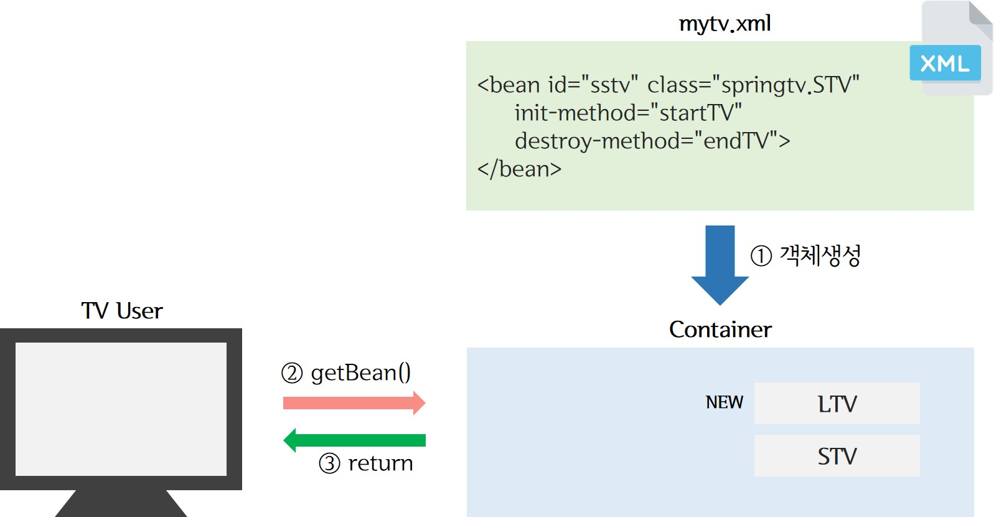

> day35 배운 내용 : FRAMEWORK | Spring Project Setting | Spring을 활용한 CRUD 구현 (workshop)

## 1. FRAMEWORK

### 1-1. FRAMEWORK의 개요

- FRAME WORK(프레임워크)는 뼈대 혹은 틀로서 아키텍처에 해당하는 골격코드

- 개발의 기본이 되는 뼈대나 틀은 프레임워크가 제공하기 때문에 개발자는 살을 붙이는 작업만 하면 됨

  ∴ 재사용성이 강하기 때문에 빠른 구현이 가능하고, 유지보수가 용이

- 프레임워크의 장점 : 

  - 빠른 구현 시간 
  - 쉬운 관리
  - 개발자들의 역량 획일화 → 초급 개발자도 쉽게 접근
  - 검증된 아키텍처의 재사용과 일관성 유지

### 1-2. Spring Framework

- 이전에는 EJB(Enterprise Java Beans) 사용 → 너무 복잡하고 비싸고 어려움

- POSO(Plain Old Java Object) : EJB 기능을 하면서 간단하게 사용 가능

  > 평범한 옛날 자바 객체를 의미 / Spring Container(XML) 위에서 자유로운 이용

- 스프링 프레임워크의 장점 

  > 스프링의 특징을 한 줄로 서술하면 "IoC와 AOP를 지원하는 경량의 컨테이너 프레임워크"
  
- 경랑(LightWeight) ∵ 몇 개의 JAR 파일만으로 실행 / POSO 형태의 객체를 관리하기 때문
  
- 제어의 역행(Inversion of Control, :star:IoC) : 객체 간 낮은 결합도 → 유지보수가 편리
  
  ∵ class 간의 결합이 없기 때문에 넣고 빼는 것이 쉬움 & 소스코드가 아닌 컨테이너로 처리

- 관점지향 프로그래밍(Aspect Oriented Programming, :star:AOP) : 공통적으로 사용하는 기능들은 외부의 독립된 클래스로 분리 → 해당 기능을 프로그램 코드에 직접 명시하지 않고 선언적으로 처리 ∴ 유지보수를 향상
- 컨테이너(Container) : 특정 객체의 생성과 관리를 담당하며 객체 운용에 필요한 다양한 기능을 제공 
  
  - JVM 위에 Spring Container (**XML**로 존재)가 위치하여 동작
  - 서버 안에 포함되어 배포 및 구동 / 자바 코드를 직접 처리할 일이 줄어듦

 

### 1-3. Spring Container

> - 프로그램 로딩 시 관리할 클래스들이 등록된 XML 파일을 통하여 Container(POJO)에 객체가 생성
> - User가 App에서 `getBean`으로 사용할 객체를 요청하면 Spring이 찾아 return 해줌
> - 객체가 바뀌어도 매번 전체 코드 변경 없이 App의 일부 코드만 변경하면 자유롭게 이용이 가능

 

#### 1-3-1. 스프링 컨테이너의 종류

- `BeanFactory` : 스프링 설정 파일에 등록된 `<bean>` 객체를 생성하고 관리하는 가장 기본적인 기능 제공

  > 클라이언트의 요청(Lookup)에 의해서만 `<bean>` 객체가 생성되는 지연 로딩(Lazy Loading) 방식 이용

- `ApplicationContext` : (대부분 스프링 프로젝트가 ApplicationContext 유형의 컨테이너를 이용)

  - 'BeanFactory'에서 제공하는 `<bean>` 객체 관리
  - 트랜젝션 관리나 메시지 기반의 다국어 처리 등 다양한 기능 제공
  - 컨테이너가 구동되는 시점에 `<bean>` 등록된 클래스들을 객체 생성하는 즉시 로딩(pre-loading) 방식
  - 또한 웹 애플리케이션 개발도 지원 

  > GenericXmlApplicationContext : 파일 시스템이나 클래스 경로에 있는 XML 설정 파일을 로딩 후 구동
  >
  > XmlWebApplicationContext : 웹 기반의 스프링 애플리케이션을 개발할 때 사용하는 컨테이너

#### 1-3-2. 스프링 XML 설정

- `<beans>` : 네임스테이스를 비롯한 XML 스키마 관련 정보 설정 / `<bean>`, `<import>`등 자식 엘리먼트 사용

- `<import>` : 클래스를 등록하고 관리하는 `<bean>`이 제공하는 기본적인 기능 외 다양한 설정이 필요할 때

  > 트랜젝션 관리 / 다국어 처리 / 기능별로 나뉘어진 XML 파일을 하나로 통합할 때도 사용

- `<bean>` : 

  - 스프링 설정 파일에 클래스를 등록할 때 사용 ∴ 클래스 하나 당 하나의 `<bean>` 사용
  - 반드시 패키지 경로가 포함된 전체 클래스 경로를 사용하여 등록(id는 생략할 수 있지만 class는 필수:star:)

  > init-method 속성 : 객체를 생성한 후 바로 메소드를 호출
  >
  > destroy-method 속성 : 객체를 삭제하기 직전에 메소드를 호출
  >
  > lazy-init 속성 : 클라이언트가 요청하는 시점에 객체를 생성 → 효율적인 메모리 관리가 가능해짐
  >
  > scope 속성 : 'singleton'으로 설정하여 단 하나의 객체만 생성하도록 / 'prototype'은 매번 새롭게 생성

### 1-4. 의존성 주입

> 객체의 생성과 의존 관계를 컨테이너가 자동으로 관리하는 것 (IoC의 핵심 원리)

## 2. Spring Project Setting

① **Make Project**  : Java Project 생성

② **Spring Nature**

③ **Maven** → 외부 lib를 관리하기 위함

> 'pom.xml'에 무엇이 필요한지 기입해두면 자동으로 Library를 찾아 다운이 됨

- Eclipse에서 Spring을 구동하기 위한 준비 :
  - marketplace에서 Spring Tools 3.0 다운
  - 프로젝터 생성 후 'Add spring project nature' 선택
  - 프로젝트를 다시 configure > convert to Maven project  설정
  - 그후 xml.html과 library 추가 + Maven Update 진행

## 3. workshop

> Spring을 활용하여 Biz, Dao 구현하기

