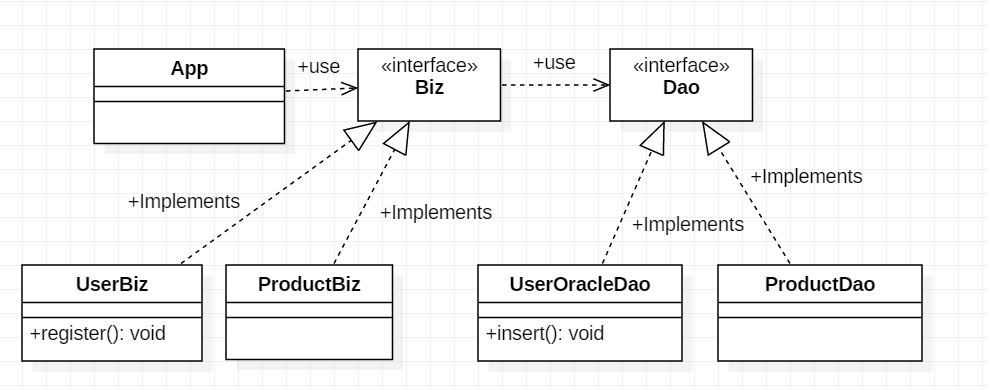
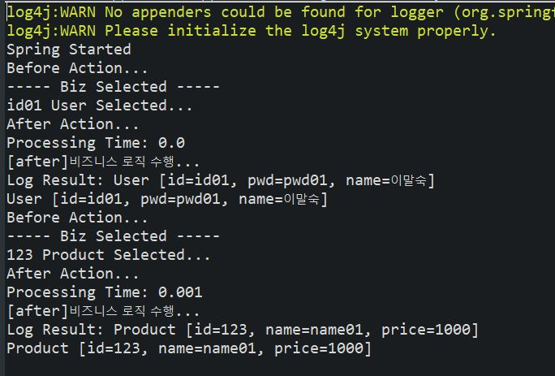

> day36 배운 내용 : Annotation | Spring AOP

## 1. Annotation

- Java 코드에 추가하여 사용할 수 있는 메타데이터의 일종 (목적성有)

  → 소스 코드 안에 어떤 형식으로 데이터를 설명해 놓은 것 / 주석의 일종?

  ∴ 컴파일러에게 메시지를 전달하여 문제 발생 시 발견할 수 있도록 함

- JDK 1.5 버전 이상에서 사용 가능

- '@' 기호와 함께 사용

> Spring File(XML)의  Namespaces에 'context' 항목 추가하여 Annotation를 사용하기 위한 환경 설정

-----------------------------------------------------------------------------------------------------------------------------------------------------------

### 1-1. Annotation 설정 기초

- component-scan : bean을 등록하지 않아도 패키지 내 클래스를 스캔하여 자동으로 객체를 생성

```xml
<context:component-scan base-package="springtv" />
<!-- 'springtv'로 시작하는 패키지를 스캔 대상에 포함하여 객체를 생성 --> 
```

- @Component : `<component-scan : bean>` 사용 시 스캔 대상에 포함하기 위한 annotation

```xml
<bean id="hs" class="springtv.HarmanSpeaker"/>
```

````java
@Component("hs")
public class HarmanSpeaker implements Speaker {
	public void up() {
		System.out.println("Harman Speaker Volume Up");
	}
}
````

> id나 name 속성을 지정하지 않았다면, 컨테이너가 자동으로 이름을 설정해줌 → 클래스 이름의 첫 글자를 소문자로 변경하기만 하면 됨! ex) TV → tv

### 1-2. 의존성 주입 설정

| Annotation |                       설명                        |
| :--------: | :-----------------------------------------------: |
| @Autowired |      해당 타입의 객체를 찾아서 자동으로 할당      |
| @Qualifier | 특정 객체의 이름을 이용하여 의존성 주입할 때 사용 |
|  @inject   |             @Autowored와 동일한 기능              |
| @Resource  |       @Autowired와 @Qualifier의 기능을 결합       |

### 1-3. Annotation과 XML로 IoC 설정

- XML 방식
  - Java 코드를 수정하지 않고 XML 파일의 설정만 변경하면 됨 ∴ 유지보수가 편리
  - 하지만 Java 코드에 의존관계와 관련된 어떤 메타 데이터도 없으므로 XML 설정을 해석해야만 무슨 객체가 의존성 주입이 되었는지 확인할 수 있음
- Annotation 방식
  - XML 설정에 대한 부담도 없고, 의존관계에 대한 정보가 코드 내에 들어있기 때문에 사용하기 편함
  - 하지만 의존성 주입할 객체의 이름이 코드에 명시되어야 하므로 반드시 수정이 필요함

> 둘의 차이점에 대하여 더 공부하기 

<br>

## 2. Spring AOP

:cactus:AOP (Aspect Oriented Programming)

- AOP를 이해하는 데 가장 중요한 핵심 개념이 바로 관심 분리(Separation of Concerns)
  - 횡단 관심(Crosscutting Concerns) : 메소드마다 공통으로 등장하는 로깅이나 예외, 트랜젝션 처리 같은 코드
  - 핵심 관심(Core Concerns) : 사용자의 요청에 따라 실제로 수행되는 핵심 비즈니스 로직
- 따라서 AOP는 기능을 구분한 후, 핵심 관심에 영향을 미치지 않고 횡단 관심을 잘 끼워넣도록 하는 개발 방법 → 공통 모듈인 횡단 관심을 코드 밖에 설정한 후 끼워넣음

### 2-1. AOP 용어 정리

- 조인포인트(JoinPoint) : 횡단 관심 모듈의 기능이 삽입되어 동작할 수 있는 특정 위치 → Client가 호출하는 모든 비즈니스 메소드
- 포인트컷(PointCut) : 어떤 클래스의 어느 조인포인트를 사용할 것인지 결정하는 선택 기능 → 필터링 된 조인 포인트

```xml
<aop:pointcut id="id01" expression="execution(* com..Biz+.select(..))"/>
<!-- com.user로 시작하는 패키지에 있는 Biz로 끝나는 class의 모든 함수에 무엇이 들어가든 -->
```

> expression 속성에 어떤 값을 설정하느냐에 따라 필터링되는 메소드가 달라짐

- 어드바이스(Advise) 

  - 횡단 관심에 해당하는 공통 기능의 코드 / 독립된 클래스의 메소드로 작성됨
  - 어드바이스로 구현된 메소드가 언제 도착할지 스프링 설정 파일을 통해서 지정

  > before / after / after-returning / after-throwing / around 다섯 가지로 동작 시점 지정

### 2-2. AOP 엘리먼트

```xml
<aop:config> 
<aop:pointcut/> : 루트
<aop:aspect>
    <aop:before/> : method 실행 전
    <aop:after-returning/> : method 정상 실행 후
    <aop:after-throwing/> : method exception 발생 후
    <aop:after> : method 실행 후
        <aop:around/> 모든 시점 적용 가능 → 데이터 로딩 시간 측정 가능
        </aop:aspect>
    </aop:config>
```

-----------------------------------------------------------------------------------------------------------------------------------------------------------

:round_pushpin: **day36 workshop** : Annotation을 이용한 AOP 구현과 Log 출력하기

[실습코드 보러가기](https://github.com/xuansohx/TIL/tree/master/%EC%8B%A4%EC%8A%B5%EC%BD%94%EB%93%9C/spring/day36_spring_BizDao_AOP_log)

UML



Result(console)



