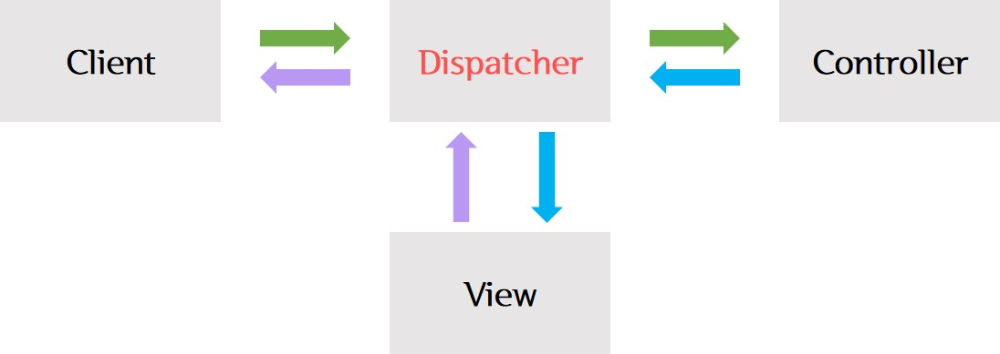
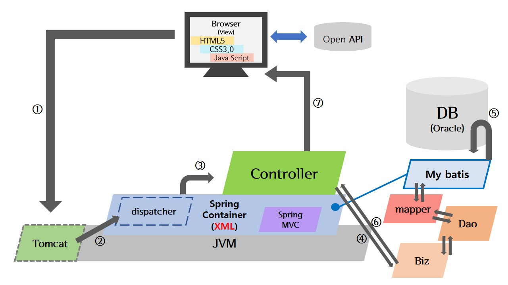

> day39 수행평가 : Dynamic Web Client 구축 (HTML5, CSS3.0, JavaScript) | Web Server Application 구축 (SpringMVC Framework) | 시스템 구조 및 구현 화면 → DB연동 / CRUD / map / chart / 화면전환 등 구현

[실습코드 보러가기](https://github.com/xuansohx/TIL/tree/master/%EC%8B%A4%EC%8A%B5%EC%BD%94%EB%93%9C/spring/day39_spring_smvc_CRUD_final)

<br>

▶ 'Dispatcher' 개념 정리 

- 'dispatch'는 '보내다'라는 뜻 ∴ 서버 시작 시 들어오는 요청을 받아 Controller로 전달 (업무 분담 효과)
- `.do`, `.mc` 등 지정한 url 패턴을 입력하면 작업을 처리 / url 패턴은 우리가 정할 수 있음

```html
<script>
location.href='main.do';
</script>
```



<br>

▶ 시스템 구조



▶ 과제 수행 시 어려웠던 점 : Product Update 때 이미지를 제외하고 일부만 업데이트 시 이미지가 사라지는 문제

→ If문의 조건으로 이미지 파일의 이름을 'null' 여부로 확인하였는데 무조건 if문을 통과하여 파일을 새로 등록하지 않으면 기존의 파일이 사라짐 / null 값이 조건에 적용되지 않음

∴ 이미지 파일의 이름이 아니라 파일의 사이즈를 확인하는 조건문으로 수정

```java
// ProductUpdate
	@RequestMapping("/productupdateimpl.mc")
	public String productupdateimpl(Product product) {
	
		try {
			if (product.getMf().getSize() != 0) { // 이미지 파일이 바뀐 경우
				product.setImgname(product.getMf().getOriginalFilename());
				// product 안의 Mf의 파일 이름을 가져와달라
				Utill.saveFile(product.getMf()); // 이미지 업로드
			}

			biz.modify(product); // DB에 update 요청
		} catch (Exception e) {
			e.printStackTrace();
		}
		return "redirect:productdetail.mc?id=" + product.getId();
	}
```

