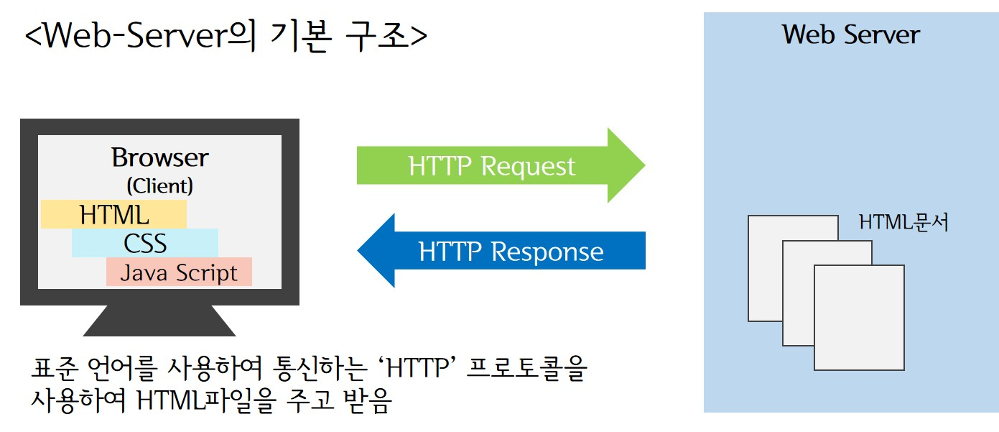
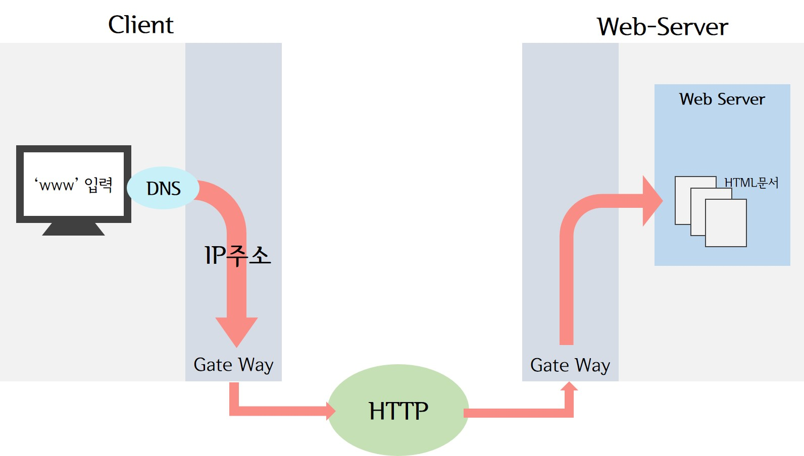
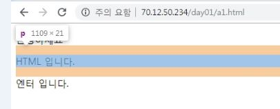

> day20 배운 내용 : 웹에 대한 기초 사항| HTML → HTML5 | HTML 문서의 기본 구조 및 맛보기

## 1. 웹에 대한 기초 사항

###  1-1. 'WWW(World Wide Web)'의 동작원리

> 'www'는 흔히 웹이라 불리며, 기존의 문자 기반의 서비스에서 벗어나 하이퍼 텍스트와 그림을 통하여 인터넷에서 모든 서비스를 쉽게 이용할 수 있도록 함 

★ 브라우저의 URL 입력창에 `www.naver.com`을 입력하면 무슨 일이 벌어질까?

: HTML로 웹 페이지를 작성하여 **웹 서버**에 저장 → 수많은 클라이언트 컴퓨터 및 스마트폰이 웹 서버에서 HTML 문서를 받아서 웹 브라우저를 통하여 화면에 웹 페이지를 표시함

### 1-2. 웹 서버가 하는 일



- 'HTTP'라는 통신 프로토콜을 이용하여 텍스트+이미지로 구성 된 HTML 문서 교환

  → HTTP의 주요 역할 :  HTTP Request & HTTP Response

- **HTML** (Hyper Text Markup Language) : 웹 페이지를 기술하기 위한 언어

- 웹 브라우저는 HTML 문서를 읽어서 눈에 보이는 웹 페이지를 만듦 (우리가 보는 네이버 화면)

- 실제 웹은 `HTML` 뿐만 아니라 `CSS`와 `Java Script` 세 가지로 이루어짐

### 1-3. 웹 접속 과정



> DNS와 HTTP, Gate Way의 관계 확인하기 → 그림에서 표기한 과정이 맞는지 확인 _ 190611

- Gate Way : 통신 네트워크의 출입구 → GW를 통하여 여러 IP가 HOST(Web-Server)에 접속
- DNS (Domain Name System) : 사람들이 사용하는 문자로 된 인터넷 주소(domain)를 컴퓨터가 사용하는 숫자로 된 인터넷 주소(IP)로 바꾸어 웹사이트에 접속하고자 하는 사람과 웹사이트의 서버를 연결해주는 방식

## 2. HTML

- 웹 페이지를 기술하기 위한 언어로서 마크업(Markup) 언어의 일종

- 마크업 언어란? 텍스트에 태그를 붙여 문서 내 텍스트의 위치를 알려줌

  ```html
  <title>Web Programming</title>  (시작태그와 종료태그 반드시 필요)
  ```

  - 단순한 텍스트로 되어 있기 때문에 메모장으로도 편집이 가능
  - 크기가 작아서 서버와 클라이언트 사이에서 빠른 소통
  - 컴퓨터의 기종이나 운영체제에 독립적 → 표준 문서 규격으로 채택

- 'HTML5'는 HTML의 새로운 표준 

  → 화려한 UI와 웹 애플리케이션 개발 가능성, 미디어 재생 기능, 위치 기반 서비스 지원함

  [HTML 학습사이트](https://www.w3schools.com/)

## 3. HTML의 기본 구조 및 맛보기

> 기본적인 웹 서버는 80번 port를 사용 | 'Create a Dynamic Web Project' 이용하여 프로젝트 생성 (eclipse)

> content root = app's name | content directory = HTML이 존재하는 곳 → web

### 3-1. HTML 문서의 기본 구조

- HTML 문서는 `<html>`로 시작하여 `</html>`로 끝남 

```html
<!DOCTYPE html> <!-- 버전 -->
<html>
    
<head> <!-- 타이틀, 메타정보, 페이지의 전체적인 환경설정(EX-언어) -->
<meta charset="EUC-KR">
<title>Insert title here</title>
</head>
    
<body> <!-- 우리에게 보여지는 영역(=실제 출력되는 부분) -->
<h1>HTML TEST</h1>
</body>
    
</html> <!-- HTML은 시작 태그와 종료 태그를 반드시 사용해야 됨 -->
```

> http://70.12.50.220:80/day01/a1.html (IP주소/:port/애플리케이션/.html)

- HTML 문서 작성 시 주의사항
  - 태그 이름은 대소문자를 구별하지 않음 ∴ <head> = <HEAD>
  - 하나의 요소 안에 다른 요소가 포함될 수 있음
  - 시작 태그와 종료 태그 사이의 연속된 공백은 하나의 공백으로 취급
  - 주석은 `<!-- -->`로 표시 (단축키 = `Ctrl`+`Shift`+`?`)
  - 필요한 파일은 모두 'web'에 저장하여 사용

### 3-2. HTML의 요소와 속성

- 요소(element) : 시작 태그와 종료 태그로 이루어진 문서의 구성 요소

  ∴ 요소 = (시작 태그 + 콘텐츠 + 종료 태그) 

```html
<title> 나의 웹 페이지 </title>
<!--
<title> : 시작 태그(start tag)
나의 웹 페이지 : 요소의 내용 (콘텐츠)
</title> : 종료 태그(end tag)
-->
```

- 속성(attribute) : 요소에 대한 추가적인 정보를 제공하는 것으로 항상 시작 태그에 기술 

```html
<a href = "http://www.w3.org">W3C컨소시엄</a> 
```

> 사용자가 'W3C컨소시엄' 클릭하면 위의 사이트로 연결됨 

### 3-3. HTML 맛보기

#### ① 텍스트 표시

- `<p>` : 전체 글을 내용에 따라 나눌 때 단락(paragraph)의 태그 사용 → 단락의 전후에 빈 줄을 추가

  단락을 생성하지 않으면 모든 텍스트가 연결되어서 하나의 긴 줄로 표시(수평선 영역 모두 차지) - block

```html
<p>하나의 단락을 구성합니다.</p>
```



> `<br>`을 사용하면 단락 구분을 할 수 있지만 화면 크기의 변동 시 글씨가 깨질 우려가 있어 권장하지 않음

- `<h1>`도 수평선의 전체 영역을 차지(block) ∴ `<p>`와 함께 사용하는 것 불가

- `&nbsp` : 공백 문자 한 개 ≒ 스페이스 (non-breaking space)

```html
<P>엔터&nbsp;&nbsp;&nbsp;&nbsp;입니다.</P>
```

> HTML 코드에서는 엔터키로 줄을 바꾸었거나, 스페이스를 여러 개 입력하여도 화면에 반영되지 않음

- ``: image는 종료 태그가 없으며, Inline이라 한 줄에 여러 개 가능

```html
 web 바로 아래 있을 때
  web 내 폴더 안에 있을 때 'img'라는 폴더명 기입
```

> 사용하게 될 이미지나 파일은 반드시 HTML 문서가 존재하는 content directory(web)에 함께 있도록 함

- `<pre>`: 개발자가 입력한 스페이스나 탭, 줄 바꿈이 그대로 유지

```html
<pre>
엔터   입니다.
엔터   입니다.
</pre> 
```

> `<pre>` 또한 해상도에 따라 글씨가 깨질 수 있음 → PC 뿐만 아니라 모바일에서 사용할 것까지 감안하기

- `<hr/>` : 브라우저의 너비만큼 수평선을 그림 (horizontal line)

#### ② 리스트 : 항목을 나열하는 데 사용 ★

```html
<ul> <!-- 리스트의 시작 태그 -->
<li>List1</li> <!-- 리스트 항목 -->
<li>List2</li>
<li>List3</li> 
</ul> 
```

> `<ul>`은 번호 없는 리스트(unordered lists), `<ol>`은 번호 있는 리스트(ordered lists)

```html
<dl> <!-- 정의 리스트 -->
<dt>단어</dt> 
<dd>단어의 설명</dd>
</dl> 
```

-----------------------------------------------------------------------------------------------------------------------------------------------------------

[ 참고 ] 한글코드

- **euc-kr** : 

  ① KSC5601에 기반을 둔 대표적인 완성형 코드

  ② 영어와 한글을 2바이트로 나타내는 방식으로 초창기부터 사용해 온 방식 

  → 한글을 많이 사용하는 경우 적은 메모리 공간을 차지하고 호환성이 좋음 

  ∴ 한글과 영문만 사용하는 웹 페이지라면 적당하지만, 다국적 문제를 표현하는 데는 문제가 있음

- **urf-8** : 

  ① 유니코드의 일종으로 가변길이 문자 인코딩 방법 

  ② 일반적으로 영어는 1바이트, 한글은 3바이트로 표현 

  ∴ 영어를 많이 사용하는 경우 urf-8이 메모리 공간을 적게 차지함

  ③ 모든 한글 문자를 표현할 수 있고 다른 나라의 운영체제에서도 폰트 없이 한글을 보는 것이 가능

  → 글로벌한 언어체계 대응이 가능하기 때문에 점차 'utf-8'로 바뀌는 추세