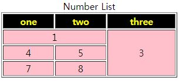
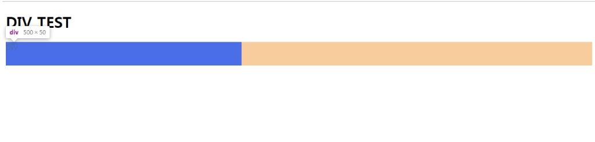
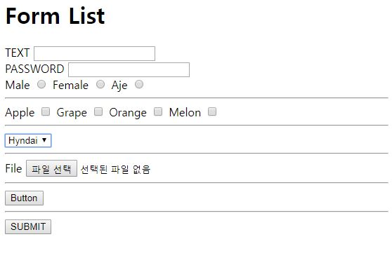
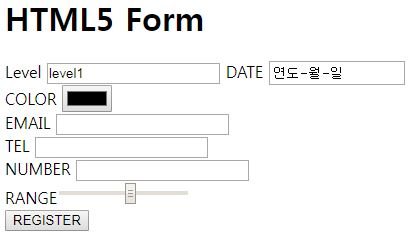

> day21 배운 내용 : Hyper Link | Image | Table | `<div>` 와 `<span>`| HTML 입력 태그 및 요소

## 1. Hyper Link

- 웹 사이트 연결하기

```html
<a href="http://www.naver.com">Click1</a>
<a href="http://www.daum.net">Click2</a>
```

> `<a>`는 자신의 position만 차지하는 inline → 여러 개 입력 시 연달아 표시

> block 속성을 갖는 `<h3>`으로 감싸면 크기와 속성이 변함 : 크기가 커지고 block 속성

- 다른 페이지로 이동

```html
<a href="b1.html">Click1</a>
<a href="b/b2.html">Click2</a>
<!-- 디렉토리 내 같은 폴더에서 이동을 하면 HTML 문서 이름만 쓰면 되지만, 
     그렇지 않으면 폴더명까지 명시 -->

<a href="../a.html">HOME</a> 
<!-- 상위폴더로 이동하는 상대 주소 값도 가능 -->

<a href="b1.html" target="_blank">Click1</a></h3>
<!-- target을 _black로 설정하면 새로운 창이 생기면서 실행 -->
```

- 현재 페이지 내에서 원하는 페이지로 이동 

```html
<a href="#h_target">Click3</a>
<h1 id="h_target">Header1</h1>
```

> 원하는 위치에 'id'를 부여하여 현재 페이지 내 북마크 설정

> 동일한 명칭을 사용해도 script 언어 상 에러는 발생하지 않지만 처음 신호는 무시

- 파일 다운로드

```html
<a href="file/tomcat.zip">Click4</a>
<!-- 클릭과 동시에 다운로드 실행 -->

<a href="file/tomcat.zip">Click4</a>
<a href="#" onclick="send();">Click4</a> 
<!-- '#'이 있으면 바로 실행 안 됨 → Javascript로 연결 -->
```

[ 참고 ] HTML5 + CSS + JavaScript

```css
<style> /* CSS영역 */
a {
	text-decoration: none;
	color: red;
	font-size: 2em; /* 두 배 크게 설정 */
}
</style> 
```

```java
<script> /* JavaScript영역 */
function send(){
	alert('Are You OK ?'); 
	location.href= 'b1.html';
};
</script>
```

## 2. Image

- 이미지 추가 및 속성 변경

```CSS
<style>
img {
	width: 100px;
	height: 130px;
    display: block;
/* img도 inline이라 한 줄로 쭉 → display 사용하여 세로로 정렬가능 */
}
</style>
```

```html
<body>
	<a href="img/m1.jpg" target="_blank">
    </a>
    <!-- 클릭하면 원본사진이 새창에 나오도록 설정 -->
    
	
</body>
```

> ``는 종료 태그가 없음

+ 오디오와 비디오 추가

```html
<!-- 오디오 추가 -->
<audio src="file/Kalimba.mp3" controls="controls">
Not Support
</audio>

<!-- 비디오 추가 -->
<video src="http://media.w3.org/2010/05/bunny/movie.ogv" controls="controls"></video>
```

## 3. Table

- Table의 기본 구조

```html
<table>
		<caption>Number List</caption>
		<thead>
		thead는 없으면 안 써도 됨
		</thead>
		<tbody>
		
		</tbody>
	</table>
```

- `<thead>`에서 Table의 디자인 속성 부여 → `<head>`영역에서 정의

```CSS
<head>
<style>
table {
	width: 300px;
}
table>thead>tr {
	background: black; /* 배경색 */
	color: yellow; /* 글자색 */
}

table>tbody>tr {
	text-align: center; /* 가운데 정렬 */
	background: pink;
}
</style>
<title>Insert title here</title>
</head>
```

- `<tbody>`에서 Table 생성 및 데이터 기입

```html
<body>
	<table border="1"> <!-- 테이블의 경계선 굵기 -->
		<caption>Number List</caption>
		<thead>
		<tr><th>one</th><th>two</th><th>three</th></tr>
		</thead>
		<tbody>
		<tr><td>1</td><td>2</td><td>3</td></tr>
		<tr><td>4</td><td>5</td><td>6</td></tr>
		<tr><td>7</td><td>8</td><td>9</td></tr>
		</tbody>
	</table>
</body>
```

> `<th>` : 'table head'의 약자로 표의 제목을 쓸 때

> `<tr>` : 'table row'의 약자로 가로줄을 만들 때 사용 (하나의 행 데이터)

> `<td>` : 'table date'의 약자로 셀을 만들 때 사용

- Table 병합하여 출력하기

```html
<tr><td colspan="2">1</td><td>2</td><td rowspan="3">3</td></tr> 
<tr><td>4</td><td>5</td></tr>
<tr><td>7</td><td>8</td></tr>
```

> `colspan` : 'column span'의 약자로 셀(가로줄)을 합치는 개수를 지정

> `rowspan` : 셀(세로줄)을 합치는 개수를 지정



## 4. div와 span

- `<div>` : 'divide'의 약자로 페이지를 논리적인 섹션으로 분리할 때 사용하는 태그

- block 수준의 요소로서 HTML의 요소를 묶는 컨테이너로 사용

  → 웹 페이지 공간 분할

```CSS
<head>
<meta charset="EUC-KR">
<style>
div {
	background: blue;
	width: 300px;
	height: 50px;
	color: yellow;
}
</style>
<title>Insert title here</title>
</head>
```

- `<div>`로 설정된 block의 일부 영역의 색만 변경하고 싶으면 `<span>` 사용 → `<span>`은 inline

```CSS
<head>
<meta charset="EUC-KR">
<style>
div {
	background: blue;
	width: 300px;
	height: 50px;
	color: yellow;
}
span {
	color: red;
}
</style>
<title>Insert title here</title>
</head>
<body>
	<h1>DIV TEST</h1>
	<div>
		Block <span>Area</span> Blue Zone..
	</div>
</body>
```



## 5. HTML 입력 태그 및 요소

### 5-1. HTML 입력 방식

- WEB은 쌍방향성 ∴ 사용자가 서버로 데이터를 전송하는 것도 가능 → 입력양식(form)을 이용

```html
<form action="a" method="post"> <input ... > </form>
```

> action 뒤에 입력을 처리하는 서버 스크립트의 주소 기입 | method에는 서버로 보내지는 방법을 기술

> `<form>`은 화면에 나타나지 않고 입력 요소를 담는 컨테이너의 역할만을 함 → 입력 받는 요소를 넣음
>
> ∴ `<form>` 안에는  `<input>` 요소가 포함되어야 함

- 입력방식 ① : **GET 방식**

  - URL 주소 뒤에 사용자가 입력한 데이터를 붙여서 전달하는 방식

    → http://70.12.50.234/day02/a?nm=id01&pwd=pwd01 

  - '?' 기호 앞이 URL 주소 및 서버, 기호 뒤에 오는 것이 파라미터(데이터)

  - 글자 수 제한(최대 2084글자)이 있으며, 주소만 보면 누구나 데이터를 알 수 있어 비밀이 보장되지 않음

  - 하지만 북마크가 가능하고 '뒤로 가기'가 보장된다는 장점

- 입력방식 ② : **POST 방식**
  - URL 주소가 아닌 HTTP Request 헤더에 포함시켜 전송하는 방식
  - 길이 제한이 없으며 보안이 유지됨
  - 브라우저 히스토리에도 남지 않으며, 북마크도 불가능
  - '뒤로 가기'가 보장되지 않기 때문에 페이지 이동을 하면 데이터를 다시 다시 보내야 함

### 5-2. HTML 입력 태그

> 텍스트 필드, 체크박스, 패스워드, 라디오버튼, 제출 버튼

- `<input>`형식 

```html
<form>
<input type="button" value="눌러보세요!" name="button"/>
</form>
```

> type 속성 : 입력 요소의 유형 | value 속성 : 사용자에게 보이는 텍스트 | name 속성 : 서버로 전달되는 이름

| type 속성값 |                           설명                           |
| :---------: | :------------------------------------------------------: |
|    text     |       텍스트를 입력할 수 있는 한 줄짜리 필드 생성        |
|  password   |      비밀번호를 입력할 수 있는 한 줄짜리 필드 생성       |
|    radio    |                     라디오 버튼 생성                     |
|  checkbox   |                      체크 박스 생성                      |
|    file     |              파일 이름을 입력하는 필드 생성              |
|    reset    | 초기화 버튼 생성 → 버튼을 누르면 모든 입력 필드가 초기화 |
|    image    |               이미지를 전송 버튼으로 만듦                |
|   hidden    |          사용자에게는 보이지 않지만 서버로 전송          |
|   submit    |                      제출 버튼 생성                      |

-----------------------------------------------------------------------------------------------------------------------------------------------------------

- 텍스트 필드와 제출 및 초기화 버튼

```html
<body>
<h1>Form Test</h1>
<form action="a" method="GET"> <!-- 'a'라는 서버로 데이터를 GET방식으로 보냄 -->
ID <input type="text" name="nm"><br>
PWD <input type="password" name="pwd" size=10><br> <!-- 필드의 크기 변경 가능 -->
<input type="reset" value="RESET">
<input type="submit" value="LOGIN">
</form>
</body>
```

```java
/* 확인메시지 출력하기 */
<script>
function login(f){
	var c = confirm('Are You Login...');
	if(c == true){
		f.method = 'GET';
		f.action = 'a'; 
		f.submit();
	};
};
</script>

/* 이때 form 영역에
<input onclick="login(this.form);"
type="button" value="LOGIN"> 
추가하기 */
```

- 라디오(radio) 버튼 : 여러 항목 중에서 하나만을 선택할 때 사용

```html
Male <input type="radio" name="g" value="m">
Female <input type="radio" name="g" value="f">
Aje <input type="radio" name="g" value="a">
```

> name이 같아야 동일한 그룹으로 취급되므로 같은 name으로 설정

- 체크 박스(checkbox) : 여러 개의 항목을 동시에 선택할 수 있음 → 'checked' 사용하면 어떤 값 미리 체크 가능

```html
Apple <input type="checkbox" name="f" value="a">
Grape <input type="checkbox" name="f" value="g">
Orange <input type="checkbox" name="f" value="o">
Melon <input type="checkbox" name="f" value="m">
```

> 똑같은 name이지만 value는 달라야 됨

- `<select>` : 메뉴를 표시하고 사용자가 선택하도록 → 항상 `<option>`과 사용

```html
<select name="car">
<option value="h">Hyndai</option>
<option value="k">Kia</option>
<option value="s">SSang</option>
<option value="c">Chev</option>
</select>
```

- `<fieldset>` + `<legend>` : 입력 요소를 그룹핑하여 다양한 입력 요소의 경계에 선을 그림 

```html
<form> 
<fieldset>
<legend>Employee Register</legend> <!--  legent 사이에 그룹의 이름을 지정-->
</fieldset>
</form>
```

- `<label> ` :  `<input>` 요소가 클릭한 것과 똑같은 효과를 냄
- 파일 업로드 버튼 : 파일을 업로드 할 때 사용

```html
<form enctype="multi-part/form-data">
   File <input type="file" name="ff"> 
</form>
```

- hidden : 사용자가 입력하는 데이터는 아니지만, 클라이언트 컴퓨터가 서버 컴퓨터로 데이터를 전공하고 싶은 경우 사용 → 화면에는 아무것도 나타나지 않음

```html
<input type="hidden" name="geo" value="fff">
```



### 5-3. HTML5 입력 요소

> 한눈에 보기

```html
<head>
<meta charset="EUC-KR">
<title>Insert title here</title>
</head>
<body>
<h1>HTML5 Form</h1> <!-- HTML5에 추가된 것 -->
<form>
Level <input value="level1"
type="text" name="le" readonly="readonly"> <!-- readonly는 반드시 value값 있어야 됨 -->
DATE <input type="date" name="d"><br>
COLOR <input type="color" name="c"><br>
EMAIL <input type="email" name="e" required="required"><br>
TEL <input type="tel"
pattern="[0-9]{3}-[0-9]{4}-[0-9]{4}" <!-- 특별한 규칙을 나타내는 정규식 -->
title="###-####-####"
name="e" required="required"><br>
NUMBER <input type="number" name="num"><br>
RANGE<input type="range" min="1" max="10"
                         name="range"><br>
<input type="submit" value="REGISTER">
</form>
</body>
```

