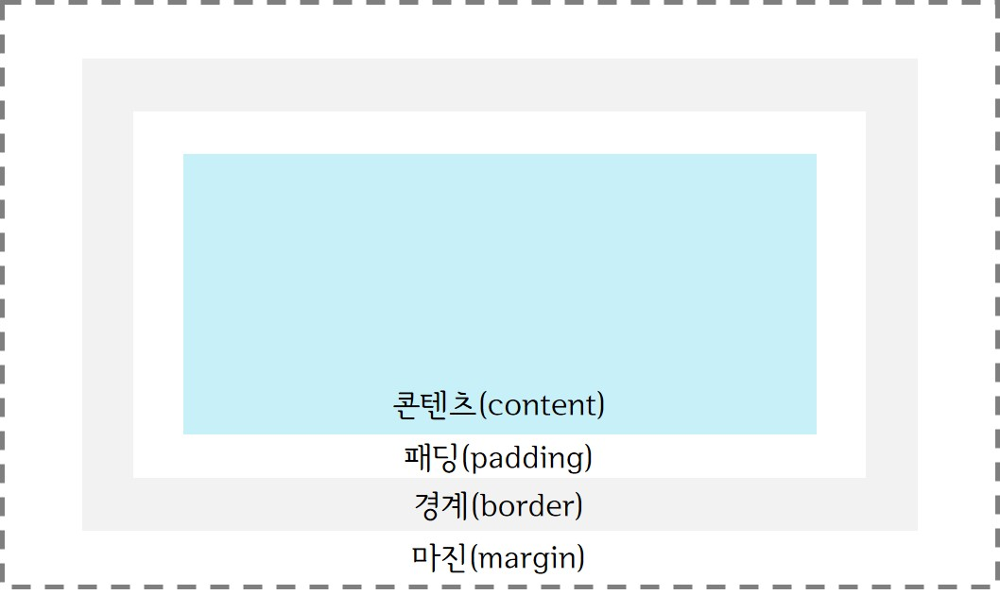
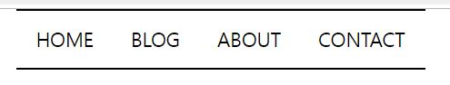
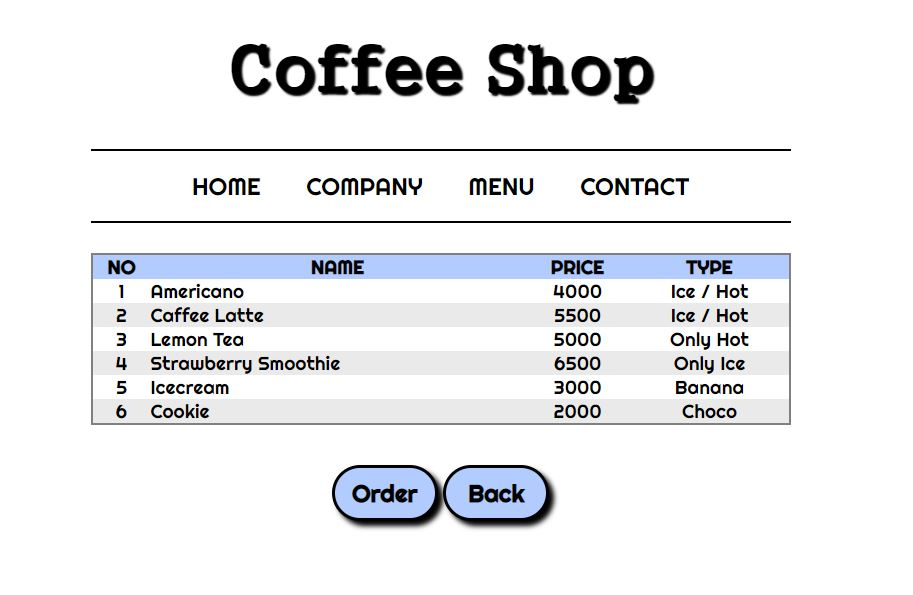

> day22 배운 내용 : CSS의 개념 | 선택자 | CSS 삽입 | 색상 | 폰트 | CSS3 박스 모델과 응용

## 1. CSS의 개념

- HTML 문서는 HTML의 요소를 이용하여 구조(내용)를 정의하기 위함 

  → 색상, 폰트, 크기와 같은 스타일은 'CSS(Cascading Style Sheets)'에서 정의

  ∴ WEB = 문서의 구조 (HTML5) + 스타일 (CSS) + 문서의 동작 (JavaScript)

### 1-1. CSS의 필요성

- 전통적인 방식대로 모든 스타일 정보를 HTML 태그로 적어줘도 됨 → 하지만 유지보수의 어려움

```html
<body>
<p>
<font size="5" color="green" face="굴림"> 옛날엔 HTML에서 모두 지정 </font>
</p>
</body>
```

- CSS에 스타일 정보를 저장하였다면 필요할 때마다 불러와 사용할 수 있음 ∴ 일관성 유지 및 작업시간 단축
- 다양한 환경에서도 동일한 형태의 문서를 제공할 수 있다는 이점

### 1-2. CSS 문법 및 위치

```CSS
<style>
selector{property : value;}
</style>
```

> HTML 내 `<head>` 요소 내에 존재하여 요소의 속성을 지정함 / 여러 개도 지정 가능


## 2. 선택자 (Selector)

> HTML 내 요소를 선택하는 부분 : 특정한 요소를 선택하여 우리가 원하는 스타일을 적용할 수 있도록 함

- 타입 선택자 (type selector)

```css
h1{
    color: green;
}
```

> 해당 요소 'h1'을 적어준 후, 요소의 속성을 지정


- 전체 선택자 (universal selector)

```css
*{
color: blue;
}
```

> '*'를 사용하면 모든 요소에 공통적인 속성을 지정함


- 클래스 선택자 (class selector)

```css
.target{
    color: red;
}

h1.target{
    color: red;
} <!-- h1 요소 중 클래스가 target인 요소의 속성을 정의할 때 -->
```

```html
<p class="target"> class가 target인 단락 </p>
```

> .class명으로 정의되며 몇 개의 요소를 하나의 클래스로 묶어서 지정할 수 있음


- 아이디 선택자 (ID selector)

```css
#special{
    color: red;
}
```

```html
<h1 id="special"> id가 special인 단락 </h1>
```

> HTML 요소에 id를 부여한 후, CSS에서 ''#id'로 호출하여 사용


-  속성 선택자 (attribute selector)

```css
input[type="text"]{
    background: yellow;
}
```

> 특정 속성을 가지는 요소를 선택하여 스타일을 지정함


- 의사 선택자 (pseudo-class) 

```css
a:hover{ /* 마우스가 a 링크 위에 있을 때 */
    background: blue;
    color: yellow;
    font-size: 1.5em; /* em은 n배 확대하라는 의미 */
}
a: link{ /* 아직 방문되지 않은 링크의 속성 */
    background: gray;
    border: 1px solid black;
}
a:visited{ /* 방문된 링크의 속성 */
    color: red;
}

h3:nth-child(2n) { /* 짝수 번째 속성 */
	color: red;
}

h3:nth-child(2n+1) { /* 홀수 번째 속성 */
	color: blue;
}
```


- 선택자 그룹 (selector group) 

```css
h1, h2, h3{font-family: sans-ferif;}
```

> 선택자를 콤마(,)로 분리하여 나열하는 것을 '선택자 그룹'이라하며 동시에 속성 적용 가능


- 자손, 자식, 형제 결합자 

```css
body em{color: red;} /* body 안 em 요소 */
body > h1{color: blue;} /* body 안 h1 요소 */
```

> 특정한 요소 내에 포함 된 후손 혹은 자식 요소를 선택하여 속성을 지정

```css
div > :not(h4){ /* h4를 제외하고 */
    color: red;
}
```


## 3. CSS 삽입

- 외부 스타일 시트 : CSS 파일을 외부에 저장한 후, HTML에서 호출하여 사용

```html
<link type = "text/css" rel = "stylesheet" href = "c1.css">
```

> type : 외부 파일의 종류가 CSS임을 나타냄 | rel : HTML과 외부 파일의 관계 | href : 외부 파일의 위치 

- 내부 스타일 시트 : HTML 안에 CSS를 정의하는 것 → `<style>` 태그 활용하여 `<head> `요소 안에 넣음
- 인라인 스타일 시트 : HTML의 `<body>` 안에 다 집어넣는 것 → 유지보수의 복잡함

```html
<body>
    <h1 style="color: red"> This is a headline </h1>
</body>
```


## 4. 색상

```CSS
background: #B2CCFF;
color: skyblue;
```

> 이름으로 나타내는 것보다 색상표를 참고하여 16진수로 나타내는 것 추천

## 5. 폰트

- 폰트 설정하기

```CSS
body{
font-family:"Times New Roman",Times,serif;
} 
```

> OS에 있는 폰트를 사용하면 내 컴퓨터에서'만' 잘 나올 수 있기 때문에 웹 폰트 사용 권장

- 웹 폰트 설정하기 ▶ [Google Fonts](https://fonts.google.com/)

```CSS
<link href="https://fonts.googleapis.com/css?family=Inconsolata|Varela+Round&display=swap" rel="stylesheet">
<style> /* <style> 위에 사용할 웹 폰트의 링크 기입 */
h1{
font-family: 'Inconsolata', monospace; /* 적용이 안 되면 뒤에 있는 폰트 적용하기 */
}
```

- `text-align` : 텍스트 정렬

```css
h1{text-align: center;} /* 중앙정렬 */
h2{text-align: right;} /* 우측정렬*/
h3{text-align: justify; } /* 양쪽 정렬 */
```

```css
font-size: 1.5em;
height: 200px;
line-height: 200px; 
/* 텍스트 중앙정렬 할 때 줄의 높이를 설정하는 것 */
/* ∵ block형태는 자유롭게 크기 조정이 가능하지만 inline은 잘 되지 않음 */
```

- `text-shadow` : 가로 / 세로 / 그림자의 길이 / 색깔

```css
h1 {
	text-shadow: 3px 3px 3px #FF0000
}
```


## 6. CSS3 박스 모델과 응용

### 6-1. 박스 모델

- 웹 브라우저는 각 HTML 요소를 사각형으로 간주하고 웹 페이지에 구성

  → 요소를 박스(사각형) 형태로 그리는 것을 '박스모델(box model)' 이라고 함

- CSS는 각 박스의 특징인 배치, 색상, 경계 등을 결정



- 콘텐츠(content) : 박스의 내용물 / 텍스트와 이미지가 나타남
- 패딩(padding) : 콘텐츠 주위의 영역 / 패딩은 투명
- 경계(border) : 패딩과 내용물을 감싸는 경계 / 박스의 경계선(border)에 영향
- 마진(margin) : 경계 주위의 영역 / 마진은 투명

```css
<style> /* 박스모양생성 */
div {
	width: 500px;
	height: 300px;
	border: 1px solid black;
}
</style>
```

### 6-2. 경계선

- 경계선 스타일(border-style)

```html
<body>
    <p style="border-style: dotted">
      <!-- dashed/solid/double 등 다양하게 지정할 수 있음 -->
      <!-- "top-right-bottom-left" 모두 다르게 설정도 가능 -->
    </p>
</body>
```

- 경계선의 폭(border-width) : thick / medium / 1px
- 경계선 색상(border-color)

```css
border : 5px solid red; /* 경계선에 대한 속성을 한 줄로 정의 */
```

- 둥근 경계선(border-radius)

```css
border-radius: 25px; /* 둥근 코너의 반지름 */
border-radius: 20px 20px 0 0; /* 각각 설정하는 것도 가능(시계방향) */
```

- 경계에 그림자 생성(box-shadow)

```css
box-shadow: 20px 10px 50x #666666; 
/* 가로 offset - 세로 offset - 번지는 정도 - 그림자의 색 */
```

### 6-3. 마진과 패딩

- 마진(margin)은 바깥 쪽의 여백 & 패딩(padding)은 안 쪽의 여백

```css
margin : 10px 20px 30px 40px; 
/* 각 변에 대한 값을 한 줄에 지정 */
/* 두 개만 쓰면 x축과 y축의 margin 설정 */

margin : 10px; /* 모든 변의 margin을 같게 설정 */
```

> 'auto'로 설정 시 브라우저가 마진을 계산

> 패딩(padding)도 같은 특징을 가짐

### 6-4. 배경 설정하기

```css
<style>
body{
    background: lightgray;
    background-image: url('img/bg.jpg'); /* 배경 이미지를 사진으로 설정 */
    background-size: 300px 300px; /* 배경 이미지의 사이즈 지정 */
    background-repeat: no-repeat; /* 사진 한 장 표시 → 반복없음 */
    background-attachment: fixed; 
    /* 스크룰 내려도 이미지가 고정이 됨 */
    /* scroll : 배경 요소와 함께 local : 요소의 콘텐츠와 함께 */
    background-position: right top; /* 배경 이미지 시작 위치 지정 */
}
</style>
```

### 6-5. 리스트 스타일 (메뉴바)

① 리스트 생성

```html
<body>
	<ul> <!-- li와 ul 둘 다 block -->
		<li><a href="">HOME</a></li>
		<li><a href="">BLOG</a></li>
		<li><a href="">ABOUT</a></li>
		<li><a href="">CONTACT</a></li>
	</ul> <!-- 점과 함께 출력이 됨 / a 때문에 언더라인도 함께 -->
	</body>
```

② 리스트 디자인

```css
<style>
/* Global CSS */
* { 
	margin: 0;
	padding: 0;
} /* 여백 없애기 */

a {
	text-decoration: none;
	color: black;
	font-size: 1.5em;
	color: black;
}

ol, ul {
	list-style: none;
}

ul {
	text-align: center;
	line-height: 50px;
	margin: 0 auto;
	width: 500px;
	height: 50px;
	padding: 10px 0 10px 0;
	border-top: 2px solid black; /* 위아래 라인 구현 */
	border-bottom: 2px solid black;
	margin: 0 auto;
}

li {
	display: inline; /* 속성을 변경함 */
	margin: 10px 20px
}

li > a:hover {
	color: green;
}
</style>
```



--------------------------------------------------------------------------------------------------------------------------

#### [ day22 workshop result]



> ① menubar는 HTML 문서에 작성  
>
> ② table과 button은 CSS 파일에 작성 후, link로 불러오기


▶ workshop 수행 시 어려웠던 점 : `inline`과 `block`의 속성

```css
/* button에 대한 CSS 파일 */
.bt> a {
    /* button의 font 속성 */
	font-family: 'Righteous', cursive;
	font-weight: bold;
	text-align: center; 
	line-height: 50px;
    
    /* button의 box 속성(크기,색상) */
	display: inline-block;
	width: 100px;
	height: 50px;
	background: #B2CCFF; 
    color : black;
    
    /* button의 border 속성 → radius 통해 모양도 설정 */
	border: 3px solid black;
	border-radius: 30px;
	box-shadow: 5px 5px 5px black;
	margin: 10px auto;
}
```

- `inline` 은 한 라인에 수평으로 배열되며, `width` `height` `margin` 속성 지정은 불가능
- `block` 은 수평선 한 라인을 모두 차지하기 때문에 수직으로 배열되며, 위의 속성 지정이 가능

> 스타일 설정을 위하여 `block`을 설정하면 위아래 수직으로 배열
>
> 하지만 수평배열을 위하여 `inline`을 사용하면 스타일 설정이 불가능

> ∴ `inline-block`을 사용하면 inline 속성을 갖기 때문에 수평 배열이 가능하며, 
>
> 동시에 block 속성도 가질 수 있기 때문에 `width` `height` `margin` 속성 지정이 가능
>
> → 이 요소를 사용하여 'Order'과 'Back' 버튼 만듦