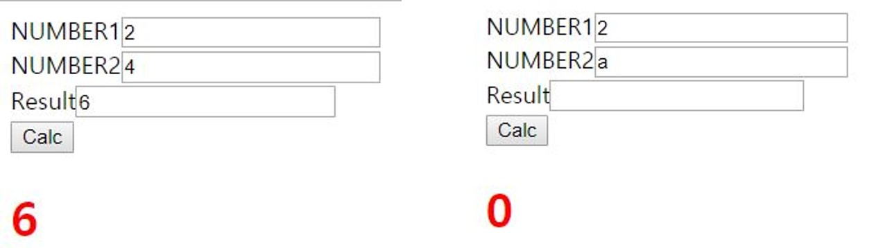
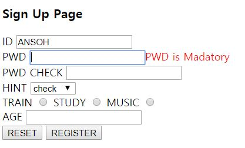
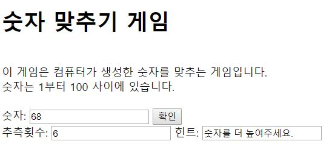

> day25 배운 내용 : JavaScript 소개 및 특징 | 용도 | JavaScript 적용 | 문법(변수, 연산자, 변환) 

> day24는 HTML과 CSS 활용하여 포트폴리오를 위한 개인 블로그 제작 실습 → [xuansohx.github.io](https://github.com/xuansohx/xuansohx.github.io) 참고

## 1. JavaScript 소개

- 웹 페이지는 HTML, CSS 그리고 JavaScript를 통해 구성하고 동작
  - HTML : 웹 페이지의 내용을 만듦 → 콘텐츠 정의
  - CSS : 웹 페이지의 스타일을 정의 (`<style>` 태그 안에 작성)
  - JavaScript : 동적인 웹 페이지를 작성 → 웹의 표준 프로그래밍 언어

|   특징    |                     Java                     |                          JavaScript                          |
| :-------: | :------------------------------------------: | :----------------------------------------------------------: |
| 언어 종류 | 소스 파일을 컴파일 하여 실행하는 컴파일 언어 | 컴파일러 없이 브라우저가 소스 코드를 한 줄씩 읽으며 실행하는 인터프리티 언어 |
| 실행 방식 |          자바 가상 기계 위에서 실행          |                     브라우저 위에서 실행                     |
| 작성 위치 |           별도의 소스 파일에 작성            |                   HTML 파일 안에 삽입 가능                   |
| 변수 선언 |          변수의 타입을 반드시 선언           |           변수의 타입을 선언하지 않아도 사용 가능            |

> 자바스크립트의 표준 : ECMA (European Computer Manufacturer's Association)


## 2. JavaScript의 특징

- 인터프리티 언어 : 컴파일 과정을 거치지 않고 바로 실행할 수 있는 언어 (소스 코드를 한 줄씩 읽으며 해석)

```html
<script>
alert('1');
alert('2');
alert('3');
</script>
```

> 위에서부터 순서대로 실행되기 때문에 `alert`에 의해 1, 2, 3 팝업창이 순서대로 뜸

- 동적 타이핑(Dynamic Typing) : 변수의 타입을 선언하지 않아도 사용 가능 

  → 모든 변수를 `var x;`와 같이 선언이 가능함

- 구조적 프로그래밍 지원 : C언어의 구조적 프로그래밍을 지원하기 때문

  ∴ 'if-else', 'while', 'for' 등의 제어 구조를 완벽하게 지원

- 객체 기반 : 자바스크립트는 전적으로 객체 지향 언어 

  → 자바스크립트의 객체는 연관 배열(associative arrays)

- 함수형 프로그램 지원 : 자바스크립트에서 함수는 일급 객체(first-class object) 

  ∴ 함수 그 자체로 객체가 됨 → `.call()`과 같은 메서드를 가짐

- 프로토타입-기반(prototype-based) : 자바스크립트는 상속을 위해 클래스 개념 대신 프로토타입을 사용

  > 하나의 객체를 만들어두면 계속해서 상속받아 사용할 수 있음


## 3. JavaScript의 용도

- 이벤트에 반응하는 동작을 구현

- Ajax를 통하여 전체 페이지를 다시 로드하지 않고 서버로부터 새로운 페이지 콘텐츠를 받거나 데이터를 제출할 때 사용

  > Ajax : 새로고침 없이 새로고침 효과를 낼 수 있음

- HTML 요소의 크기나 색상을 동적으로 변경할 수 있음

- 게임이나 애니메이션과 같이 상호 대화적인 콘텐츠 구현이 가능

- 사용자가 입력한 값을 검증하는 작업도 자바스크립트를 이용 : `alert();`

- 자바스크립트의 미래
  - Node.js : 간단한 입출력 → 대표적으로 트위터
  - jQuery : 자바스크립트의 라이브러리
  - JSON : 자바스크립트의 객체 표기법 → 개발 언어의 독립적인 데이터 형식으로서 데이터 전송용 XML을 대체하고 있음 / 문서 데이터 베이스의 표준 저장형식으로 사용

▶ jQuery를 이용하여 클라이언트 애플리케이션을 개발하고, JSON으로 서버와 데이터를 주고 받음 

​    서버에서는 Node.js를 통하여 서버 프로그램을 개발

## 4. JavaScript 적용

- 내부 자바스크립트 : `<head>`의 `<script>`와 `</script>` 사이

```html
<head>
<meta charset="EUC-KR">
<title>Insert title here</title>
<style></style>
<script>
/* 내부 자바스크립트 */
</script>
</head>
```

- 외부 자바스크립트 : `<script src="name.js">` → 링크 이용

```html
<head>
<meta charset="EUC-KR">
<title>Insert title here</title>
<style></style>
<script src="j1.js"> /* 외부 자바스크립트 */
</script> 
</head>
```

> JavaScript 파일 만들 때, 확장자를 `.js`를 입력해줘도 됨

- 인라인 자바스크립트 : `<body>`와 `</body>` 사이에 이벤트 속성 삽입

```html
<body>
    <button type="button" onclick="alert('반갑습니다')">
        버튼을 누르세요!
    </button>
</body>
```


## 5. JavaScript 문법

### 5-1. 문장구조

- 각 문장의 끝에 ;(세미콜론)을 붙임
- 대소문자 구분하기
- 주석은 `//`와 `/* */`로 표시

### 5-2. 변수

```html
<script>
// 1. number
var v1 = 10;
var v2 = 10.1; /* 정수와 실수 구분없이 모두 number임 */
    
// 2. boolean
var v3 = true;
    
// 3. string
var v4 = "'abc'";
var v5 = "'abc'";
</script>
```

```html
<script>
// 4. JavaScript object
// JSON(JavaScript Object Notation)
var v6 = {}; /* 중괄호 안에 들어있는 것은 object */

// Object 만들어보기 (p.286)
var v6 = {
        name:'k1',size:1000,
		go:function(){},
		stop:function(){}
		}; /* 중괄호 안에 들어있는 것은 object */
</script>
```

```html
<script>
// 5. function
var v7 = function(){}; /* 변수 안에 함수를 넣는 것도 가능 */
    
// 6. array → type은 object로 출력됨
var v8 = [1,2,3,'a']; /* JavaScript는 배열에 여러 type 넣는 것이 가능 */
    
// 7. undefined
var v9; /* type이 결정되지 않은 변수 → v9에 값을 저장할 때 type이 결정이 됨*/
    
// 8. null
var v10 = null; /* v10은 object 중 하나인데 값이 지정되지 않은 것을 'null'이라 기입함 */

alert(typeof(v10)); /* type이 무엇인지 알려줌 → 사용자 입력 값 검증 */
</script>
```

### 5-3. 연산자

```html
<script>
var a = 10;
var b = '20';

alert(a*b); /* string이여도 더하기 이외의 연산은 모두 가능함 */
</script>
```

```html
<script>
var a = 10;
var b = '20'; /* 작은 따옴표 쓰면 문자로 인식이 됨 */

alert(a+parseInt(b)); /* ∴덧셈을 하기 위하여 형변환 해주기 */
</script>
```

### 5-4. 숫자와 문자열 사이의 변환

- `paresInt()` : 문자열을 숫자로 변환
- `String()` : 숫자를 문자열로 변환

```html
<script>
var p1 = prompt('Input Number1..?');
var p2 = prompt('Input Number2..?');
// var result = p1 + p2; 
/* 입력값은 모두 string으로 처리되므로 더하기 연산은 되지 않음
연산을 위하여 숫자로 형변환을 해주어야 함 */

var result = Number(p1) + Number(p2); /* parseInt 사용해도 됨 */
console.log(result); /* 콘솔에서 확인할 수 있음 → console을 더 추천 */
// alert(result); /* 결과 확인할 때 사용 → 팝업창 형태로 출력 */
</script>
```

> `prompt()`함수 : 사용자에게 어떤 사항을 알려주고 답변을 입력할 수 있는 윈도우를 띄움 → 사용자가 입력한 데이터는 문자열로 반환

### 5-5. HTML 내 데이터 전송

```html
<head>
<meta charset="EUC-KR">
<title>Insert title here</title>
<style>
a{
text-decoration : none;
} 
</style>
<script>
function calc(){
	var num1 = document.getElementById('n1').value; 
    /* ID가 'n1'인 데이터를 가져와 num1에 저장 */
	var num2 = document.getElementById('n2').value; 
    /* ID가 'n2'인 데이터를 가져와 num2에 저장 */
	var sum = Number(num1)+Number(num2); /* 숫자로 바꿔 더하기 연산 진행 */
    
	var r = document.getElementById('result');
	r.style.color = 'red'; /* ID가 result인 영역의 스타일 지정 */
	
	var rr = document.getElementById('rr');
	rr.value = sum;
	
	if(isNaN(sum)){ /* sum의 값이 숫자가 아니면 → Not a Number */
		r.innerHTML = 0; 
	}else{
		r.innerHTML = sum;
	}
};
</script>
</head>
```

→ if문에 의하여 숫자가 아닌 값을 입력하면 '0'이 출력



```html
<body>
    
<form>
NUMBER1<input type="text" id="n1"><br> 
NUMBER2<input type="text" id="n2"><br>
Result<input readonly="readonly" type="number" id="rr"><br> 
<!-- readonly 사용하면 결과값을 수정하지 못 함(입력이 안 됨) -->
    
<input type="button" value="Calc"
onclick="calc();">
</form>
    
<h1 id="result"></h1> 
    
</body>
```

- `document.getElementById('').innerHTML`

  : 사용자가 클릭, 입력 등을 하면 웹 페이지의 내용, 디자인을 변경하고 특정 결과물이 발생하도록 만들어 줌 

  ∴ 정적인 웹 페이지를 동적으로 만들어 줌 → 해당되는 ID의 요소에 접근하는 함수

- `''.innerHTML` : ID 요소에 접근하여 데이터와 요소를 입력 및 적용

-----------------------------------------------------------------------------------------------------

**[ day25 workshop result 1 ]** [회원가입 페이지 만들기](https://github.com/xuansohx/TIL/blob/master/%EC%8B%A4%EC%8A%B5%EC%BD%94%EB%93%9C/web/register.html)



> 'Madatory' 지정하여 데이터 미입력 시 입력 창 옆에 안내 메시지 출력

-----------------------------------------------------------------------------------------------------------------------------------------------------------

**[ day25 workshop result 2 ]** [숫자 알아맞추기 게임](https://github.com/xuansohx/TIL/blob/master/%EC%8B%A4%EC%8A%B5%EC%BD%94%EB%93%9C/web/number_game.html)



> ① 컴퓨터가 랜덤으로 추출한 숫자와 사용자가 입력한 숫자를 비교
>
> ② 사용자가 몇 번을 시도했는지 함께 나타냄
>
> ③ `<body>`에 화면에 보이는 페이지 만듦 / `<head>`에 함수 구현하기


▶ 랜덤함수 추출하기

- `Math.random()` : 0에서 1 미만의 난수를 만듦
- `Math.floor()` : 소수점 이하를 버림(내림)
- `Math.floor(Math.random()*5)` : 0 이상 1미만의 소수에 5를 곱한 후, 소수점 아래를 버림 → 0에서 1미만의 정수들이 출력
- `Math.floor(Math.random()*5+1)` : 1 이상 6미만의 정수들이 출력