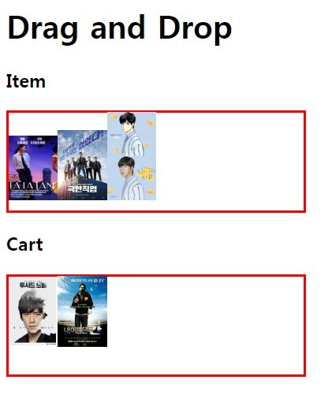
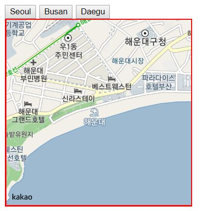

> day31 배운 내용 : CORS | 웹 스토리지 | 웹 소켓 | Drag and Drop | 지도 정보 불러오기

## 1. CORS

- HTML을 다른 서버에서 접속할 때 그 서버가 신뢰하는 서버임을 인증해주는 코드 필요 → Cross-Check

- 같은 그룹 폐쇄망 내에서는 여러 대의 서버 접속이 가능하지만 외부는 불가능 (HTML5)

- 이러한 현상을 해결하기 위한 방법 : `https://cors.io/?` 이용

  > 요청주소(url) 앞에 위의 코드 붙여주면 접근 가능  


## 2. 웹 스토리지

- Session Storage : 잠시 저장 → 서버를 다시 켜면 사라짐
- Local Storage : 서버를 재부팅하여도 정보가 저장되어 있음

```html
<head>
<script>
	$(document).ready(function () {
		$('button').eq(0).click(function () { // 첫 번째 버튼이 클릭이 되면 (eq)
			sessionStorage.m = 'sid01';
		});
		$('button').eq(1).click(function () { // 'button:eq(1)'로 써도 됨
			localStorage.m = 'lid01'
		}); 
	});
</script>
</head>

<body>
	<button>Session Storage</button>
	<button>Local Storage</button>
</body>
```
> 버튼을 누르면 해당 저장소에 데이터가 저장되는 것을 확인 후, 서버를 재부팅하는 실습 진행


## 3. 웹 소켓

- 웹 소켓(Web Socket)은 웹 애플리케이션을 위한 차세대 **양방향** 통신 기술
- 내가 요청할 때 뿐 아니라 브라우저에 접속하면 서버가 먼저 데이터 주는 것도 가능

```html
<html>
<head>
<meta charset="UTF-8">
<title>Insert title here</title>
<script src="https://ajax.googleapis.com/ajax/libs/jquery/1.12.4/jquery.min.js"></script>
    
<script>
$(document).ready(function(){
	if(typeof(EventSource) !== 'undefined'){ // 브라우저가 server event 받을 수 있는지
		var app = new EventSource('test.jsp'); 
        // 받을 수 있다면 서버 프로그램(test.jsp)이 event를 줌
		app.onmessage = function(ev){ 
        // 받을 준비 (onmessage : 서버로부터 데이터가 도착하면 발생)
			$('h3').text(ev.date); // ∴ event가 발생을 하면 h3에 ev의 data를 뿌리기
		};
	}else{ // server event 진행하지 않음을 알림
		alert('Server Event Not Available');
	};
});
</script>
</head>

<body>
<h1>Event</h1>
<h3></h3> <!-- 서버가 보낸 데이터를 h3에 저장 -->
</body>
</html>
```

```jsp
<%@page import="java.util.Date"%>
<%@ page language="java" contentType="text/html; charset=UTF-8"
	pageEncoding="UTF-8"%>
<%
	response.setContentType("text/event-stream;charset=utf-8");
	Date time = new Date();
%>
data:<%=time %>
```

> test.jsp 파일


## 4. Drag and Drop

```html
<html>

<head>
	<meta charset="UTF-8">
	<title>Insert title here</title>
	<script src="https://ajax.googleapis.com/ajax/libs/jquery/1.12.4/jquery.min.js"></script>

	<style>
		div {
			width: 300px;
			height: 100px;
			border: 2px solid red;
		}

		img {
			width: 50px;
		}
	</style>
	<script>
		sessionStorage.cnt = 0;

		function itemdrop(e) {
			var src = e.dataTransfer.getData('m');
			console.log(src);
			$('#item').append($('#' + src));
		};

		function itemleave(e) { };

		function allewdrop(e) {
			e.preventDefault();
		};

		function cartdrop(e) {
			var src = e.dataTransfer.getData('m');
			console.log(src);
			$('#cart').append($('#' + src)); 
            // cart에 drop을 하면 item을 넣음 → id에 해당하는 elements가 cart에 append
			var cnt = 0; // cart에 몇 개가 들어왔는지 셈
			if (sessionStorage.cnt == null ||
				sessionStorage.cnt == 0) {
				sessionStorage.cnt = 1;
				cnt++;
			} else {
				var cnt = ++sessionStorage.cnt;
			};
			$('h3').text(cnt);

		};

		function cartleave(e) {

		};

		function imgdrag(e) {
			e.dataTransfer.effectAllowed = 'move';
			e.dataTransfer.setData('m', e.target.id); 
            // m 이라는 이름으로 내가 선택한 id의 target을 둠
			console.log(e.target.id);

		};

	</script>
</head>

<body>
	<h1>ITEM</h1>
	<!-- ondrop : 안으로 무언가 들어옴, ondragleave : 이 영역에서 나갈 때-->
	<div id="item" ondrop="itemdrop(event)" ondragover="allewdrop(event)"        ondragleave="itemleave(event)">
		 
        <!-- div 안에 있는 img는 drag가 가능 -->
		
		
		
		
	</div>
    
	<h1>CART</h1>
	<h3></h3> <!-- 카운트가 들어갈 자리 local strorage 필요 없음 -->
	<div id="cart" ondrop="cartdrop(event)" ondragover="allewdrop(event)" ondragleave="itemleave(event)">
	</div>
</body>

</html>
```



## 5. 지도 정보 불러오기

```html
<html>
<head>
	<meta charset="UTF-8">
	<title>Insert title here</title>
	<script src="https://ajax.googleapis.com/ajax/libs/jquery/1.12.4/jquery.min.js"></script> <!-- 사용 중인 jQuery 선언 : 다운받지 않고 웹에서 바로 받아서 사용 -->
	<script src="//dapi.kakao.com/v2/maps/sdk.js?appkey=5d298aa1116853ea9a4a7084400fa795"></script> <!-- kakao의 map API 사용 -->

	<style>
		#map { 
			width: 300px;
			height: 300px;
			border: 2px solid red;
		} /* 지도의 크기와 테두리 지정 */
	</style>

	<script>
		$(document).ready(function () {
			var center = new daum.maps.LatLng(34.865290, 128.434132); // 센터값
			var container = document.getElementById('map');

			var options = {
				center: center,
				level: 3 // 얼마나 확대하는지 
			};

			var map = new daum.maps.Map(container, options);

			$('#b1').click(function () { // 서울
				var center =
					new daum.maps.LatLng(37.575993, 126.976924);
				map.setCenter(center);
			});

			$('#b2').click(function () { // 부산
				var center =
					new daum.maps.LatLng(35.158517, 129.160225);
				map.setCenter(center);
			});

			$('#b3').click(function () { // 대구
				var center =
					new daum.maps.LatLng(35.853329, 128.563077);
				map.setCenter(center);
			});

		});
	</script>
</head>

<body>
	<button id="b1">Seoul</button> <!-- 해당 버튼을 누르면 각 좌표 값으로 지도가 이동 -->
	<button id="b2">Busan</button>
	<button id="b3">Daegu</button>
	<div id="map"></div>
</body>

</html>
```



-----------------------------------------------------------------------------------------------------------------------------------------------------------

:book: **​day31 workshop** : open API의 데이터를 가져와 map에 marker 표시하기

[실습코드 보러가기](https://github.com/xuansohx/TIL/blob/master/%EC%8B%A4%EC%8A%B5%EC%BD%94%EB%93%9C/web/map_marker.html)


> Kakao map과 경기데이터드림의 open API 이용

▶ workshop 수행 시 어려웠던 점 : 변수의 위치 → 지역변수인지 전역변수인지 정확히 확인하고 사용하기

