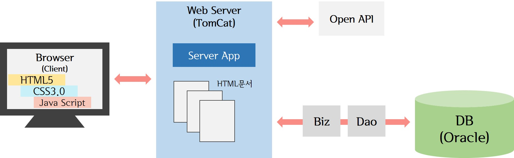

> day33 배운 내용 : Web-server의 구조 리뷰 | JSP와 DB 연동하기(CRUD)

## 1. Web-server의 구조

> Browser(Client)에서 HTML로 요청 → Servlet이 받아 JSP에 요청 → JSP는 자동적으로 Servlet으로 변환되어 실행 → 결과는 다시 HTML로 출력되어 Browser에게 전송

## 2. JSP와 DB 연동 (CRUD)

