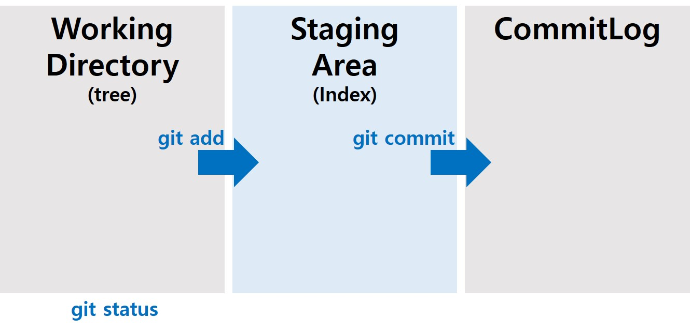

> day81 배운 내용 : GitHub 특강 (강동주 강사님) 

:heavy_check_mark: git 최신 버전 유지하기

:heavy_check_mark: vscode  / Sublime Text3 다운로드

:heavy_check_mark: **programmers** 추천 (학습사이트)

## 1. Git의 용도

### 1-1. 코드 관리 도구

- SCM (Source Code Management)

- VCS (Version Control System)

### 1-2. 원격 저장소(git/github)

- github

### 1-3. 협업 도구

- push & pull
- forking & pull request (github flow)



## 2. Git 명령어

:star: Commit Message 영어로 쓰는 것 권장 **(동사원형 + 목적어)**

과거의 history 확인하기

```
git log → git history 확인
git log --oneline → log를 한 줄로 간단하게 표시
```

git commit version 이동

```
git checkout [commit hash] → 과거의 어느 특정 시점 확인
git checkout master → 다시 현 시점으로 돌아옴

git restore [파일명] → 추가 내용을 버린 후, 최종 commit version으로 복원
```

원격저장소의 정보

```
git remote → 원격저장소의 정보 (이름)
git remote -v → 원격저장소의 정보 (이름, 주소)
git remote add [이름] [주소] → 원격저장소 추가
```

원격저장소로 협업

```
git push [원격저장소 이름] [브랜치의 이름] → 원격저장소로 코드 업데이트
git clone [원격저장소 주소]
git clone [원격저장소 주소] [프로젝트 이름] → 코드 복제 (Repository 이름 설정 가능)
```

> clone 하면 remote는 필요 없음

```
git pull → 반드시 작업을 시작하기 이전에 commit
```

`git add` 후, staging area와 commit log 비교

```
git diff
```


## 3. 협업

:deciduous_tree: **day81 workshop** : push & pull을 활용한 끝말잇기 → `Collaborators`로 권한 부여 받아야 됨

```
git pull
code . → VScode로 편집
git add [파일명]
git commit -m "message"
git push origin master
```

> 협업은 가능하지만 동시작업이 불가능하고 소통이 매우 중요하다는 단점!

<br>

**Fork**를 활용하여 협업하기 → 관리 권한은 없지만 관여를 하고 싶을 때 (Collaborators 권한 없음)

- 상대방의 Repository `Fork`

- commit 후, New Pull Request 요청

- 팀장이 Pull Requests 확인 후, Merge 

  > 팀원에게는 바로 push 할 권한이 없음